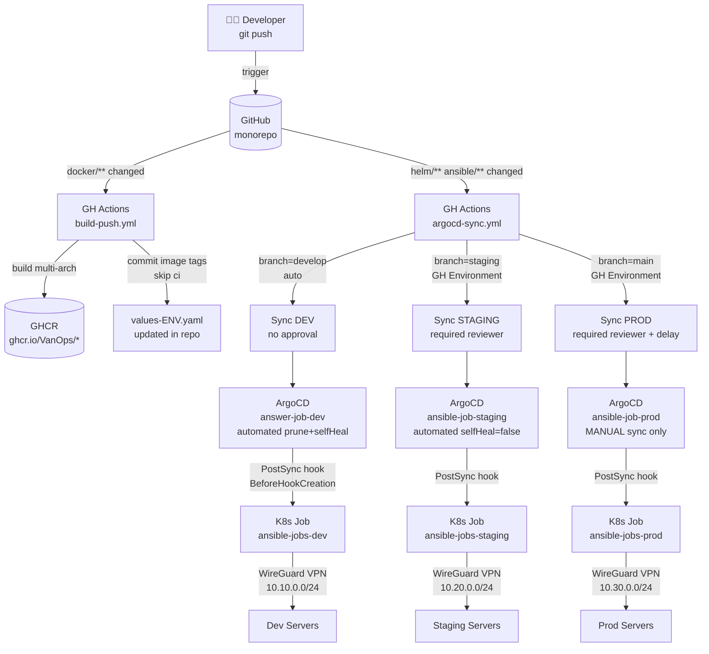
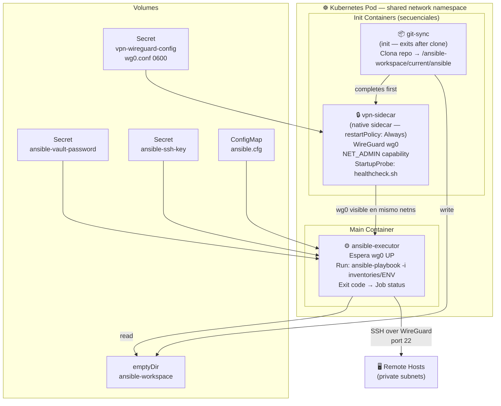
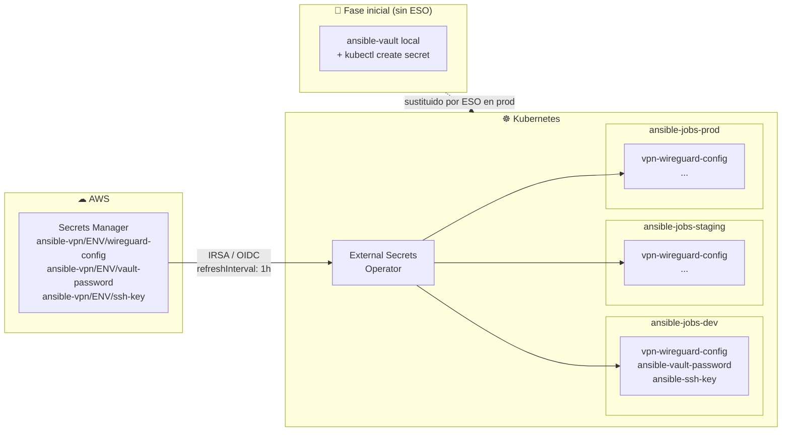
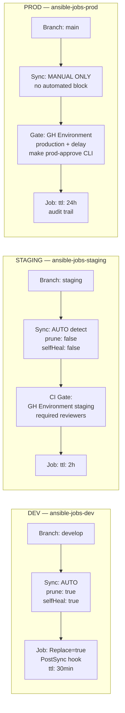

# kubernetes-job-over-VPN

GitOps pipeline con ArgoCD para ejecutar Jobs Kubernetes que corren playbooks Ansible a través de un túnel WireGuard VPN. Estructura multi-entorno (dev/staging/prod) con Helm, ExternalSecrets y GitHub Actions.

---

## Arquitectura

### 1. Flujo CI/CD GitOps



### 2. Arquitectura del Pod Kubernetes



### 3. Gestión de Secretos



### 4. Políticas de Sync por Entorno



---

## Estructura del Repositorio

```
kubernetes-job-over-VPN/
├── .github/
│   └── workflows/
│       ├── build-push.yml         # CI: build & push Docker images a GHCR
│       └── argocd-sync.yml        # CD: sync selectivo por entorno con gates
│
├── ansible/                        # Monorepo Ansible multi-entorno
│   ├── ansible.cfg
│   ├── requirements.yml            # Colecciones Ansible pre-instaladas en imagen
│   ├── inventories/
│   │   ├── dev/    (hosts.ini + group_vars/all.yml)
│   │   ├── staging/(hosts.ini + group_vars/all.yml)
│   │   └── prod/   (hosts.ini + group_vars/all.yml)
│   ├── playbooks/
│   │   ├── test-connectivity.yml  # Playbook de prueba
│   │   └── site.yml               # Playbook principal
│   ├── roles/
│   │   └── common/
│   └── vault/
│       └── secrets.yml.example
│
├── docker/
│   ├── vpn/                        # WireGuard sidecar (Debian 12 slim, multi-stage)
│   │   ├── Dockerfile
│   │   ├── entrypoint.sh
│   │   └── healthcheck.sh
│   └── ansible/                    # Ansible executor (Python 3.12 slim, multi-stage)
│       ├── Dockerfile
│       ├── scripts/
│       │   ├── entrypoint.sh
│       │   └── wait-for-vpn.sh
│       └── ssh_config
│
├── helm/
│   └── ansible-job/
│       ├── Chart.yaml
│       ├── values.yaml             # Defaults base
│       ├── values-dev.yaml
│       ├── values-staging.yaml
│       ├── values-prod.yaml
│       └── templates/
│           ├── _helpers.tpl
│           ├── job.yaml            # Job: git-sync + vpn-sidecar + ansible-executor
│           ├── configmap.yaml
│           ├── serviceaccount.yaml
│           └── rbac.yaml
│
├── argocd/
│   ├── app-of-apps.yaml            # Bootstrap: kubectl apply -f argocd/app-of-apps.yaml
│   └── apps/
│       ├── dev.yaml
│       ├── staging.yaml
│       └── prod.yaml
│
├── k8s/
│   └── external-secrets/
│       ├── secret-store.yaml
│       ├── dev-external-secret.yaml
│       ├── staging-external-secret.yaml
│       └── prod-external-secret.yaml
│
├── test/
│   ├── vpn/wg0.conf.example
│   └── secrets/vault-password.example
│
├── docker-compose.yml
├── Makefile
└── README.md
```

---

## Quick Start

### 1. Pre-requisitos

```bash
# Herramientas
brew install helm argocd kubectl yq docker
# Linux: apt install wireguard-tools + snap install kubectl helm

# Versiones requeridas
helm version    # >= 3.14
argocd version  # >= 2.10
kubectl version # >= 1.28 (native sidecars)
```

### 2. Colecciones Ansible

Las colecciones `community.general` y `ansible.posix` se pre-instalan en la imagen durante el build (stage `python-builder`) y no requieren acceso a red en runtime.

El build de la imagen `ansible-executor` usa el **repo raíz como contexto** para poder acceder a `ansible/requirements.yml`:

```bash
# Equivalente a lo que hace make build-ansible:
docker build -f docker/ansible/Dockerfile -t k8s-ansible-executor:local .

# Verificar colecciones incluidas
docker run --rm k8s-ansible-executor:local ansible-galaxy collection list
```

> `community.general` provee los callbacks `yaml`, `profile_tasks` y `timer` usados en `ansible.cfg`.
> En `ansible-core` 2.12+ estos callbacks se movieron fuera del core y su ausencia causa `ERROR! Invalid callback for stdout specified: yaml`.

---

### 3. Testing local (sin Kubernetes)

El VPN sidecar tiene **modo no-op automático** que permite probar la pipeline sin un servidor WireGuard real. El entrypoint detecta tres condiciones y entra en modo sleep (container sano, sin túnel) en lugar de fallar:

| Condición                                                         | Comportamiento  |
| ----------------------------------------------------------------- | --------------- |
| `SKIP_VPN=true`                                                   | No-op explícito |
| `wg0.conf` no existe                                              | No-op con aviso |
| `wg0.conf` tiene placeholders (`CLIENT_PRIVATE_KEY_BASE64`, etc.) | No-op con aviso |

El healthcheck usa `/tmp/vpn-ready` (fichero creado por el entrypoint) en lugar de comprobar la interfaz `wg0`, por lo que pasa correctamente en modo no-op.

#### Modo no-op (sin credenciales VPN reales)

```bash
make dev-setup   # copia archivos de ejemplo (wg0.conf.example → wg0.conf)
# NO edites test/vpn/wg0.conf → el sidecar entra en modo no-op automáticamente

echo "test-password" > test/secrets/vault-password
ssh-keygen -t ed25519 -f test/secrets/ssh-private-key -N ""

make dev-up      # VPN sidecar en no-op, Ansible intenta conectar al inventario dev
```

O de forma explícita:

```bash
SKIP_VPN=true make dev-up
```

#### Modo completo (con servidor WireGuard real)

```bash
make dev-setup

# Editar test/vpn/wg0.conf con credenciales reales:
#   PrivateKey = <clave privada del cliente>
#   [Peer] PublicKey = <clave pública del servidor>
#   [Peer] Endpoint  = vpn.example.com:51820
# El sidecar detecta valores reales y levanta el túnel automáticamente.

echo "mi-vault-password" > test/secrets/vault-password
cp ~/.ssh/ansible_rsa test/secrets/ssh-private-key && chmod 600 test/secrets/ssh-private-key

make dev-up
```

```bash
# Otros comandos útiles
make dev-shell         # shell interactivo en el contenedor Ansible
make dev-vpn-status    # estado de la interfaz WireGuard (solo en modo real)
make dev-logs          # logs combinados VPN + Ansible
make dev-down          # parar y limpiar
```

### 4. Bootstrap ArgoCD

```bash
# Reemplazar OWNER con tu GitHub user/org
sed -i 's/VanOps/tu-github-user/g' \
  argocd/app-of-apps.yaml argocd/apps/*.yaml \
  helm/ansible-job/values.yaml helm/ansible-job/values-*.yaml

# Bootstrap (crea las 3 apps automáticamente)
make argocd-install

# Secretos iniciales en dev (sin ExternalSecrets)
make k8s-secrets-dev
```

### 5. Secretos — Fase inicial (ansible-vault local)

```bash
# Crear y cifrar secretos ansible
cp ansible/vault/secrets.yml.example ansible/vault/secrets.yml
# editar con valores reales
ansible-vault encrypt ansible/vault/secrets.yml

# Crear K8s secrets manualmente
make k8s-secrets-dev
```

### 6. Secretos — Producción (ExternalSecrets + AWS)

```bash
# Instalar ESO
helm repo add external-secrets https://charts.external-secrets.io
helm install external-secrets external-secrets/external-secrets \
  -n external-secrets --create-namespace

# Crear secretos en AWS SM:
# ansible-vpn/ENV/wireguard-config → { "wg0.conf": "<contenido>" }
# ansible-vpn/ENV/vault-password   → { "vault-password": "<pass>" }
# ansible-vpn/ENV/ssh-key          → { "ssh-private-key": "<PEM>" }

make k8s-apply-external-secrets
```

---

## Operaciones habituales

| Target                   | Descripción                       |
| ------------------------ | --------------------------------- |
| `make dev-up`            | Build + playbook local            |
| `make dev-down`          | Parar entorno local               |
| `make dev-shell`         | Shell en Ansible local            |
| `make helm-lint`         | Lint Helm todos los entornos      |
| `make helm-template-dev` | Renderizar manifests dev          |
| `make dev-sync`          | Sync ArgoCD dev                   |
| `make staging-sync`      | Sync ArgoCD staging               |
| `make prod-approve`      | Approve + sync prod (interactivo) |
| `make argocd-status`     | Estado de las 3 apps              |
| `make k8s-logs-dev`      | Logs ansible-executor dev         |
| `make vault-edit`        | Editar vault cifrado              |
| `make ci`                | Lint completo local               |

---

## GitHub Environments

Configurar en **GitHub → Settings → Environments**:

| Environment  | Protección                               |
| ------------ | ---------------------------------------- |
| `dev`        | Sin protección                           |
| `staging`    | Required reviewers: 1                    |
| `production` | Required reviewers: 2 + Wait timer: 5min |

Secrets por environment: `ARGOCD_SERVER`, `ARGOCD_TOKEN`

---

## Requisitos técnicos

| Componente                | Versión                                     |
| ------------------------- | ------------------------------------------- |
| Kubernetes                | ≥ 1.28 (native sidecars)                    |
| EKS                       | ≥ 1.29                                      |
| Helm                      | ≥ 3.14                                      |
| ArgoCD                    | ≥ 2.10                                      |
| External Secrets Operator | ≥ 0.9                                       |
| ansible-core              | 2.17.7                                      |
| community.general         | ≥ 9.0 (callback yaml, profile_tasks, timer) |
| ansible.posix             | ≥ 1.5 (módulos SSH/POSIX)                   |
| WireGuard (kernel)        | ≥ 5.6 (built-in)                            |

---

## 📚 Módulo Educativo: SSH + Ansible + VPN

Este repositorio incluye un **módulo educativo completo** sobre Ansible + SSH + VPN tunnels con labs ejecutables.

### Contenido

📖 [**docs/ssh/**](docs/ssh/README.md) — Módulo educativo completo con 5 documentos:

1. **[01-ansible-ssh-principles.md](docs/ssh/01-ansible-ssh-principles.md)** — Fundamentos SSH en Ansible
   - known_hosts, StrictHostKeyChecking, ProxyJump
   - Configuración ansible.cfg y ssh_config
   - Diagrama flujo conexión SSH completo
   - Troubleshooting común (7+ problemas)

2. **[02-docker-ansible-lab.md](docs/ssh/02-docker-ansible-lab.md)** — Lab Docker Compose ejecutable
   - Entorno multi-host: ansible-control + bastion + targets
   - ProxyJump en acción
   - Comandos `make lab1-*` ready-to-use
   - 4 ejercicios prácticos

3. **[03-ssh-vpn-basics.md](docs/ssh/03-ssh-vpn-basics.md)** — SSH sobre túneles VPN
   - Comparación WireGuard vs OpenVPN (2026)
   - Configs completos cliente/servidor
   - SSH tunneling (local/remote/dynamic)
   - Debian networking: routing, DNS, iptables

4. **[04-vpn-tunnel-lab.md](docs/ssh/04-vpn-tunnel-lab.md)** — Lab VPN avanzado
   - Simula arquitectura K8s con VPN sidecar
   - WireGuard server/client + Ansible executor
   - `network_mode: service:vpn-client` (shared netns)
   - Comandos `make lab2-*` + 3 ejercicios avanzados

5. **[05-ssh-params-reference.md](docs/ssh/05-ssh-params-reference.md)** — Referencia completa
   - 30+ tablas parámetros SSH
   - ExternalSecrets integration (Vault → K8s)
   - Valores recomendados producción 2026
   - Debian 12 troubleshooting específico

### Quick Start Labs

```bash
# Lab 1: SSH Multi-Host básico
make lab1-setup && make lab1-up && make lab1-test

# Lab 2: VPN Tunnel + Ansible avanzado (simula K8s)
make lab2-setup && make lab2-up && make lab2-ansible
```

**Incluye**:

- ✅ 5 diagramas Mermaid (arquitectura + secuencias)
- ✅ 2 labs ejecutables con Docker Compose
- ✅ Scripts automation (generate-keys, test-connectivity)
- ✅ Configs production-ready 2026
- ✅ 7+ ejercicios prácticos

Ver [**docs/ssh/README.md**](docs/ssh/README.md) para documentación completa.

---

## Seguridad

- `test/vpn/wg0.conf`, `test/secrets/vault-password`, `test/secrets/ssh-private-key` están en `.gitignore`
- Solo commitear `ansible/vault/secrets.yml` **cifrado** con ansible-vault
- En producción: todos los secretos desde AWS Secrets Manager vía ExternalSecrets (IRSA)
- Contenedor Ansible: usuario no-root UID 1000, capabilities: DROP ALL
- VPN sidecar: solo `NET_ADMIN + SYS_MODULE`, sin root UID
