# Release Flow

Este documento describe el flujo completo de release para `kubernetes-job-over-VPN`: desde un commit en una rama de feature hasta el despliegue en producción, incluyendo la validación GitOps con ArgoCD y el sistema de notificaciones.

---

## Índice

1. [Estrategia de ramas](#1-estrategia-de-ramas)
2. [Flujo de commits entre ramas](#2-flujo-de-commits-entre-ramas)
3. [Pipeline CI/CD por rama](#3-pipeline-cicd-por-rama)
4. [Validación GitOps con ArgoCD](#4-validación-gitops-con-argocd)
5. [Comportamiento de sync por entorno](#5-comportamiento-de-sync-por-entorno)
6. [Flujo de notificaciones](#6-flujo-de-notificaciones)
7. [Proceso de release de Ansible](#7-proceso-de-release-de-ansible)
8. [Rollback](#8-rollback)
9. [Referencia rápida de comandos](#9-referencia-rápida-de-comandos)

---

## 1. Estrategia de ramas

| Rama         | Entorno | Sync ArgoCD | Namespace              | Retención de pods |
| ------------ | ------- | ----------- | ---------------------- | ----------------- |
| `feature/**` | —       | —           | —                      | —                 |
| `develop`    | Dev     | Automático  | `ansible-jobs-dev`     | 30 min            |
| `staging`    | Staging | Semi-manual | `ansible-jobs-staging` | Sin TTL           |
| `main`       | Prod    | Manual      | `ansible-jobs-prod`    | 24 h              |

- **`feature/**`\*\*: trabajo de desarrollo. CI de compliance y seguridad.
- **`develop`**: integración continua. Despliegue automático en dev.
- **`staging`**: pre-producción. Requiere aprobación de GitHub environment antes del sync.
- **`main`**: producción. Requiere reviewers explícitos y sync manual con `argocd app sync`.

---

## 2. Flujo de commits entre ramas

```mermaid
gitGraph
   commit id: "init"

   branch develop
   checkout develop
   commit id: "feat: nueva tarea ansible"
   commit id: "fix: corregir playbook"

   branch feature/my-feature
   checkout feature/my-feature
   commit id: "wip: cambio experimental"
   commit id: "refactor: limpiar roles"

   checkout develop
   merge feature/my-feature id: "Merge PR → develop" tag: "CI: compliance + build"

   commit id: "ci: update image tags [skip ci]"

   checkout staging
   merge develop id: "Merge develop → staging" tag: "Gate: GH environment"

   commit id: "ci: update image tags staging [skip ci]"

   checkout main
   merge staging id: "Merge staging → main" tag: "Gate: required reviewers"

   commit id: "ci: update image tags prod [skip ci]"
   commit id: "ci: update prod artifact URL vX.Y.Z [skip ci]" tag: "Release vX.Y.Z"
```

### Reglas de promoción

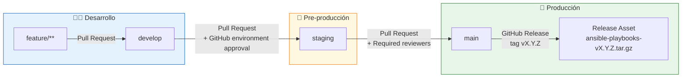

---

## 3. Pipeline CI/CD por rama

### 3.1 Flujo completo de CI/CD

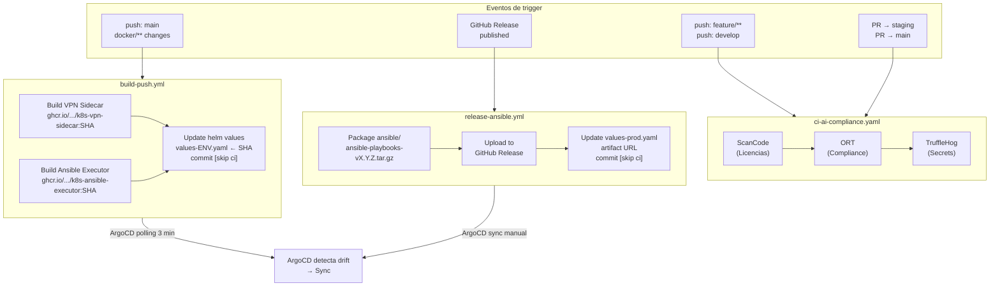

### 3.2 Qué workflow se ejecuta en cada rama

| Evento                             | `ci-ai-compliance` | `build-push` | `release-ansible` |
| ---------------------------------- | :----------------: | :----------: | :---------------: |
| Push a `feature/**`                |         ✅         |      —       |         —         |
| Push a `develop`                   |         ✅         |      —       |         —         |
| PR hacia `staging` o `main`        |         ✅         |      —       |         —         |
| Push a `main` (cambios en docker/) |         —          |      ✅      |         —         |
| GitHub Release publicado           |         —          |      —       |        ✅         |

> El workflow `build-push.yml` actualmente se dispara solo en `main`. Los tags de imagen en `values-dev.yaml` y `values-staging.yaml` se actualizan manualmente o extendiendo el trigger a `develop` y `staging`.

---

## 4. Validación GitOps con ArgoCD

### 4.1 Arquitectura App-of-Apps

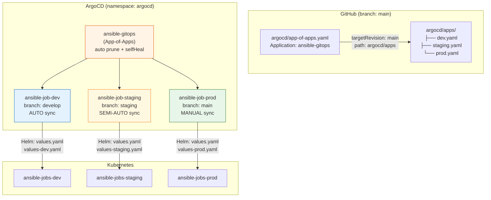

### 4.2 Ciclo de vida de un Job en Kubernetes

Cada Application despliega un `Kubernetes Job` con patrón sidecar:

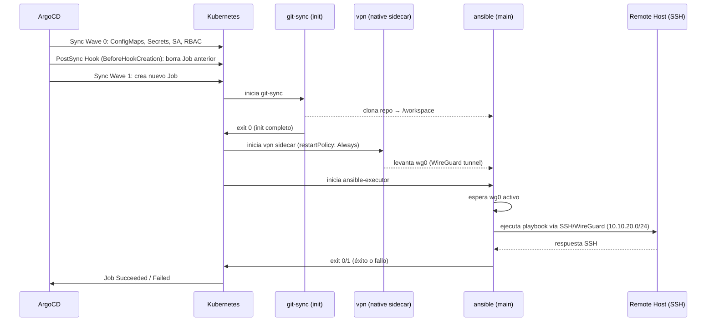

---

## 5. Comportamiento de sync por entorno

### 5.1 Dev — Sync Automático

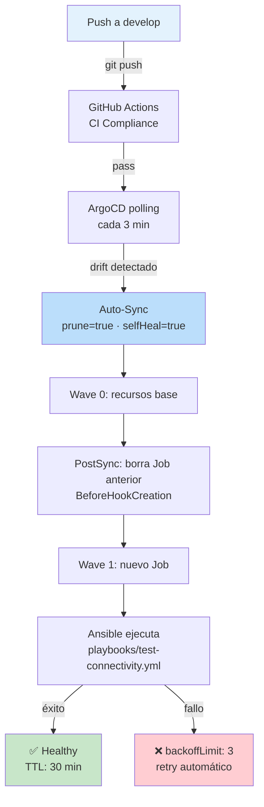

**Características clave:**

- `prune: true` — elimina recursos obsoletos de Git
- `selfHeal: true` — re-sincroniza si el clúster deriva del estado de Git
- `Replace: true` — fuerza recreación de Jobs (campos inmutables)
- `retry.limit: 5` con backoff exponencial

### 5.2 Staging — Sync Semi-manual

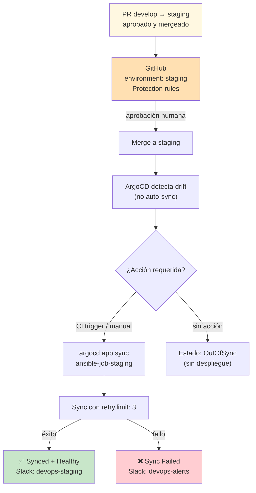

**Características clave:**

- `prune: false` — no elimina recursos automáticamente (requiere acción explícita)
- `selfHeal: false` — detecta drift pero no lo corrige
- La sincronización efectiva requiere trigger manual o de CI
- `retry.limit: 3` — menos reintentos que dev

### 5.3 Prod — Sync Manual

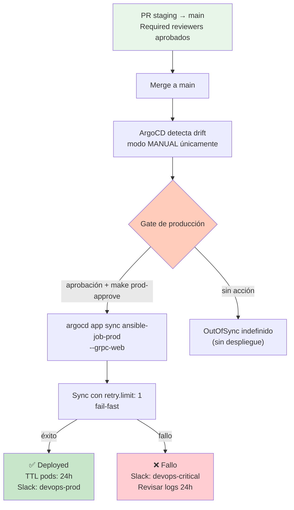

**Características clave:**

- Sin bloque `automated` — sync 100% manual
- `retry.limit: 1` — falla rápido, no reintenta a ciegas
- Pods retenidos 24h (`ttlSecondsAfterFinished: 86400`) para inspección de logs
- Historial de syncs visible en ArgoCD UI y `argocd app history`

---

## 6. Flujo de notificaciones

### 6.1 Canales configurados por entorno

| Entorno | Evento               | GitHub Status | Slack channel     |
| ------- | -------------------- | :-----------: | ----------------- |
| Dev     | `on-sync-running`    |  ⏳ pending   | —                 |
| Dev     | `on-deployed`        |  ✅ success   | —                 |
| Dev     | `on-sync-failed`     |  ❌ failure   | `devops-alerts`   |
| Dev     | `on-health-degraded` |  ❌ failure   | `devops-alerts`   |
| Staging | `on-sync-running`    |  ⏳ pending   | `devops-staging`  |
| Staging | `on-sync-succeeded`  |  ✅ success   | `devops-staging`  |
| Staging | `on-deployed`        |  ✅ success   | —                 |
| Staging | `on-sync-failed`     |  ❌ failure   | `devops-alerts`   |
| Staging | `on-health-degraded` |  ❌ failure   | `devops-alerts`   |
| Prod    | `on-sync-running`    |  ⏳ pending   | `devops-prod`     |
| Prod    | `on-sync-succeeded`  |  ✅ success   | `devops-prod`     |
| Prod    | `on-deployed`        |  ✅ success   | —                 |
| Prod    | `on-sync-failed`     |  ❌ failure   | `devops-critical` |
| Prod    | `on-health-degraded` |  ❌ failure   | `devops-critical` |

### 6.2 Secuencia de notificación completa

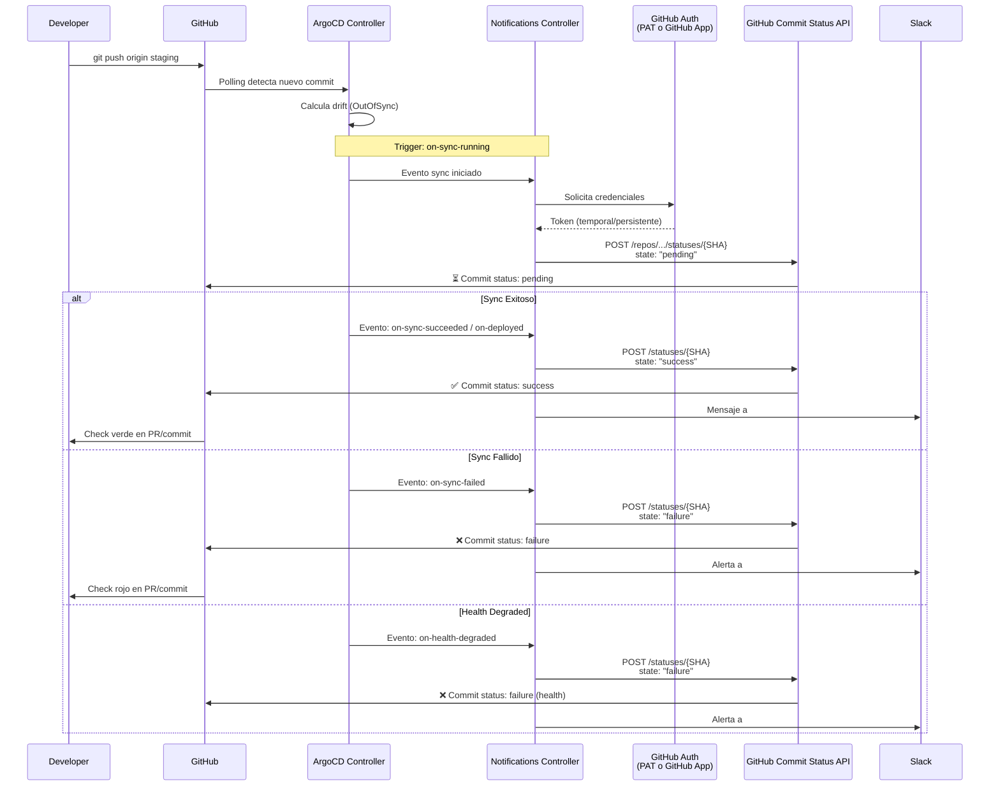

### 6.3 Métodos de autenticación para GitHub Notifications

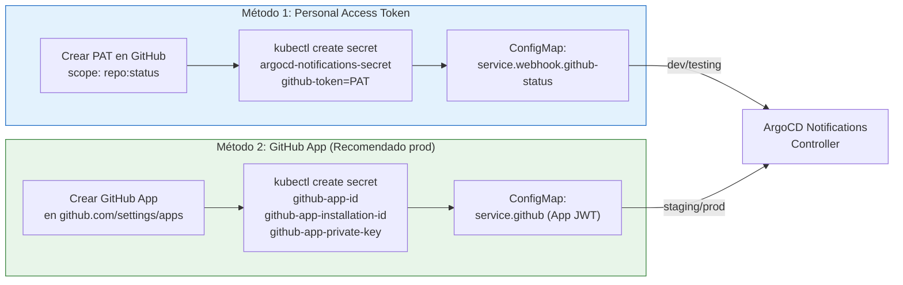

| Característica | PAT                    | GitHub App             |
| -------------- | ---------------------- | ---------------------- |
| Setup          | ⚡ 5 minutos           | ⏱️ 15-20 minutos       |
| Expiración     | ⚠️ Máx. 1 año          | ✅ No expira           |
| Permisos       | 🔓 Amplios (todo repo) | 🔒 Granulares (status) |
| Auditabilidad  | Usuario personal       | `App[bot]`             |
| Ideal para     | Dev / Testing          | Staging / Producción   |

---

## 7. Proceso de release de Ansible

Un **GitHub Release** (tag `vX.Y.Z`) desencadena el empaquetado de los playbooks para producción:

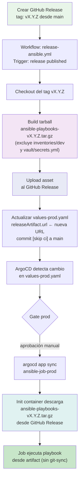

**¿Por qué usar release artifacts en producción?**

- Los playbooks están versionados e inmutables (sin git-sync dinámico)
- Prod descarga exactamente `vX.Y.Z`, no la punta de la rama
- Permite rollback descargando un tag anterior sin tocar Git
- `gitSync.enabled: false` en `values-prod.yaml`

---

## 8. Rollback

### Por entorno

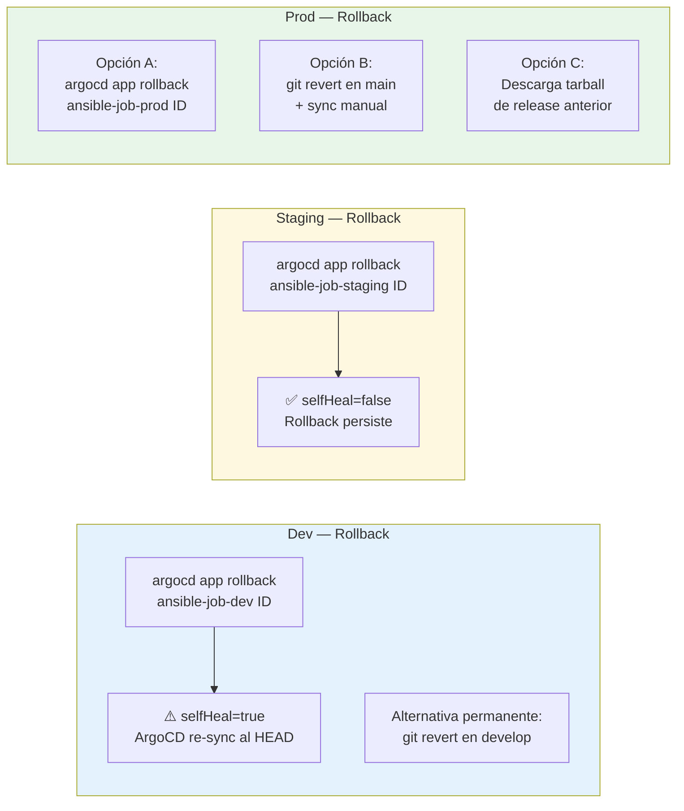

### Comandos de rollback

```bash
# Ver historial de syncs
argocd app history ansible-job-prod --grpc-web

# Rollback a revisión ID anterior
argocd app rollback ansible-job-prod <ID> --grpc-web

# Esperar health
argocd app wait ansible-job-prod --health --timeout 300 --grpc-web
```

> En dev, con `selfHeal=true`, el rollback vía ArgoCD es temporal: en el siguiente polling, ArgoCD restaura el estado de `develop`. Para un rollback permanente en dev, usa `git revert` o fija el tag de imagen en `values-dev.yaml`.

---

## 9. Referencia rápida de comandos

### Bootstrap (una sola vez)

```bash
# Instalar ArgoCD App-of-Apps
kubectl apply -f argocd/app-of-apps.yaml

# Instalar ArgoCD Notifications Controller
make argocd-notifications-install

# Configurar notificaciones (elige uno)
make argocd-notifications-setup      # PAT (dev/testing)
make argocd-notifications-setup-app  # GitHub App (staging/prod)
```

### Operación diaria

```bash
# Estado de todas las Applications
make argocd-status

# Ver diff pendiente por entorno
make argocd-diff-dev
argocd app diff ansible-job-staging --grpc-web
argocd app diff ansible-job-prod    --grpc-web

# Forzar sync
make dev-sync                                          # dev (automático igual)
argocd app sync ansible-job-staging --grpc-web         # staging
argocd app sync ansible-job-prod    --grpc-web         # prod (requiere aprobación previa)

# Ver logs del Job
make k8s-logs-dev
kubectl logs -n ansible-jobs-staging -l batch.kubernetes.io/job-name -c ansible
kubectl logs -n ansible-jobs-prod    -l batch.kubernetes.io/job-name -c ansible

# Ver logs de notificaciones
make argocd-notifications-logs
```

### Gestión de releases

```bash
# Crear un release (desde main, tag vX.Y.Z)
gh release create vX.Y.Z --title "Release vX.Y.Z" --notes "..."

# Verificar que el artifact fue generado
gh release view vX.Y.Z --json assets

# Ver URL del artifact en values-prod.yaml
grep -A3 'releaseArtifact:' helm/ansible-job/values-prod.yaml
```

---

## Referencias

| Recurso                 | Ruta                                                                               |
| ----------------------- | ---------------------------------------------------------------------------------- |
| App-of-Apps ArgoCD      | [argocd/app-of-apps.yaml](argocd/app-of-apps.yaml)                                 |
| Application dev         | [argocd/apps/dev.yaml](argocd/apps/dev.yaml)                                       |
| Application staging     | [argocd/apps/staging.yaml](argocd/apps/staging.yaml)                               |
| Application prod        | [argocd/apps/prod.yaml](argocd/apps/prod.yaml)                                     |
| ConfigMap Notifications | [k8s/argocd-notifications/configmap.yaml](k8s/argocd-notifications/configmap.yaml) |
| Guía Notifications      | [docs/argocd/github-notifications.md](docs/argocd/github-notifications.md)         |
| Guía ArgoCD dev         | [docs/argocd/README.md](docs/argocd/README.md)                                     |
| Workflow Build & Push   | [.github/workflows/build-push.yml](.github/workflows/build-push.yml)               |
| Workflow Release        | [.github/workflows/release-ansible.yml](.github/workflows/release-ansible.yml)     |
| Helm values base        | [helm/ansible-job/values.yaml](helm/ansible-job/values.yaml)                       |
