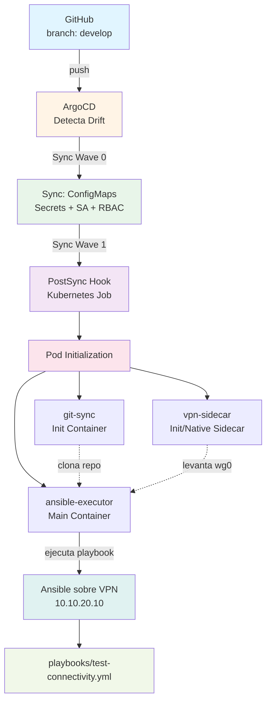
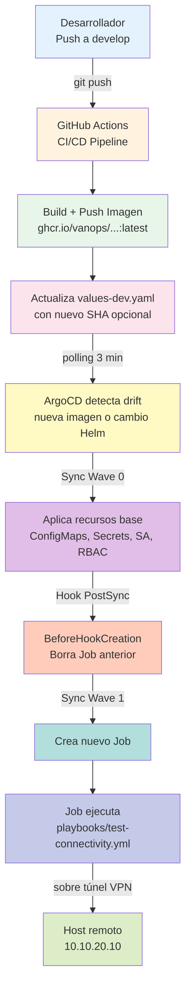
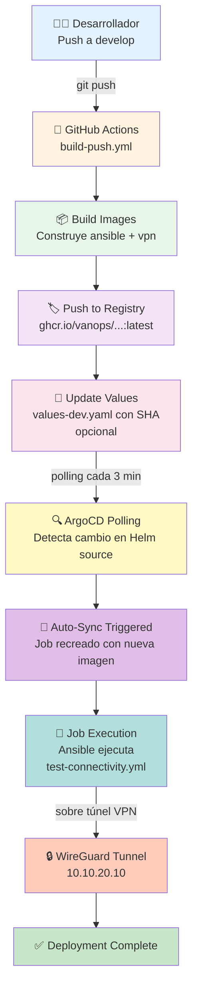

# ArgoCD — Despliegue en Entorno Dev

## Objetivo

Desplegar y operar la aplicación `ansible-job-dev` en ArgoCD apuntando al entorno de desarrollo.
El Job ejecuta playbooks Ansible sobre un túnel WireGuard, gestionado como hook PostSync de ArgoCD.

---

## Arquitectura del Pipeline GitOps



### Patrón de contenedores del Job

| Contenedor | Tipo                                              | Función                                                     |
| ---------- | ------------------------------------------------- | ----------------------------------------------------------- |
| `git-sync` | Init container                                    | Clona el repo y sale (una vez)                              |
| `vpn`      | Native sidecar (init con `restartPolicy: Always`) | Levanta túnel WireGuard wg0, permanece activo               |
| `ansible`  | Main container                                    | Espera wg0, ejecuta el playbook, sale con código de retorno |

Red compartida: los tres contenedores comparten el mismo namespace de red (ven la interfaz `wg0`).

---

## Requisitos Previos

### Clúster Kubernetes

| Requisito                | Versión mínima | Notas                                                        |
| ------------------------ | -------------- | ------------------------------------------------------------ |
| Kubernetes               | 1.29+          | Native sidecars GA. Para 1.28 ver nota `sidecarMode`         |
| ArgoCD                   | 2.10+          | Soporte completo `sync-wave` + `replace` hooks               |
| Helm                     | 3.14+          | Requerido por ArgoCD Helm source                             |
| ExternalSecrets Operator | 0.9+           | Sólo si se usan ExternalSecrets en lugar de Secrets manuales |

> **Nota `sidecarMode` (EKS 1.28):** Si el clúster no soporta native sidecars, establece
> `vpn.sidecarMode: "false"` en `values-dev.yaml`. El sidecar actuará como init container
> estándar (levanta WireGuard y sale), con la limitación de que no hay reintentos en caso
> de caída del túnel.

### Herramientas locales

```bash
# Verificar versiones
kubectl version --client          # 1.28+
helm version                      # 3.14+
argocd version --client           # 2.10+
```

### Namespaces necesarios

ArgoCD crea el namespace automáticamente (`CreateNamespace=true` en `syncOptions`):

```
argocd           → donde viven las Applications de ArgoCD
ansible-jobs-dev → donde se ejecutan los Jobs del entorno dev
```

### Imagen de contenedor (GHCR)

Las imágenes se publican en GHCR por el workflow de CI (`build-push.yml`):

```
ghcr.io/vanops/k8s-vpn-sidecar:latest
ghcr.io/vanops/k8s-ansible-executor:latest
```

Si el clúster es privado o GHCR requiere autenticación, crea un imagePullSecret:

```bash
kubectl create secret docker-registry ghcr-pull-secret \
  --docker-server=ghcr.io \
  --docker-username=<GITHUB_USER> \
  --docker-password=<GHCR_TOKEN> \
  -n ansible-jobs-dev
```

Y añádelo en `values-dev.yaml`:

```yaml
imagePullSecrets:
  - name: ghcr-pull-secret
```

---

## Secrets Necesarios

El Job requiere **tres Secrets** en el namespace `ansible-jobs-dev` antes de que ArgoCD pueda
sincronizar correctamente. En dev se crean manualmente; en staging/prod los gestiona
ExternalSecrets Operator.

> # **Para staging:** Ver la [guía completa de configuración de HashiCorp Vault](../vault/01-vault-setup-staging.md) con KV v2 mount, políticas y External Secrets Operator.

### 1. WireGuard config (`vpn-wireguard-config`)

Contiene el fichero `wg0.conf` que define el túnel VPN cliente.

```bash
# Generar keys y configs si no existen (sólo la primera vez)
bash test/vpn-lab/setup.sh

# Crear el Secret
kubectl create secret generic vpn-wireguard-config \
  --from-file=wg0.conf=./test/vpn/wg0.conf \
  -n ansible-jobs-dev
```

**Estructura del `wg0.conf` esperado:**

```ini
[Interface]
PrivateKey = <CLIENT_PRIVATE_KEY>
Address    = 10.10.99.2/24
DNS        = 10.10.99.1

[Peer]
PublicKey  = <SERVER_PUBLIC_KEY>
Endpoint   = <VPN_SERVER_IP>:51820
AllowedIPs = 10.10.99.0/24, 10.10.20.0/24
PersistentKeepalive = 25
```

Ver plantilla en [test/vpn/wg0.conf.example](../../test/vpn/wg0.conf.example).

### 2. Vault password (`ansible-vault-password`)

Contraseña para descifrar `ansible/vault/secrets.yml` (fichero Ansible Vault).

```bash
# Usando la contraseña de ejemplo (o la real en tu entorno)
kubectl create secret generic ansible-vault-password \
  --from-literal=vault-password="$(cat test/secrets/vault-password)" \
  -n ansible-jobs-dev
```

Ver plantilla en [test/secrets/vault-password.example](../../test/secrets/vault-password.example).

### 3. SSH private key (`ansible-ssh-key`)

Clave privada SSH para conectar con los hosts remotos (usuario `ansible`).

```bash
kubectl create secret generic ansible-ssh-key \
  --from-file=ssh-private-key=./test/secrets/ssh-private-key \
  -n ansible-jobs-dev
```

> La clave pública correspondiente debe estar en `~/.ssh/authorized_keys` del usuario `ansible`
> en el host remoto (10.10.20.10 en el lab).

### Verificar los tres Secrets

```bash
kubectl get secrets -n ansible-jobs-dev
# Expected:
# vpn-wireguard-config   Opaque   1      ...
# ansible-vault-password Opaque   1      ...
# ansible-ssh-key        Opaque   1      ...
```

---

## Instalación de ArgoCD (si no existe)

Si el clúster no tiene ArgoCD instalado:

```bash
kubectl create namespace argocd
kubectl apply -n argocd \
  -f https://raw.githubusercontent.com/argoproj/argo-cd/stable/manifests/install.yaml

# Esperar a que esté listo
kubectl wait --for=condition=available deployment/argocd-server \
  -n argocd --timeout=120s

# Obtener contraseña inicial del admin
kubectl -n argocd get secret argocd-initial-admin-secret \
  -o jsonpath="{.data.password}" | base64 -d && echo
```

---

## Bootstrap: App-of-Apps

El fichero [argocd/app-of-apps.yaml](../../argocd/app-of-apps.yaml) es la **Application raíz**
que gestiona las tres Applications hijo (dev, staging, prod) de forma automática.

### Paso 1 — Configurar el repositorio

Edita `argocd/app-of-apps.yaml` y `argocd/apps/dev.yaml` para usar tu fork/org:

```yaml
# argocd/app-of-apps.yaml  (línea 28)
repoURL: https://github.com/<TU_ORG>/kubernetes-job-over-VPN

# argocd/apps/dev.yaml  (línea 29)
repoURL: https://github.com/<TU_ORG>/kubernetes-job-over-VPN
```

Si el repositorio es privado, registra las credenciales en ArgoCD primero:

```bash
argocd repo add https://github.com/<TU_ORG>/kubernetes-job-over-VPN \
  --username <GITHUB_USER> \
  --password <GITHUB_PAT>
```

### Paso 2 — Aplicar el Bootstrap (una sola vez)

```bash
# Opción A: kubectl directo
kubectl apply -f argocd/app-of-apps.yaml

# Opción B: Makefile
make argocd-install
```

ArgoCD detectará el directorio `argocd/apps/` y creará automáticamente:

- `ansible-job-dev` (namespace `ansible-jobs-dev`)
- `ansible-job-staging` (namespace `ansible-jobs-staging`)
- `ansible-job-prod` (namespace `ansible-jobs-prod`)

---

## Configuración del Entorno Dev

### Ficheros Helm involucrados

| Fichero                                                                    | Propósito                          |
| -------------------------------------------------------------------------- | ---------------------------------- |
| [helm/ansible-job/values.yaml](../../helm/ansible-job/values.yaml)         | Valores base de todos los entornos |
| [helm/ansible-job/values-dev.yaml](../../helm/ansible-job/values-dev.yaml) | Overrides específicos para dev     |

### Valores clave en `values-dev.yaml`

```yaml
environment: dev

vpn:
  image:
    tag: "latest" # CI actualiza esto con el SHA del commit
  secretName: vpn-wireguard-config

ansible:
  image:
    tag: "latest"
  playbook: playbooks/test-connectivity.yml
  inventory: inventories/dev
  verbosity: 2 # Verbose para facilitar debugging en dev

gitSync:
  branch: develop # Apunta a la rama de desarrollo

job:
  ttlSecondsAfterFinished: 1800 # 30 min — pods auto-limpian rápido en dev
  backoffLimit: 3
  activeDeadlineSeconds: 900 # 15 min máximo de ejecución
```

### Application ArgoCD (`argocd/apps/dev.yaml`)

| Parámetro                 | Valor                                 |
| ------------------------- | ------------------------------------- |
| Nombre                    | `ansible-job-dev`                     |
| Namespace destino         | `ansible-jobs-dev`                    |
| Branch seguida            | `develop`                             |
| Sync policy               | **Automático** (prune + selfHeal)     |
| `Replace=true`            | Fuerza recreación de Jobs inmutables  |
| `ServerSideApply=true`    | Mejor detección de conflictos         |
| `ApplyOutOfSyncOnly=true` | Solo aplica recursos que han cambiado |
| Hook pattern              | PostSync + BeforeHookCreation         |

### Comportamiento del sync automático



---

## Login y Operación ArgoCD

### Login con token

```bash
# Configura el servidor en Makefile o exporta variables:
export ARGOCD_SERVER=argocd.example.com

# Login con token (guardado en ~/.argocd-token)
make argocd-login

# O directamente:
argocd login $ARGOCD_SERVER \
  --auth-token $(cat ~/.argocd-token) \
  --grpc-web
```

### Comandos de operación dev

```bash
# Ver estado de todas las Applications
make argocd-status

# Ver diff antes de sincronizar
make argocd-diff-dev

# Forzar sync manual (aunque dev es auto-sync)
make dev-sync

# Ver historial de syncs
argocd app history ansible-job-dev --grpc-web
```

---

## Verificación del Despliegue

### 1. Estado de la Application

```bash
argocd app get ansible-job-dev --grpc-web
```

Salida esperada:

```
Name:               ansible-job-dev
Project:            default
Server:             https://kubernetes.default.svc
Namespace:          ansible-jobs-dev
URL:                https://argocd.example.com/applications/ansible-job-dev
Repo:               https://github.com/VanOps/kubernetes-job-over-VPN
Target:             develop
Path:               helm/ansible-job
Helm Values:        values.yaml,values-dev.yaml
SyncStatus:         Synced
HealthStatus:       Healthy
```

### 2. Estado del Job en Kubernetes

```bash
# Listar Jobs en el namespace dev
kubectl get jobs -n ansible-jobs-dev

# Ver el pod del Job
kubectl get pods -n ansible-jobs-dev

# Logs del contenedor ansible (playbook output)
kubectl logs -n ansible-jobs-dev \
  -l batch.kubernetes.io/job-name \
  -c ansible --tail=100

# Logs del sidecar VPN (estado WireGuard)
kubectl logs -n ansible-jobs-dev \
  -l batch.kubernetes.io/job-name \
  -c vpn --tail=50
```

### 3. Verificar conectividad VPN dentro del Pod

```bash
# Exec en el pod (mientras está running)
POD=$(kubectl get pod -n ansible-jobs-dev \
  -l batch.kubernetes.io/job-name \
  -o jsonpath='{.items[0].metadata.name}')

# Estado WireGuard
kubectl exec -n ansible-jobs-dev $POD -c vpn -- wg show

# Ping al servidor VPN (10.10.99.1)
kubectl exec -n ansible-jobs-dev $POD -c ansible -- ping -c 3 10.10.99.1

# Ping al host remoto (10.10.20.10)
kubectl exec -n ansible-jobs-dev $POD -c ansible -- ping -c 3 10.10.20.10
```

### 4. Verificar Secrets montados

```bash
kubectl exec -n ansible-jobs-dev $POD -c ansible -- \
  ls -la /run/secrets/
# Expected:
# vault-password   (mode 440)
# ssh-private-key  (mode 440)

kubectl exec -n ansible-jobs-dev $POD -c vpn -- \
  ls -la /etc/wireguard/
# Expected:
# wg0.conf  (mode 400)
```

---

## Troubleshooting

### Job no se crea / stuck en PostSync

```bash
# Ver eventos de la Application
argocd app get ansible-job-dev --grpc-web

# Ver hooks pendientes
kubectl get jobs -n ansible-jobs-dev
kubectl describe job -n ansible-jobs-dev <JOB_NAME>
```

**Causa común:** El Job anterior no se eliminó. ArgoCD usa `BeforeHookCreation` pero si el Job
tiene un finalizer activo o el namespace está bloqueado, el hook falla.

```bash
# Forzar borrado del Job anterior
kubectl delete job -n ansible-jobs-dev --all
# Luego re-sincronizar
argocd app sync ansible-job-dev --grpc-web
```

### VPN no levanta (`wg0` no aparece)

```bash
kubectl logs -n ansible-jobs-dev $POD -c vpn
```

Causas habituales:

| Síntoma                                      | Causa                       | Solución                                |
| -------------------------------------------- | --------------------------- | --------------------------------------- |
| `RTNETLINK answers: Operation not permitted` | `NET_ADMIN` no concedido    | Verificar securityContext + PSP/PSA     |
| `Module wireguard not found`                 | Kernel sin módulo WireGuard | `sudo modprobe wireguard` en el nodo    |
| `wg0.conf: No such file`                     | Secret no montado           | Verificar `vpn-wireguard-config` existe |
| Timeout esperando VPN (ansible)              | Peer VPN inalcanzable       | Verificar `Endpoint` en `wg0.conf`      |

### Ansible falla con `Host key verification failed`

```bash
# El entorno dev tiene ANSIBLE_HOST_KEY_CHECKING=False por defecto
# Si falla, verificar en el configmap ansible.cfg:
kubectl get configmap -n ansible-jobs-dev
kubectl describe configmap ansible-job-dev-config -n ansible-jobs-dev
```

### ImagePullBackOff

```bash
kubectl describe pod -n ansible-jobs-dev $POD | grep -A 10 Events
```

Si el error es `401 Unauthorized` desde GHCR:

```bash
# Verificar o crear imagePullSecret
kubectl get secret ghcr-pull-secret -n ansible-jobs-dev
```

### `ignoreDifferences` y campos inmutables del Job

ArgoCD ignora automáticamente los siguientes campos (configurado en `dev.yaml`):

```yaml
ignoreDifferences:
  - group: batch
    kind: Job
    jsonPointers:
      - /spec/selector
      - /spec/template/metadata/labels/controller-uid
      - /spec/template/metadata/labels/batch.kubernetes.io/controller-uid
```

Si aparece un diff que no puedes resolver, el `Replace=true` en `syncOptions` fuerza el borrado
y recreación del Job completo en cada sync.

---

## Flujo de Actualización Continua



---

## Comandos Make Disponibles

| Comando                 | Descripción                                 |
| ----------------------- | ------------------------------------------- |
| `make argocd-install`   | Bootstrap app-of-apps (una sola vez)        |
| `make argocd-login`     | Login a ArgoCD con token                    |
| `make argocd-status`    | Estado de todas las Applications            |
| `make argocd-diff-dev`  | Ver diff pendiente en dev                   |
| `make dev-sync`         | Forzar sync dev + esperar a que sea Healthy |
| `make k8s-secrets-dev`  | Crear todos los secrets necesarios en dev   |
| `make k8s-logs-dev`     | Ver logs del contenedor ansible en dev      |
| `make k8s-logs-vpn-dev` | Ver logs del sidecar VPN en dev             |
| `make k8s-watch-dev`    | Watch de Jobs en el namespace dev           |

---

## Monitoreo y Observabilidad

### Métricas del Job

Los Jobs de Kubernetes exponen métricas básicas vía kube-state-metrics:

```bash
# Número de Jobs completados/fallidos
kubectl get jobs -n ansible-jobs-dev

# Duración del último Job (via describe)
kubectl describe job -n ansible-jobs-dev <JOB_NAME> | grep "Start Time\|Completion Time"
```

### Logs centralizados

Si el clúster tiene un agregador de logs (Loki, Elasticsearch), los logs del contenedor
`ansible` contienen el output completo del playbook con timestamps:

```json
{
  "timestamp": "2026-03-01T10:15:30Z",
  "container": "ansible-executor",
  "namespace": "ansible-jobs-dev",
  "message": "TASK [Gathering Facts] *****..."
}
```

**Campos útiles para filtrar:**

- `namespace=ansible-jobs-dev`
- `container=ansible-executor`
- `app.kubernetes.io/name=ansible-job`

### Alertas recomendadas

| Alerta                         | Condición                                 | Acción                                   |
| ------------------------------ | ----------------------------------------- | ---------------------------------------- |
| Job falla 3 veces consecutivas | `backoffLimit` excedido                   | Revisar logs, validar VPN/SSH            |
| Job tarda > 15 min             | `activeDeadlineSeconds` timeout           | Optimizar playbook o ajustar timeout     |
| VPN no conecta                 | Logs con `RTNETLINK` o `Module not found` | Verificar permisos o kernel del nodo     |
| Imagen no se descarga          | `ImagePullBackOff`                        | Verificar `imagePullSecret` o token GHCR |

### Notificaciones ArgoCD

El fichero [argocd/apps/dev.yaml](../../argocd/apps/dev.yaml) incluye annotations para Slack:

```yaml
annotations:
  notifications.argoproj.io/subscribe.on-sync-failed.slack: devops-alerts
  notifications.argoproj.io/subscribe.on-health-degraded.slack: devops-alerts
```

**Requisito:** ArgoCD Notifications Controller instalado y configurado con token de Slack.

Configurar el ConfigMap de notificaciones:

```bash
# Ver la configuración actual
kubectl get configmap argocd-notifications-cm -n argocd -o yaml

# Añadir Slack webhook (ejemplo)
kubectl patch configmap argocd-notifications-cm -n argocd --type merge -p '
{
  "data": {
    "service.slack": "token: $slack-token",
    "template.app-sync-failed": "message: Application {{.app.metadata.name}} sync failed."
  }
}'
```

Más info: [ArgoCD Notifications Docs](https://argo-cd.readthedocs.io/en/stable/operator-manual/notifications/)

---

## Rollback y Gestión de Versiones

### Ver historial de syncs

```bash
argocd app history ansible-job-dev --grpc-web
```

Salida:

```
ID  DATE                           REVISION
5   2026-03-01 10:30:15 +0000 UTC  abc1234 (HEAD -> develop)
4   2026-03-01 09:15:42 +0000 UTC  def5678
3   2026-03-01 08:00:10 +0000 UTC  ghi9012
```

### Rollback a una revisión anterior

```bash
# Rollback a la revisión 4
argocd app rollback ansible-job-dev 4 --grpc-web

# Esperar a que complete
argocd app wait ansible-job-dev --health --timeout 300 --grpc-web
```

> **Nota:** El rollback en ArgoCD es un sync al commit Git histórico. Si el repositorio
> ha avanzado y `selfHeal=true`, ArgoCD volverá a sincronizar a la última versión de
> `develop` automáticamente después del rollback manual. Para un rollback permanente,
> considera usar `git revert` en la rama o desactivar temporalmente `selfHeal`.

### Gestionar tags de imagen

El workflow de CI actualiza las imágenes con el SHA del commit:

```yaml
# antes
ansible:
  image:
    tag: "latest"

# después del push a develop
ansible:
  image:
    tag: "abc1234"  # git SHA
```

Para **pinear una versión conocida buena** en dev:

```bash
# Editar values-dev.yaml
yq eval '.ansible.image.tag = "def5678"' -i helm/ansible-job/values-dev.yaml

# Commit y push
git add helm/ansible-job/values-dev.yaml
git commit -m "chore(dev): pin ansible image to def5678"
git push origin develop
```

ArgoCD sincronizará automáticamente la nueva configuración.

---

## Consideraciones de Seguridad

### 1. Secrets en Git

**NUNCA comittees Secrets en texto plano.** Este proyecto usa:

- **Dev:** Secrets manuales en el clúster (`kubectl create secret`)
- **Staging:** External Secrets Operator + HashiCorp Vault
  <<<<<<< HEAD
- # **Prod:** External Secrets Operator + HashiCorp Vault
- **Prod:** External Secrets Operator + AWS Secrets Manager
  > > > > > > > 7153a2c (Staging (#4))

Ver [k8s/external-secrets/](../../k8s/external-secrets/) para la configuración de staging/prod.

### 2. RBAC del ServiceAccount

El ServiceAccount `ansible-job` en dev tiene permisos mínimos (ninguno por defecto).
Si los playbooks necesitan interactuar con la API de Kubernetes, añade un Role/RoleBinding:

```yaml
# helm/ansible-job/templates/rbac.yaml (ejemplo)
apiVersion: rbac.authorization.k8s.io/v1
kind: Role
metadata:
  name: { { include "ansible-job.fullname" . } }
  namespace: { { .Release.Namespace } }
rules:
  - apiGroups: [""]
    resources: ["pods"]
    verbs: ["get", "list"]
```

**Principio de mínimo privilegio:** Solo concede los permisos que Ansible realmente necesite.

### 3. PSP / PSA (Pod Security Standards)

El pod del Job requiere `NET_ADMIN` capability para WireGuard. En clusters con
Pod Security Admission:

```yaml
# Namespace label para exempt del default restricted policy
apiVersion: v1
kind: Namespace
metadata:
  name: ansible-jobs-dev
  labels:
    pod-security.kubernetes.io/enforce: baseline
    pod-security.kubernetes.io/audit: restricted
    pod-security.kubernetes.io/warn: restricted
```

O bien, define un **PodSecurityPolicy** específico para el ServiceAccount (en clusters < 1.25).

### 4. Aislamiento de red

El sidecar VPN permite al pod alcanzar redes remotas (10.10.20.0/24 en el ejemplo).
**Recomendaciones:**

- Usa NetworkPolicies para restringir egress desde el namespace `ansible-jobs-dev`
- Configura `AllowedIPs` en WireGuard solo con las subredes necesarias
- Audita regularmente los hosts en los inventarios de Ansible

### 5. Rotación de credenciales

| Secreto              | Frecuencia de rotación | Método                                                             |
| -------------------- | ---------------------- | ------------------------------------------------------------------ |
| WireGuard PrivateKey | Trimestral             | Regenerar con `wg genkey`, actualizar Secret                       |
| SSH key              | Semestral              | Regenerar con `ssh-keygen`, actualizar `authorized_keys`           |
| Vault password       | Anual                  | Re-encriptar `ansible/vault/secrets.yml` con `ansible-vault rekey` |

Para staging/prod, External Secrets Operator puede rotar automáticamente los Secrets
si el backend (Vault/AWS) soporta rotación automática.

---

## Desactivar Sync Automático (Modo Manual)

Si necesitas pausar syncs automáticos en dev temporalmente (por ejemplo, para debugging):

### Opción 1 — Via CLI

```bash
argocd app set ansible-job-dev \
  --sync-policy none \
  --grpc-web
```

Restaurar auto-sync:

```bash
argocd app set ansible-job-dev \
  --sync-policy automated \
  --grpc-web
```

### Opción 2 — Editar el YAML

Commenta o elimina el bloque `automated` en [argocd/apps/dev.yaml](../../argocd/apps/dev.yaml):

```yaml
syncPolicy:
  # automated:
  #   prune: true
  #   selfHeal: true
  syncOptions:
    - CreateNamespace=true
    - Replace=true
```

> **Importante:** Si editas el YAML en Git, la Application `ansible-gitops` (app-of-apps)
> sincronizará el cambio y desactivará el auto-sync. Para una pausa temporal sin commit,
> usa la CLI.

---

## Limpieza y Mantenimiento

### Limpieza de Jobs completados

Los Jobs en dev tienen `ttlSecondsAfterFinished: 1800` (30 minutos). Kubernetes borra
automáticamente los Pods completados después de este tiempo.

Para forzar limpieza manual:

```bash
# Borrar todos los Jobs (dev)
kubectl delete jobs -n ansible-jobs-dev --all

# Borrar solo Jobs completados
kubectl delete jobs -n ansible-jobs-dev \
  --field-selector status.successful=1
```

### Reducir historial de ArgoCD

ArgoCD guarda hasta 10 revisiones por defecto. Para reducir:

```bash
# Editar el ConfigMap de ArgoCD
kubectl edit configmap argocd-cm -n argocd

# Añadir/modificar
data:
  resource.customizations.health.batch_Job: |
    hs = {}
    hs.status = "Progressing"
    return hs
  application.resourceTrackingMethod: annotation  # reduce metadata
```

### Backup de configuración

**Backup de Application manifests:**

```bash
kubectl get application -n argocd -o yaml > argocd-apps-backup.yaml
```

**Backup de Secrets (dev):**

```bash
kubectl get secrets -n ansible-jobs-dev \
  vpn-wireguard-config ansible-vault-password ansible-ssh-key \
  -o yaml > dev-secrets-backup.yaml
```

> **Advertencia:** Los Secrets están en base64, no encriptados. Guarda el backup en un
> lugar seguro (ej. HashiCorp Vault, AWS Secrets Manager, Git Encrypted con SOPS).

---

## Referencias

### ArgoCD y Helm

- [argocd/apps/dev.yaml](../../argocd/apps/dev.yaml) — Application ArgoCD del entorno dev
- [argocd/app-of-apps.yaml](../../argocd/app-of-apps.yaml) — Bootstrap App-of-Apps
- [helm/ansible-job/values-dev.yaml](../../helm/ansible-job/values-dev.yaml) — Valores Helm dev
- [helm/ansible-job/values.yaml](../../helm/ansible-job/values.yaml) — Valores base Helm
- [docs/helm/01-deploy-helm-lab.md](../helm/01-deploy-helm-lab.md) — Despliegue con Helm directo (sin ArgoCD)
- [docs/argocd/github-notifications.md](github-notifications.md) — 🆕 Configurar GitHub Commit Status desde ArgoCD

### Gestión de Secretos

- [docs/vault/01-vault-setup-staging.md](../vault/01-vault-setup-staging.md) — Configuración completa de HashiCorp Vault para staging
- [docs/vault/README.md](../vault/README.md) — Guía completa de HashiCorp Vault para staging y prod
- [docs/aws-secrets-manager/README.md](../aws-secrets-manager/README.md) — Guía de referencia de AWS Secrets Manager (no se usa actualmente)
- [docs/vault/README.md](../vault/README.md) — Guía completa de HashiCorp Vault para staging
- [k8s/external-secrets/](../../k8s/external-secrets/) — Manifests de ExternalSecrets para staging/prod
