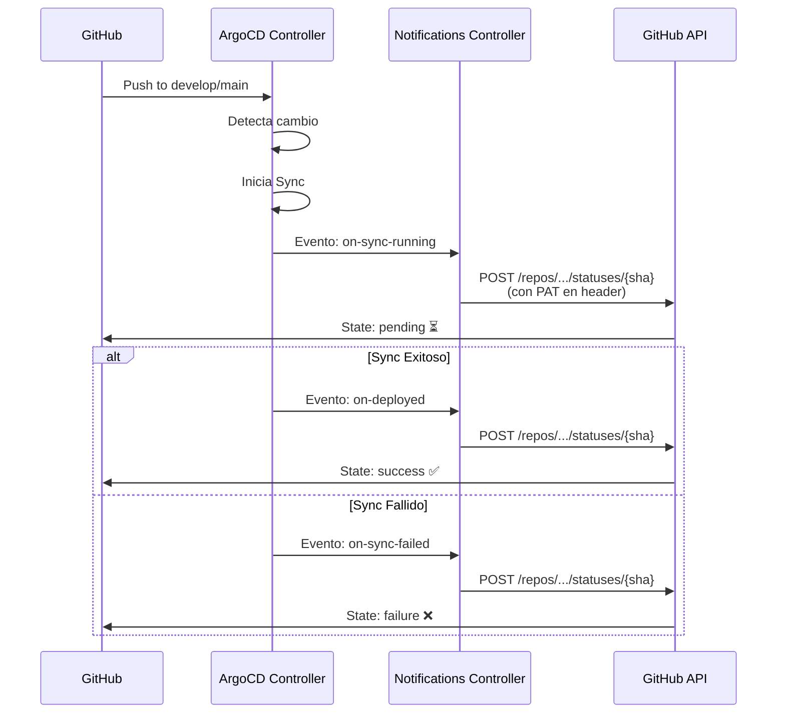

# GitHub Notifications con Personal Access Token

## Objetivo

Configurar ArgoCD Notifications con Personal Access Token para actualizar automáticamente el estado de los commits en GitHub cuando un despliegue se completa.

**💡 Ideal para**: Entornos de desarrollo y testing

**⚡ Ventajas**: Configuración simple y rápida (5 minutos)

**⚠️ Limitaciones**:

- Token vinculado a un usuario específico
- Expira (máximo 1 año en 2026)
- Permisos amplios

**📚 Para producción**: Considera usar [GitHub App](github-notifications-github-app.md)

---

## Arquitectura



---

## Instalación Paso a Paso

### Paso 1: Instalar ArgoCD Notifications Controller

Si no está instalado:

```bash
# Opción A: Manual (Recomendado - más simple)
kubectl apply -n argocd -f https://raw.githubusercontent.com/argoproj-labs/argocd-notifications/release-1.0/manifests/install.yaml

# Opción B: Con Helm (solo si ArgoCD se instaló con Helm)
helm upgrade --install argocd argo/argo-cd \
  --namespace argocd \
  --set notifications.enabled=true
```

**⚠️ Importante**: Si instalaste ArgoCD Notifications manualmente y luego intentas usar Helm, obtendrás un error de ownership. Elige un método y mantente con él.

**Si ya tienes el error de Helm**:

```bash
# Error: "invalid ownership metadata; label validation error: missing key app.kubernetes.io/managed-by"

# Solución 1: Eliminar la instalación manual y reinstalar con Helm
kubectl delete -n argocd -f https://raw.githubusercontent.com/argoproj-labs/argocd-notifications/release-1.0/manifests/install.yaml
helm upgrade --install argocd argo/argo-cd --namespace argocd --set notifications.enabled=true

# Solución 2: Continuar con kubectl (recomendado)
# No hacer nada, ya está instalado correctamente
```

Verificar:

```bash
kubectl get pods -n argocd | grep notifications
# Debe aparecer: argocd-notifications-controller-xxx
```

**Usando el Makefile** (usa kubectl apply):

```bash
make argocd-notifications-install
```

---

### Paso 2: Crear GitHub Personal Access Token

#### 2.1 Generar el Token

1. Ve a: **https://github.com/settings/tokens/new**
2. Configura:

| Campo          | Valor                                                                               |
| -------------- | ----------------------------------------------------------------------------------- |
| **Note**       | `argocd-notifications`                                                              |
| **Expiration** | 90 días (recomendado)<br/>o sin expiración (menos seguro)                           |
| **Scopes**     | ✅ `repo:status` (actualizar commit status)<br/>✅ `repo` (solo si es repo privado) |

3. Clic en **Generate token**
4. **Copia el token** (solo se muestra una vez): `ghp_xxxxxxxxxxxxxxxxxxxx`

#### 2.2 Guardar el Token de Forma Segura

**Opción recomendada**: Usar un gestor de contraseñas (1Password, LastPass, etc.)

**Para testing local**: Guardar en archivo git-ignored

```bash
echo "ghp_xxxxxxxxxxxxxxxxxxxx" > ~/.argocd-github-token
chmod 600 ~/.argocd-github-token
```

---

### Paso 3: Configurar el Secret en Kubernetes

#### Opción A: Comando Rápido (Recomendado)

```bash
# Interactivo - te pedirá el token
make argocd-notifications-setup
```

#### Opción B: Comando Manual

```bash
# Reemplaza TU_TOKEN_AQUI con tu token
kubectl create secret generic argocd-notifications-secret \
  --from-literal=github-token=ghp_xxxxxxxxxxxxxxxxxxxx \
  -n argocd

# Verificar que se creó
kubectl get secret argocd-notifications-secret -n argocd
```

#### Opción C: Usando Archivo YAML

```bash
# 1. Editar el archivo
vim k8s/argocd-notifications/github-token-secret.yaml

# 2. Agregar tu token en el campo github-token
# 3. Aplicar
kubectl apply -f k8s/argocd-notifications/github-token-secret.yaml
```

---

### Paso 4: Aplicar ConfigMap de Notificaciones

El ConfigMap ya está configurado para usar Personal Access Token por defecto.

```bash
kubectl apply -f k8s/argocd-notifications/configmap.yaml -n argocd
```

Verificar:

```bash
kubectl get configmap argocd-notifications-cm -n argocd -o yaml
```

Deberías ver:

```yaml
data:
  service.webhook.github-status: |
    url: https://api.github.com
    headers:
    - name: Authorization
      value: token $github-token
```

---

### Paso 5: Verificar la Configuración

#### 5.1 Test del Token

```bash
# Usando el Makefile
make argocd-notifications-test

# O manualmente
TOKEN=$(kubectl get secret argocd-notifications-secret -n argocd -o jsonpath='{.data.github-token}' | base64 -d)
curl -H "Authorization: token $TOKEN" https://api.github.com/user
```

Debe devolver tu información de usuario de GitHub.

#### 5.2 Ver Logs del Controller

```bash
# Usando el Makefile
make argocd-notifications-logs

# O manualmente
kubectl logs -n argocd -l app.kubernetes.io/name=argocd-notifications-controller -f
```

---

### Paso 6: Configurar Applications (Opcional)

Las Applications en `argocd/apps/` ya tienen las anotaciones configuradas:

```yaml
apiVersion: argoproj.io/v1alpha1
kind: Application
metadata:
  name: ansible-job-dev
  namespace: argocd
  annotations:
    # GitHub Commit Status
    notifications.argoproj.io/subscribe.on-deployed.github-status: ""
    notifications.argoproj.io/subscribe.on-sync-failed.github-status: ""
    notifications.argoproj.io/subscribe.on-sync-running.github-status: ""
    notifications.argoproj.io/subscribe.on-health-degraded.github-status: ""
```

**Subscripciones Globales**: El ConfigMap también tiene una sección `subscriptions` que aplica a todas las Applications automáticamente.

---

## Probar la Configuración

### 1. Hacer un Commit de Prueba

```bash
git commit --allow-empty -m "test: trigger argocd sync notification"
git push origin develop
```

### 2. Verificar en GitHub

Ve a tu commit en GitHub:

```
https://github.com/VanOps/kubernetes-job-over-VPN/commit/{SHA}
```

Deberías ver los estados:

| Estado         | Descripción                       | Cuándo aparece             |
| -------------- | --------------------------------- | -------------------------- |
| ⏳ **pending** | ArgoCD sync running               | Durante el sync            |
| ✅ **success** | Application deployed successfully | Sync exitoso + app healthy |
| ❌ **failure** | Deployment failed                 | Error en el sync           |

### 3. Ver en Pull Requests

Los estados también aparecen en los PRs automáticamente:

```
✅ argocd/ansible-job-dev — Application deployed successfully
```

---

## Troubleshooting

### Error: "No notification service found"

```bash
# Verificar que el secret existe
kubectl get secret argocd-notifications-secret -n argocd

# Ver detalles (el token estará en base64)
kubectl get secret argocd-notifications-secret -n argocd -o yaml

# Ver si hay errores en el controller
kubectl logs -n argocd deployment/argocd-notifications-controller --tail=50
```

**Solución**: Recrear el secret con `make argocd-notifications-setup`

---

### Error: "Bad credentials" en GitHub API

```bash
# Test manual del token
TOKEN=$(kubectl get secret argocd-notifications-secret -n argocd -o jsonpath='{.data.github-token}' | base64 -d)
echo "Token: $TOKEN"

curl -v -H "Authorization: token $TOKEN" https://api.github.com/user
```

**Posibles causas**:

- Token expirado (revisar en https://github.com/settings/tokens)
- Scopes insuficientes (debe tener `repo:status`)
- Token mal copiado (espacios, saltos de línea)

**Solución**: Regenerar token y actualizar el secret

```bash
# Actualizar el secret
kubectl create secret generic argocd-notifications-secret \
  --from-literal=github-token=NUEVO_TOKEN \
  -n argocd \
  --dry-run=client -o yaml | kubectl apply -f -

# Reiniciar el controller para que tome el nuevo token
kubectl rollout restart deployment argocd-notifications-controller -n argocd
```

---

### Las notificaciones no se envían

**Verificar ConfigMap**:

```bash
# Ver triggers
kubectl get cm argocd-notifications-cm -n argocd -o jsonpath='{.data.trigger\.on-deployed}'

# Ver servicio
kubectl get cm argocd-notifications-cm -n argocd -o jsonpath='{.data.service\.webhook\.github-status}'
```

**Verificar annotations de la Application**:

```bash
kubectl get app ansible-job-dev -n argocd -o yaml | grep notifications
```

**Forzar un sync manual**:

```bash
argocd app sync ansible-job-dev
```

**Ver logs detallados**:

```bash
kubectl logs -n argocd -l app.kubernetes.io/name=argocd-notifications-controller -f --tail=100
```

---

### Error: "API rate limit exceeded"

GitHub limita las peticiones API:

- Con autenticación: **5,000 requests/hora**
- Sin autenticación: 60 requests/hora

**Verificar límites**:

```bash
TOKEN=$(kubectl get secret argocd-notifications-secret -n argocd -o jsonpath='{.data.github-token}' | base64 -d)

curl -H "Authorization: token $TOKEN" https://api.github.com/rate_limit
```

**Solución**:

- Esperar a que se resetee el límite
- Para múltiples repos/instalaciones, considera migrar a [GitHub App](github-notifications-github-app.md)

---

## Mantenimiento

### Renovar Token Expirado

```bash
# 1. Crear nuevo token en GitHub (mismo proceso del Paso 2)
# 2. Actualizar el secret
kubectl create secret generic argocd-notifications-secret \
  --from-literal=github-token=NUEVO_TOKEN \
  -n argocd \
  --dry-run=client -o yaml | kubectl apply -f -

# 3. Reiniciar controller
kubectl rollout restart deployment argocd-notifications-controller -n argocd

# 4. Verificar
make argocd-notifications-test
```

### Rotar Token por Seguridad

Recomendado cada 90 días:

```bash
# 1. Crear nuevo token en GitHub
# 2. Actualizar secret (mismo comando de arriba)
# 3. Revocar el token antiguo en: https://github.com/settings/tokens
```

---

## Migrar a GitHub App

Cuando vayas a staging/producción, considera migrar a GitHub App para mayor seguridad:

**Ventajas de GitHub App**:

- ✅ No expira
- ✅ Permisos granulares (solo `commit status`)
- ✅ Independiente de usuarios
- ✅ Mejor auditabilidad

**Guía**: [GitHub Notifications con GitHub App](github-notifications-github-app.md)

**Comando rápido**:

```bash
make argocd-notifications-setup-app
```

---

## Resumen de Comandos

```bash
# Setup inicial
make argocd-notifications-install  # Instalar controller
make argocd-notifications-setup    # Configurar con PAT

# Verificación
make argocd-notifications-test     # Test del token
make argocd-notifications-logs     # Ver logs

# Mantenimiento
kubectl get secret argocd-notifications-secret -n argocd
kubectl rollout restart deployment argocd-notifications-controller -n argocd
```

---

## Comparación: PAT vs GitHub App

| Característica    | Personal Access Token  | GitHub App               |
| ----------------- | ---------------------- | ------------------------ |
| **Configuración** | ⭐ 5 minutos           | ⭐⭐⭐ 15-20 minutos     |
| **Expiración**    | Sí (max 1 año)         | No expira                |
| **Seguridad**     | ⭐⭐ Básica            | ⭐⭐⭐ Alta              |
| **Permisos**      | Amplios (todo el repo) | Granulares (solo status) |
| **Dependencia**   | Usuario específico     | Independiente            |
| **Ideal para**    | Dev/Testing            | Staging/Production       |

---

## Referencias

- [Documentación general](github-notifications.md)
- [GitHub App (alternativa)](github-notifications-github-app.md)
- [ArgoCD Notifications Docs](https://argocd-notifications.readthedocs.io/)
- [GitHub PAT Documentation](https://docs.github.com/en/authentication/keeping-your-account-and-data-secure/creating-a-personal-access-token)
- [GitHub Commit Status API](https://docs.github.com/en/rest/commits/statuses)
