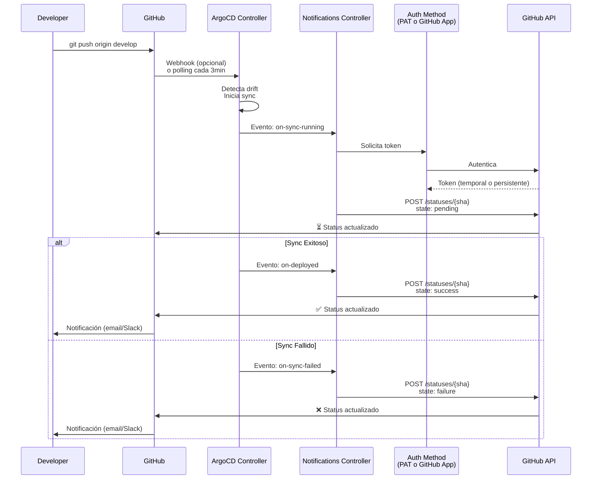
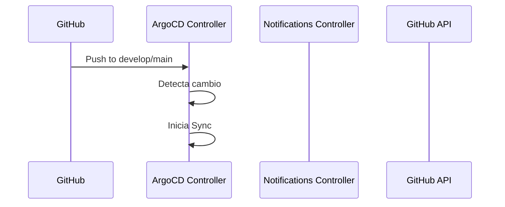

# Configurar GitHub Commit Status desde ArgoCD

## Objetivo

Configurar ArgoCD Notifications para actualizar automáticamente el estado de los commits en GitHub cuando un despliegue se completa (exitoso o fallido).

---

## Elige tu Método de Autenticación

Este proyecto soporta dos métodos para notificar a GitHub:

### 📄 [Método 1: Personal Access Token](github-notifications-pat.md)

**✅ Ideal para**: Desarrollo y testing

**Ventajas**:

- ⚡ Configuración rápida (5 minutos)
- 🎯 Simple y directa
- 📝 Fácil de entender

**Limitaciones**:

- ⏰ Expira (máximo 1 año)
- 👤 Vinculado a un usuario
- 🔓 Permisos amplios

**Comando rápido**:

```bash
make argocd-notifications-setup
```

**[📖 Ver Documentación Completa →](github-notifications-pat.md)**

---

### 🤖 [Método 2: GitHub App](github-notifications-github-app.md)

**✅ Ideal para**: Staging y producción

**Ventajas**:

- ♾️ Sin expiración
- 🔒 Permisos granulares (solo commit status)
- 🏢 Independiente de usuarios
- 📊 Mejor auditabilidad

**Complejidad**:

- ⏱️ Configuración más compleja (15-20 minutos)
- 🔧 Requiere más pasos

**Comando rápido**:

```bash
make argocd-notifications-setup-app
```

**[📖 Ver Documentación Completa →](github-notifications-github-app.md)**

---

## Comparación Rápida

| Característica    | [Personal Access Token](github-notifications-pat.md) | [GitHub App](github-notifications-github-app.md) |
| ----------------- | ---------------------------------------------------- | ------------------------------------------------ |
| **Tiempo setup**  | ⚡ 5 minutos                                         | ⏱️ 15-20 minutos                                 |
| **Complejidad**   | ⭐ Simple                                            | ⭐⭐⭐ Complejo                                  |
| **Expiración**    | ⚠️ Sí (max 1 año en 2026)                            | ✅ No expira                                     |
| **Permisos**      | 🔓 Amplios (todo el repo)                            | 🔒 Granulares (solo status)                      |
| **Dependencia**   | 👤 Usuario específico                                | 🏢 Independiente                                 |
| **Auditabilidad** | Usuario personal                                     | `App[bot]`                                       |
| **Rate limits**   | 5,000 req/hora                                       | 5,000 req/hora por instalación                   |
| **Mantenimiento** | ⚠️ Renovar anualmente                                | ✅ Opcional (anual)                              |
| **Seguridad**     | ⭐⭐ Básica                                          | ⭐⭐⭐ Alta                                      |
| **Ideal para**    | ✅ Dev/Testing                                       | ✅ Staging/Production                            |

---

## Resultado Esperado

Indistintamente del método que elijas, obtendrás:

### En GitHub Commits

```
✅ argocd/ansible-job-dev — Application deployed successfully
⏳ argocd/ansible-job-staging — ArgoCD sync running
❌ argocd/ansible-job-prod — Deployment failed
```

### En Pull Requests

Los estados de ArgoCD aparecen automáticamente en los PRs:

```
✅ All checks have passed

argocd/ansible-job-dev          ✅ Application deployed successfully
argocd/ansible-job-staging      ✅ Application deployed successfully
```

### Sobre el Estado del Commit

GitHub muestra 3 posibles estados:

| Estado      | Íconos | Descripción                     | Cuándo aparece                  |
| ----------- | ------ | ------------------------------- | ------------------------------- |
| **pending** | ⏳ 🟡  | ArgoCD está sincronizando       | Durante el sync                 |
| **success** | ✅ 🟢  | Aplicación desplegada y healthy | Sync exitoso + health OK        |
| **failure** | ❌ 🔴  | El despliegue falló             | Error en sync u health degraded |

---

## Arquitectura General



---

## Instalación Común (Ambos Métodos)

### Requisitos Previos

- Kubernetes cluster (1.28+)
- ArgoCD instalado y funcionando
- Acceso a GitHub (repos)
- `kubectl` configurado
- usa kubectl)
  make argocd-notifications-install

# Opción B: Manual con kubectl (más confiable)

kubectl apply -n argocd -f https://raw.githubusercontent.com/argoproj-labs/argocd-notifications/release-1.0/manifests/install.yaml

# Opción C: Con Helm (solo si todo tu ArgoCD se gestiona con Helm)

helm upgrade --install argocd argo/argo-cd \
 --namespace argocd \
 --set notifications.enabled=true

```

**⚠️ Advertencia sobre Helm**: Si ya instalaste manualmente con kubectl, NO uses Helm después (o viceversa). Obtendrás un error de ownership. Elige un método y mantenlo.

**Si tienes error de Helm**: Ya tienes ArgoCD Notifications instalado correctamente con kubectl. Simplemente continúa al siguiente paso.m upgrade --install argocd argo/argo-cd \
  --namespace argocd \
  --set notifications.enabled=true

# Opción C: Manual con kubectl
kubectl apply -n argocd -f https://raw.githubusercontent.com/argoproj-labs/argocd-notifications/release-1.0/manifests/install.yaml
```

Verificar:

```bash
kubectl get pods -n argocd | grep notifications
# Debe aparecer: argocd-notifications-controller-xxx
```

### Paso 2: Elegir tu Método

**Para desarrollo/testing (rápido)**:

- 📄 **[Ir a Documentación de Personal Access Token →](github-notifications-pat.md)**

**Para staging/producción (robusto)**:

- 🤖 **[Ir a Documentación de GitHub App →](github-notifications-github-app.md)**

---

## Comandos Rápidos

```bash
# Instalar controller (requerido para ambos métodos)
make argocd-notifications-install

# MÉTODO 1: Personal Access Token
make argocd-notifications-setup    # Setup interactivo
make argocd-notifications-test     # Verificar token

# MÉTODO 2: GitHub App
make argocd-notifications-setup-app  # Setup interactivo

# Comandos comunes
make argocd-notifications-logs     # Ver logs del controller
kubectl get secret argocd-notifications-secret -n argocd  # Ver secret
kubectl get cm argocd-notifications-cm -n argocd  # Ver config
```

---

## Troubleshooting General

### Error: Notifications controller no existe

```bash
# Instalar
make argocd-notifications-install

# Verificar
kubectl get pods -n argocd -l app.kubernetes.io/name=argocd-notifications-controller
```

### Error: Secret no encontrado

```bash
# Ver si existe
kubectl get secret argocd-notifications-secret -n argocd

# Recrear según el método que uses
make argocd-notifications-setup      # PAT
make argocd-notifications-setup-app  # GitHub App
```

### Las notificaciones no aparecen en GitHub

```bash
# 1. Ver logs
make argocd-notifications-logs

# 2. Verificar ConfigMap
kubectl get cm argocd-notifications-cm -n argocd -o yaml

# 3. Ver annotations en Applications
kubectl get app -n argocd -o yaml | grep notifications

# 4. Forzar un sync
argocd app sync ansible-job-dev
```

### Más troubleshooting específico

- **[Troubleshooting PAT →](github-notifications-pat.md#troubleshooting)**
- **[Troubleshooting GitHub App →](github-notifications-github-app.md#troubleshooting)**

---

## Migración entre Métodos

### De PAT a GitHub App (Recomendado para producción)

```bash
# 1. Configurar GitHub App (ver documentación)
make argocd-notifications-setup-app

# 2. Actualizar ConfigMap
# Editar k8s/argocd-notifications/configmap.yaml:
#   - Descomentar service.github (GitHub App)
#   - Comentar service.webhook.github-status (PAT)

kubectl apply -f k8s/argocd-notifications/configmap.yaml -n argocd

# 3. Reiniciar controller
kubectl rollout restart deployment argocd-notifications-controller -n argocd

# 4. Verificar logs
make argocd-notifications-logs

# 5. Revocar PAT antiguo (opcional)
# https://github.com/settings/tokens
```

### De GitHub App a PAT (Simplificar para dev)

```bash
# 1. Configurar PAT
make argocd-notifications-setup

# 2. Actualizar ConfigMap
# Editar k8s/argocd-notifications/configmap.yaml:
#   - Comentar service.github (GitHub App)
#   - Descomentar service.webhook.github-status (PAT)

kubectl apply -f k8s/argocd-notifications/configmap.yaml -n argocd

# 3. Reiniciar controller
kubectl rollout restart deployment argocd-notifications-controller -n argocd
```

---

## Configuración de Applications

Las Applications en `argocd/apps/*.yaml` ya tienen las anotaciones configuradas:

```yaml
apiVersion: argoproj.io/v1alpha1
kind: Application
metadata:
  name: ansible-job-dev
  namespace: argocd
  annotations:
    # GitHub Commit Status
    notifications.argoproj.io/subscribe.on-deployed.github-status: ""
    notifications.argoproj.io/subscribe.on-sync-failed.github-status: ""
    notifications.argoproj.io/subscribe.on-sync-running.github-status: ""
    notifications.argoproj.io/subscribe.on-health-degraded.github-status: ""
```

Esto funciona con ambos métodos (PAT y GitHub App).

---

## Próximos Pasos

- [ ] Configurar notificaciones para staging y prod
- [ ] Integrar con Slack/Teams para notificaciones adicionales
- [ ] Configurar alertas de salud degradada
- [ ] Crear dashboard de métricas de despliegue

---

## Referencias

### Documentación Específica

- 📄 **[Personal Access Token (PAT)](github-notifications-pat.md)** - Configuración con token personal
- 🤖 **[GitHub App](github-notifications-github-app.md)** - Configuración con aplicación de GitHub

### Recursos Externos

- [ArgoCD Notifications Docs](https://argocd-notifications.readthedocs.io/)
- [GitHub Commit Status API](https://docs.github.com/en/rest/commits/statuses)
- [ArgoCD Notification Services](https://argocd-notifications.readthedocs.io/en/stable/services/overview/)
- [GitHub Apps Documentation](https://docs.github.com/en/developers/apps)
- [GitHub PAT Documentation](https://docs.github.com/en/authentication/keeping-your-account-and-data-secure/creating-a-personal-access-token)

### Archivos de Configuración

- [argocd/apps/dev.yaml](../../argocd/apps/dev.yaml) - Application dev con annotations
- [argocd/apps/staging.yaml](../../argocd/apps/staging.yaml) - Application staging
- [argocd/apps/prod.yaml](../../argocd/apps/prod.yaml) - Application prod
- [k8s/argocd-notifications/configmap.yaml](../../k8s/argocd-notifications/configmap.yaml) - Configuración de notificaciones
- [k8s/argocd-notifications/github-token-secret.yaml](../../k8s/argocd-notifications/github-token-secret.yaml) - Template para PAT
- [k8s/argocd-notifications/github-app-secret.yaml](../../k8s/argocd-notifications/github-app-secret.yaml) - Template para GitHub App


