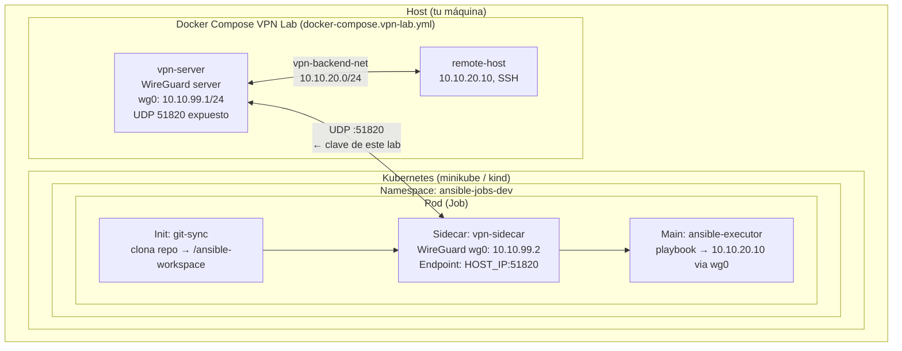

# Despliegue con Helm — Laboratorio VPN dockerizado

Guía paso a paso para desplegar el `ansible-job` Helm chart en un cluster Kubernetes real (minikube / kind / cualquier cluster local) conectando el init-container WireGuard al **laboratorio VPN dockerizado** del repositorio.

---

## Índice

1. [Arquitectura del escenario](#1-arquitectura-del-escenario)
2. [Requisitos previos](#2-requisitos-previos)
3. [Paso 1 — Generar claves y levantar el laboratorio VPN](#paso-1--generar-claves-y-levantar-el-laboratorio-vpn)
4. [Paso 2 — Determinar la IP del host accesible desde el cluster](#paso-2--determinar-la-ip-del-host-accesible-desde-el-cluster)
5. [Paso 3 — Adaptar el wg0.conf para Kubernetes](#paso-3--adaptar-el-wg0conf-para-kubernetes)
6. [Paso 4 — Crear los Secrets en Kubernetes](#paso-4--crear-los-secrets-en-kubernetes)
7. [Paso 5 — Desplegar con Helm](#paso-5--desplegar-con-helm)
8. [Paso 6 — Verificar el Job](#paso-6--verificar-el-job)
9. [Limpieza](#9-limpieza)
10. [Troubleshooting](#10-troubleshooting)

---

## 1. Arquitectura del escenario



**Diferencia clave vs Docker Compose:** cuando el pod corre en Kubernetes, el DNS `vpn-server` no existe. El `Endpoint` del `wg0.conf` debe apuntar a la **IP del host** accesible desde dentro del cluster, no al nombre Docker.

---

## 2. Requisitos previos

| Herramienta              | Versión mínima                     | Verificación             |
| ------------------------ | ---------------------------------- | ------------------------ |
| Kubernetes               | 1.28+ (ver nota de compatibilidad) | `kubectl version`        |
| Helm                     | 3.x                                | `helm version`           |
| Docker + Compose         | 24+ / v2                           | `docker compose version` |
| `wg` / `wireguard-tools` | cualquiera                         | `which wg`               |

> **Compatibilidad de Kubernetes y `sidecarMode`:**
>
> El chart soporta dos modos de ejecución del sidecar VPN, controlados por `vpn.sidecarMode`:
>
> | `sidecarMode` | Comportamiento | Requisito K8s |
> |---|---|---|
> | `"true"` (por defecto) | El sidecar usa `restartPolicy: Always` — [sidecar container nativo](https://kubernetes.io/docs/concepts/workloads/pods/sidecar-containers/). El sidecar VPN se mantiene activo durante toda la vida del Job. | K8s 1.28+ (vanilla) / K8s 1.29+ (EKS) |
> | `"false"` | El sidecar levanta WireGuard y termina su proceso principal. Compatible con clusters que no implementan la API nativa de sidecars (EKS 1.28 y anteriores). | K8s 1.27+ |
>
> Los valores de entorno ya reflejan esto: `values-dev.yaml` establece `sidecarMode: "false"` para compatibilidad con EKS 1.28.

### Cluster Kubernetes — opciones

```bash
# minikube (driver Docker — recomendado para este lab)
minikube start --kubernetes-version=v1.29.0 --driver=docker

# o kind
kind create cluster --image kindest/node:v1.29.0

# Cluster existente (kubeadm, bare-metal, cloud: EKS/GKE/AKS)
# Solo verificar que kubectl apunta al cluster correcto
kubectl cluster-info
kubectl config current-context
```

> Para clusters en la nube o en máquinas remotas, el `vpn-server` Docker debe ser accesible desde los nodos del cluster (ver [Paso 2](#paso-2--determinar-la-ip-del-host-accesible-desde-el-cluster)).

---

## Paso 1 — Generar claves y levantar el laboratorio VPN

Si es la primera vez, genera las claves WireGuard y SSH:

```bash
make lab-setup
```

Esto crea (y gitignora automáticamente):

- `test/vpn-lab/wg0-server.conf` — config del servidor WireGuard
- `test/vpn/wg0.conf` — config del cliente WireGuard (**Endpoint = vpn-server:51820**)
- `test/secrets/ssh-private-key` — clave SSH privada para Ansible
- `test/secrets/ssh-public-key` — clave SSH pública (montada en `remote-host`)

Luego levanta solo los servicios del laboratorio (sin el stack Ansible, que correrá en K8s):

```bash
make lab-up
```

Verifica que el servidor está sano:

```bash
make lab-vpn-status
# Debe mostrar la interfaz wg0 activa en el servidor

docker compose -f docker-compose.vpn-lab.yml ps
# vpn-server y remote-host deben estar "healthy"
```

---

## Paso 2 — Determinar la IP del host accesible desde el cluster

El pod en Kubernetes necesita alcanzar el `vpn-server` Docker a través de la red. La IP varía según el driver del cluster:

### minikube (driver Docker)

```bash
# La IP del gateway de la red minikube en el host
MINIKUBE_HOST_IP=$(docker network inspect minikube \
  | jq -r '.[0].IPAM.Config[0].Gateway')
echo "Host IP para wg0.conf: $MINIKUBE_HOST_IP"
# Típico: 192.168.49.1
```

Alternativa directa:

```bash
minikube ssh -- ip route show default | awk '{print $3}'
```

### kind

```bash
KIND_HOST_IP=$(docker network inspect kind \
  | jq -r '.[0].IPAM.Config[0].Gateway')
echo "Host IP para wg0.conf: $KIND_HOST_IP"
# Típico: 172.18.0.1
```

### Cluster real — kubeadm / bare-metal

Los nodos corren en máquinas físicas o VMs con acceso de red directo al host donde ejecuta el `vpn-server` Docker. Usa la IP de la interfaz del host que enruta hacia la subred de los nodos:

```bash
# Sustituye <NODE_IP> por la IP de cualquier nodo del cluster
NODE_IP=$(kubectl get nodes -o jsonpath='{.items[0].status.addresses[?(@.type=="InternalIP")].address}')

# IP del host que alcanza ese nodo (interfaz de salida correcta)
HOST_IP=$(ip route get "$NODE_IP" | awk '{for(i=1;i<=NF;i++) if($i=="src"){print $(i+1); exit}}')
echo "Host IP para wg0.conf: $HOST_IP"
```

> Asegúrate de que el puerto **UDP 51820** está abierto en el firewall del host (`ufw allow 51820/udp` o equivalente).

### Cluster cloud — EKS / GKE / AKS

Los nodos del cluster corren en la nube. El `vpn-server` Docker debe ser accesible desde internet o desde la VPC del proveedor.

**Opción A — IP pública del host:**

```bash
HOST_IP=$(curl -s https://ifconfig.me)
echo "Host IP pública: $HOST_IP"
```

Abre el puerto UDP 51820 en el firewall/security-group del host y, si hay NAT, configura el port-forwarding correspondiente.

**Opción B — IP privada (mismo proveedor cloud o VPN site-to-site):**

```bash
# IP privada de la interfaz del host dentro de la VPC / red del proveedor
HOST_IP=$(hostname -I | awk '{print $1}')
echo "Host IP privada: $HOST_IP"
```

> Para entornos de producción lo habitual es tener el `vpn-server` real en una VM dentro de la misma VPC o detrás de un NLB, no en un Docker de desarrollo.

### Verificar conectividad UDP desde dentro del cluster

```bash
kubectl run -it --rm net-test --image=alpine --restart=Never -- \
  sh -c "apk add -q nmap && nmap -sU -p 51820 ${HOST_IP}"
```

Salida esperada:

```
PORT      STATE         SERVICE
51820/udp open|filtered unknown
```

> **`open|filtered` es el resultado correcto y esperado para WireGuard.** UDP es un protocolo sin conexión: nmap envía un paquete UDP genérico y, si no recibe respuesta, no puede distinguir entre "el puerto está abierto pero ignoró el paquete" y "el firewall descartó el paquete silenciosamente". WireGuard no responde a paquetes UDP arbitrarios — solo a handshakes WireGuard válidos — por lo que siempre aparece como `open|filtered` cuando el puerto es alcanzable.
>
> Lo que garantiza este resultado: **el paquete llegó al host** (no hay firewall bloqueando antes). Si el puerto estuviera bloqueado por un firewall que rechaza activamente, nmap mostraría `closed`; si el host fuera inaccesible, mostraría `filtered` con un tiempo de espera mucho mayor.
>
> La prueba definitiva de que WireGuard funciona es que el sidecar VPN complete el handshake (ver [Paso 6b](#6b-logs-del-sidecar-vpn-init-container)).

---

## Paso 3 — Adaptar el wg0.conf para Kubernetes

El fichero generado por `setup.sh` usa `Endpoint = vpn-server:51820` (DNS Docker interno). Para Kubernetes hay que reemplazarlo con la IP real del host.

> **Solo cambia `Endpoint`. `AllowedIPs` no necesita modificarse** al cambiar de minikube a un cluster real: define qué tráfico se enruta por el túnel (independiente de dónde corre el pod).
>
> | Campo | Qué controla | ¿Cambia entre clusters? |
> |---|---|---|
> | `Endpoint` | IP/puerto del servidor WireGuard | **Sí** — depende del tipo de cluster (Paso 2) |
> | `AllowedIPs` | Subredes enrutadas por el túnel | **No** — depende de la red remota, no del cluster |
>
> Para este lab: `10.10.99.0/24` es la subred del túnel WireGuard y `10.10.20.0/24` es la subred del `remote-host`. En producción, ajusta `AllowedIPs` a las subredes reales que quieras alcanzar por la VPN.

### 3a. Copiar y editar (opción manual)

```bash
cp test/vpn/wg0.conf test/vpn/wg0-k8s.conf
```

Edita `test/vpn/wg0-k8s.conf` y sustituye la línea `Endpoint`:

```ini
[Interface]
PrivateKey = <CLIENT_PRIVATE_KEY>   # generado por setup.sh, no tocar
Address    = 10.10.99.2/24

[Peer]
PublicKey         = <SERVER_PUBLIC_KEY>   # generado por setup.sh, no tocar
# ── Cambia esta línea ──────────────────────────────────────────────────
Endpoint          = 192.168.49.1:51820   # ← IP del host desde el cluster
# ──────────────────────────────────────────────────────────────────────
AllowedIPs        = 10.10.99.0/24, 10.10.20.0/24
PersistentKeepalive = 25
```

### 3b. Script en una línea con sed

```bash
HOST_IP="192.168.49.1"    # resultado del Paso 2

sed "s|Endpoint = .*|Endpoint = ${HOST_IP}:51820|" \
  test/vpn/wg0.conf > test/vpn/wg0-k8s.conf

# Verificar
grep Endpoint test/vpn/wg0-k8s.conf
# Endpoint = 192.168.49.1:51820
```

> `wg0-k8s.conf` está gitignoreado igual que `wg0.conf`. No es necesario añadirlo al repo.

---

## Paso 4 — Crear los Secrets en Kubernetes

El chart espera **tres Secrets** en el namespace `ansible-jobs-dev`:

| Secret                   | Clave             | Contenido                                   |
| ------------------------ | ----------------- | ------------------------------------------- |
| `vpn-wireguard-config`   | `wg0.conf`        | Config WireGuard del cliente (wg0-k8s.conf) |
| `ansible-vault-password` | `vault-password`  | Contraseña del vault de Ansible             |
| `ansible-ssh-key`        | `ssh-private-key` | Clave SSH privada para Ansible              |

### Opción A — Makefile (crea con el wg0.conf original, solo para referencia)

```bash
make k8s-secrets-dev
```

> Este target usa `test/vpn/wg0.conf` (con el endpoint Docker). Para el lab K8s usa la **Opción B** con el fichero adaptado.

### Opción B — Kubectl directo (recomendado para este escenario)

```bash
# 1. Crear namespace
kubectl create namespace ansible-jobs-dev --dry-run=client -o yaml | kubectl apply -f -

# 2. Secret WireGuard (usa el wg0-k8s.conf adaptado con la IP del host)
kubectl create secret generic vpn-wireguard-config \
  --from-file=wg0.conf=./test/vpn/wg0-k8s.conf \
  -n ansible-jobs-dev \
  --dry-run=client -o yaml | kubectl apply -f -

# 3. Secret contraseña vault
kubectl create secret generic ansible-vault-password \
  --from-file=vault-password=./test/secrets/vault-password \
  -n ansible-jobs-dev \
  --dry-run=client -o yaml | kubectl apply -f -

# 4. Secret clave SSH
kubectl create secret generic ansible-ssh-key \
  --from-file=ssh-private-key=./test/secrets/ssh-private-key \
  -n ansible-jobs-dev \
  --dry-run=client -o yaml | kubectl apply -f -
```

### Verificar los Secrets

```bash
kubectl get secrets -n ansible-jobs-dev
# NAME                    TYPE     DATA   AGE
# vpn-wireguard-config    Opaque   1      ...
# ansible-vault-password  Opaque   1      ...
# ansible-ssh-key         Opaque   1      ...

# Inspeccionar el contenido del wg0.conf (base64 decode)
kubectl get secret vpn-wireguard-config -n ansible-jobs-dev \
  -o jsonpath='{.data.wg0\.conf}' | base64 -d

# Confirmar que el Endpoint apunta a la IP del host
kubectl get secret vpn-wireguard-config -n ansible-jobs-dev \
  -o jsonpath='{.data.wg0\.conf}' | base64 -d | grep Endpoint
# Endpoint = 192.168.49.1:51820
```

---

## Paso 5 — Desplegar con Helm

### 5a. Lint y dry-run (opcional pero recomendado)

```bash
# Lint del chart con valores dev
make helm-lint

# Ver el YAML renderizado sin desplegar
make helm-template-dev
```

### 5b. Instalar / actualizar el chart

```bash
helm upgrade --install ansible-job-dev helm/ansible-job/ \
  -f helm/ansible-job/values.yaml \
  -f helm/ansible-job/values-dev.yaml \
  --namespace ansible-jobs-dev \
  --create-namespace \
  --wait \
  --timeout 10m
```

> **Nota sobre `--wait`:** Helm esperará a que el Job complete o falle. El Job tiene `activeDeadlineSeconds: 900` (15 min en dev) como límite máximo.

### 5c. Parámetros importantes de `values-dev.yaml`

```yaml
environment: dev
vpn:
  image:
    tag: "latest"       # imagen del sidecar WireGuard
  secretName: vpn-wireguard-config  # debe coincidir con el Secret del Paso 4
  sidecarMode: "false"  # EKS 1.28: no soporta sidecars nativos; "true" para K8s 1.28+ vanilla

ansible:
  image:
    tag: "latest"
  playbook: playbooks/test-connectivity.yml  # playbook de prueba
  inventory: inventories/dev                 # apunta a 10.10.20.10 (remote-host)
  verbosity: 2                               # logs detallados para dev

gitSync:
  branch: develop  # rama que clonar (el repo en GitHub)

job:
  backoffLimit: 3           # reintentos ante fallo
  activeDeadlineSeconds: 900  # 15 min máximo
```

> **`sidecarMode`:** Con `"false"`, el init-container VPN levanta WireGuard y termina. El túnel permanece activo en el namespace de red compartido del pod. Usa `"true"` si tu cluster soporta la API nativa de sidecars (K8s 1.28+ vanilla o K8s 1.29+ EKS).

---

## Paso 6 — Verificar el Job

### 6a. Estado del Job y Pod

```bash
# Observar el Job en tiempo real
make k8s-watch-dev
# equivalente a: kubectl get jobs,pods -n ansible-jobs-dev -w

# Ver todos los pods del namespace
kubectl get pods -n ansible-jobs-dev -o wide
```

### 6b. Logs del sidecar VPN (init container)

El sidecar vpn debe aparecer como `Running` (o `Completed` si `sidecarMode: "false"`):

```bash
make k8s-logs-vpn-dev
# equivalente a:
kubectl logs -n ansible-jobs-dev \
  -l app.kubernetes.io/name=ansible-job \
  -c vpn-sidecar --follow
```

Salida esperada del sidecar VPN:

```
[VPN] Starting WireGuard sidecar (SKIP_VPN=false)
[VPN] Loading config from /etc/wireguard/wg0.conf
[VPN] Interface wg0 up — peer 10.10.99.1 handshake OK
[VPN] Monitoring wg0 every 10s...
```

### 6c. Logs del executor Ansible

```bash
make k8s-logs-dev
# equivalente a:
kubectl logs -n ansible-jobs-dev \
  -l app.kubernetes.io/name=ansible-job \
  -c ansible-executor --follow
```

Salida esperada con el playbook `test-connectivity.yml`:

```
PLAY [Test connectivity to remote hosts] *****

TASK [Ping remote-dev] ***
ok: [remote-dev]

TASK [Check SSH connectivity] ***
ok: [remote-dev]

PLAY RECAP *****
remote-dev    : ok=2    changed=0    unreachable=0    failed=0
```

### 6d. Comprobar que el job terminó con éxito

```bash
kubectl get job -n ansible-jobs-dev -o wide
# NAME             COMPLETIONS   DURATION   AGE
# ansible-job-dev  1/1           45s        2m
```

`COMPLETIONS 1/1` indica éxito.

---

## 9. Limpieza

```bash
# Eliminar el despliegue Helm
helm uninstall ansible-job-dev -n ansible-jobs-dev

# Eliminar los Secrets
kubectl delete secret vpn-wireguard-config ansible-vault-password ansible-ssh-key \
  -n ansible-jobs-dev

# Eliminar el namespace completo
kubectl delete namespace ansible-jobs-dev

# Parar el laboratorio Docker
make lab-down
```

Para borrar también las claves generadas y empezar desde cero:

```bash
make lab-clean
```

---

## 10. Troubleshooting

### El sidecar VPN no levanta

```bash
kubectl describe pod <pod-name> -n ansible-jobs-dev | grep -A 20 "vpn-sidecar"
kubectl logs <pod-name> -n ansible-jobs-dev -c vpn-sidecar
```

**Causa más común:** el endpoint del `wg0.conf` no es alcanzable desde el pod.

Comprueba:

1. Que el `vpn-server` Docker está corriendo: `docker compose -f docker-compose.vpn-lab.yml ps`
2. Que el puerto UDP 51820 está expuesto: `ss -ulnp | grep 51820`
3. Que la IP del host en `wg0.conf` es correcta (Paso 2 y 3)
4. Que el Secret tiene el fichero adaptado: `kubectl get secret vpn-wireguard-config -n ansible-jobs-dev -o jsonpath='{.data.wg0\.conf}' | base64 -d | grep Endpoint`

Prueba de conectividad UDP desde dentro del cluster:

```bash
# Lanzar un pod de diagnóstico en el mismo namespace
kubectl run -it --rm dig-test -n ansible-jobs-dev \
  --image=alpine --restart=Never -- \
  sh -c "apk add -q nmap && nmap -sU -p 51820 192.168.49.1 && echo OK"
```

### Ansible no llega al remote-host (10.10.20.10)

Si el sidecar VPN está levantado pero Ansible no puede conectar al host remoto:

```bash
# Entrar al pod en ejecución (si aún no ha terminado)
kubectl exec -it <pod-name> -n ansible-jobs-dev -c ansible-executor -- bash

# Dentro del pod: verificar que wg0 tiene la ruta
ip route show
# Debe aparecer: 10.10.20.0/24 dev wg0

# Ping al remote-host a través del túnel
ping -c 3 10.10.20.10

# Test SSH manual
ssh -i /run/secrets/ssh-private-key -o StrictHostKeyChecking=no \
  ansible@10.10.20.10 "hostname"
```

**Causa posible:** el `vpn-server` Docker no está haciendo NAT hacia la red `vpn-backend-net`. Verifica que `net.ipv4.ip_forward=1` está activo en el contenedor `vpn-server`:

```bash
docker exec vpn-server sysctl net.ipv4.ip_forward
# net.ipv4.ip_forward = 1
```

### El Secret vault-password no funciona

```bash
# Verificar contenido (sin salto de línea extra)
kubectl get secret ansible-vault-password -n ansible-jobs-dev \
  -o jsonpath='{.data.vault-password}' | base64 -d | wc -c

# Comparar con el fichero original
wc -c test/secrets/vault-password
```

Si los tamaños no coinciden, puede haber un salto de línea extra. Recrea el secret:

```bash
kubectl create secret generic ansible-vault-password \
  --from-literal=vault-password="$(cat test/secrets/vault-password | tr -d '\n')" \
  -n ansible-jobs-dev \
  --dry-run=client -o yaml | kubectl apply -f -
```

### El handshake WireGuard no se completa (cluster real o cloud)

Si el sidecar VPN arranca pero el handshake con el `vpn-server` no aparece, el problema suele ser de red externa:

**1. Verificar firewall del host (Linux):**

```bash
# Comprobar si el puerto UDP 51820 está abierto
ss -ulnp | grep 51820

# ufw (Ubuntu / Debian)
sudo ufw allow 51820/udp
sudo ufw status

# firewalld (RHEL / CentOS)
sudo firewall-cmd --add-port=51820/udp --permanent
sudo firewall-cmd --reload
```

**2. Verificar security group (AWS EKS):**

```bash
# Obtener el security group del host que corre vpn-server
aws ec2 describe-instances --filters "Name=...,Values=..." \
  --query 'Reservations[].Instances[].SecurityGroups'

# Añadir regla de entrada UDP 51820 desde los nodos del cluster
aws ec2 authorize-security-group-ingress \
  --group-id sg-XXXXXXXX \
  --protocol udp --port 51820 \
  --cidr <CIDR_DE_LOS_NODOS>
```

**3. Verificar firewall cloud (GCP GKE / Azure AKS):**

```bash
# GCP — añadir regla de entrada
gcloud compute firewall-rules create allow-wg \
  --allow udp:51820 \
  --source-ranges <CIDR_DE_LOS_NODOS>

# Azure — añadir regla NSG
az network nsg rule create --nsg-name <NSG> -g <RG> \
  --name allow-wg --priority 200 \
  --access Allow --protocol Udp \
  --destination-port-ranges 51820
```

**4. Comprobar IP pública o NAT:**

```bash
# Desde un pod dentro del cluster, verificar que la IP y el puerto son alcanzables
kubectl run -it --rm wg-test -n ansible-jobs-dev \
  --image=alpine --restart=Never -- \
  sh -c "apk add -q nmap && nmap -sU -p 51820 <HOST_IP> && echo REACHABLE || echo UNREACHABLE"
```

### Ver todos los eventos del namespace

```bash
kubectl get events -n ansible-jobs-dev --sort-by='.lastTimestamp'
```
