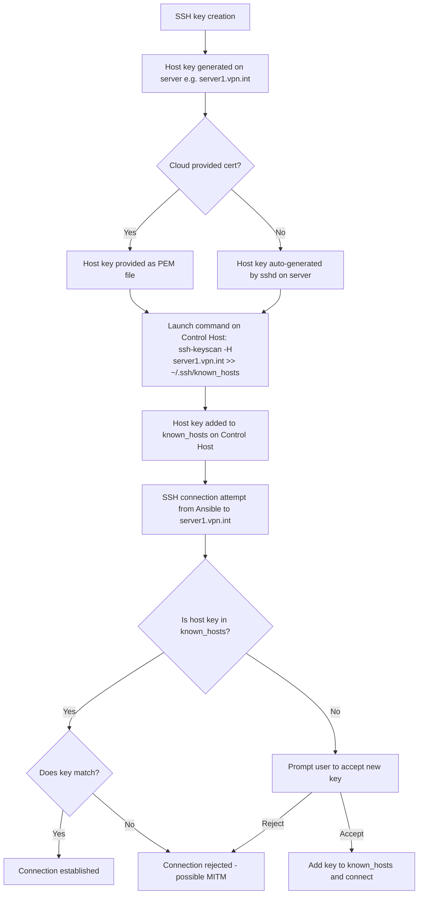
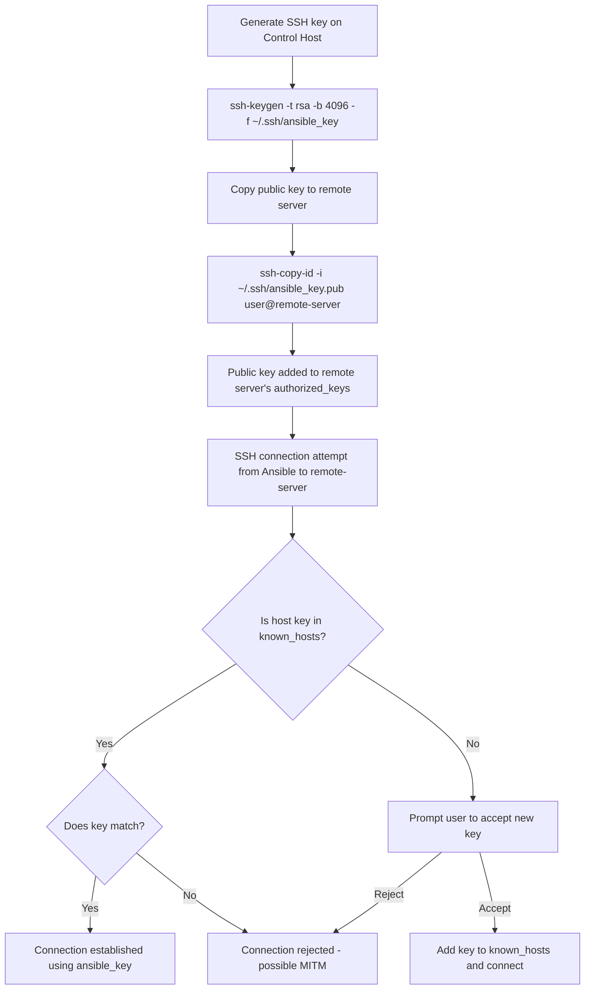
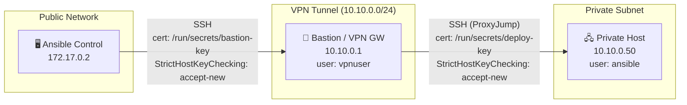

# 0 — Fundamentos SSH

**Audiencia**: DevOps engineers trabajando en entornos Linux (Debian 12 Bookworm)
**Objetivo**: Comprender los mecanismos de OpenSSH — verificación de host keys, ProxyJump y configuración del cliente SSH — como base para el uso avanzado con Ansible.

> **Siguiente**: [01-ansible-ssh-principles.md](01-ansible-ssh-principles.md) — Integración SSH en Ansible

---

## 📋 Tabla de Contenidos

1. [Gestión de known_hosts](#known-hosts)
2. [ProxyJump para Hosts Intermedios](#proxyjump)
3. [Configuración ssh_config](#ssh-config)
4. [Troubleshooting SSH](#troubleshooting)

---

## <a id="known-hosts"></a>1. Gestión de known_hosts

El archivo `~/.ssh/known_hosts` contiene las **huellas digitales (fingerprints)** de las claves públicas de servidores SSH conocidos. SSH verifica estas huellas para prevenir ataques **Man-in-the-Middle (MITM)**.

Este archivo debe ser gestionado en el host de control (donde se ejecuta el cliente SSH), no en los hosts remotos.

Cuando un host remoto cambia su clave SSH (por ejemplo, reinstalación del servidor), SSH detecta la discrepancia y rechaza la conexión para proteger contra MITM.

El siguiente flujo de proceso de configuración de host keys cubre tanto el caso de claves generadas en el servidor remoto como claves PEM provistas por cloud provider:



Otro modo de trabajo es generar una clave SSH en el Control Host y copiar la clave pública al servidor remoto (usando `ssh-copy-id` o manualmente), pero esto solo gestiona la autenticación, no la verificación de host keys.



Una prueba manual de verificación de host keys se puede hacer levantando este sencillo escenario docker. El proyecto incluye un servidor SSH hardened en `docker/ssh-test-server/` con las siguientes características de seguridad:

- ✅ Usuario no-root (`ansible`) con sudo NOPASSWD
- ✅ Autenticación solo por clave pública (sin passwords)
- ✅ Root login deshabilitado
- ✅ Python3 preinstalado para módulos Ansible

### Levanta lab Docker Compose

El lab completo está disponible en `docker-compose.ssh-lab.yml`:

```bash
# Levantar lab completo (servidor + cliente con tests automáticos)
docker compose -f docker-compose.ssh-lab.yml up --build
```

Comandos de apoyo:

```bash
# Ver logs de conexión
docker compose -f docker-compose.ssh-lab.yml logs -f ssh-client

# Cleanup
docker compose -f docker-compose.ssh-lab.yml down
```

### Ejecuta pruebas manuales sobre docker compose en el cliente

```bash
docker exec -it -u ansible ssh-test-client bash
```

#### Prueba 1: Conexión SSH directa al servidor

```bash
# Desde el cliente, probar conexión SSH al servidor
ssh -o StrictHostKeyChecking=accept-new ansible@ssh-server whoami
# cmd-output:
# ansible@ssh-client:/ansible$ ssh -o StrictHostKeyChecking=accept-new ansible@ssh-server whoami
# Warning: Permanently added 'ssh-server' (ED25519) to the list of known hosts.
# ansible@ssh-server: Permission denied (publickey).
```

#### Prueba 2: Usar Ansible desde el cliente para hacer ping al servidor

```bash
# Desde el cliente, usar Ansible para hacer ping al servidor
ansible all -i ssh-server, -u ansible --private-key=/home/ansible/.ssh/id_rsa -m ping
# [WARNING]: Error getting vault password file (default): The vault password file /run/secrets/vault-password was not found
# ERROR! The vault password file /run/secrets/vault-password was not found
```

#### Prueba 3: Verificar que la clave SSH del servidor se agregó a known_hosts

> **Nota**: Esta prueba muestra el estado en una sesión limpia (nueva ejecución de `docker exec`, sin haber ejecutado Prueba 1). Si ya ejecutaste Prueba 1, `known_hosts` ya contiene la clave del servidor gracias a `StrictHostKeyChecking=accept-new`.

```bash
# Verificar que la clave del servidor se agregó a known_hosts
cat ~/.ssh/known_hosts
# cmd-output:
# cat: /home/ansible/.ssh/known_hosts: No such file or directory
# agregar clave del servidor a known_hosts
ssh-keyscan -H ssh-server >> ~/.ssh/known_hosts
# cmd-output:
# # ssh-server:22 SSH-2.0-OpenSSH_9.2p1 Debian-2+deb12u7
cat ~/.ssh/known_hosts
# cmd-output:
# |1|ZM+6JY5g2GGbMWKCGw8n4xQ==|Hv3k... ssh-ed25519 AAAAC3NzaC1lZDI1NTE5AAAA...
```

### Ejecuta pruebas manuales sobre docker compose en el servidor

```bash
docker exec -u ansible  ssh-test-server bash -c "mkdir -p ~/.ssh"
docker exec -u ansible  ssh-test-client bash -c "mkdir -p ~/.ssh"
docker exec -it -u ansible ssh-test-server bash
```

#### Prueba 1: Probar conexión SSH con con autenticación por clave pública en el cliente desde el servidor

```bash
# Desde el servidor, probar conexión SSH al cliente usando la clave privada montada
ssh -i ~/.ssh/ansible_key -o StrictHostKeyChecking=accept-new ansible@ssh-client whoami
# cmd-output:
# ansible@ssh-server:/ansible$ ssh -i ~/.ssh/ansible_key -o StrictHostKeyChecking=accept-new ansible@ssh-client whoami
# Warning: Permanently added 'ssh-client' (ED25519) to the list of known hosts.
# ansible@ssh-client: Permission denied (publickey).
```

Es necesario agregar la clave pública del **servidor** al archivo `authorized_keys` del **cliente** para que la autenticación funcione correctamente.

```bash
# Agregar clave pública del cliente al servidor, creando una nueva clave SSH en el servidor primero
ssh-keygen -t rsa -b 4096 -f ~/.ssh/ansible_key
ssh-copy-id -i ~/.ssh/ansible_key.pub ansible@ssh-client
# cmd-output:
# ansible@ssh-server:/ansible$ ssh-keygen -t rsa -b 4096 -f ~/.ssh/ansible_key
# Generating public/private rsa key pair ...
# /usr/bin/ssh-copy-id: INFO: Source of key(s) to be installed: "~/.ssh/ansible_key.pub"
# /usr/bin/ssh-copy-id: INFO: attempting to log in with the new key(s), to filter out any that are already installed
# /usr/bin/ssh-copy-id: INFO: 1 key(s) remain to be installed -- if you are prompted now it is to install the new keys
# ansible@ssh-client: Permission denied (publickey).
```

Copia la clave pública generada en el servidor al cliente para que la autenticación funcione:

```bash
# Copiar clave pública del servidor al cliente
public_key=$(docker exec -u ansible ssh-test-server cat /home/ansible/.ssh/ansible_key.pub)
echo "$public_key" | docker exec -i -u ansible ssh-test-client bash -c "cat >>  /home/ansible/.ssh/authorized_keys"
```

Luego, desde el servidor, probar la conexión SSH al cliente usando la nueva clave:

```bash
# Desde el servidor, probar conexión SSH al cliente usando la clave privada del servidor
ssh -i ~/.ssh/ansible_key ansible@ssh-client whoami
# cmd-output:
# ansible
```

Si es necesario otorgar permisos root para determinadas tareas, se puede usar `sudo` desde el servidor agregando en el archivo `/etc/sudoers` la siguiente línea:

```
ansible ALL=(ALL) NOPASSWD: ALL

# Mas restrictivo, solo para ciertos comandos:
ansible ALL=(ALL) NOPASSWD: /usr/bin/apt, /usr/bin/systemctl

# Si se quiere solo subsystemas de systemctl, se puede usar:
ansible ALL=(ALL) NOPASSWD: /usr/bin/systemctl restart nginx, /usr/bin/systemctl restart apache2
```

### Ventajas sobre el Anterior

La siguiente tabla compara la imagen original `docker/remote-host` (usada en el stack principal) con la nueva imagen `docker/ssh-test-server` creada específicamente para este lab.

| Característica | Versión Anterior    | Versión Nueva            |
| -------------- | ------------------- | ------------------------ |
| Usuario        | `root` con password | `ansible` con pubkey     |
| Autenticación  | Password hardcoded  | SSH key only             |
| Root login     | Habilitado          | **Deshabilitado**        |
| Password auth  | Habilitado          | **Deshabilitado**        |
| Python         | No incluido         | Python3 preinstalado     |
| Sudo           | N/A                 | Configurado sin password |
| Reutilizable   | No                  | Dockerfile + entrypoint  |

Ver documentación completa en [`docker/ssh-test-server/README.md`](../../docker/ssh-test-server/README.md)

### Problema en Entornos Dinámicos

En producción con:

- IPs dinámicas (cloud autoscaling)
- Containers efímeros
- Kubernetes Jobs (cada Job = nuevo pod)

El archivo `known_hosts` puede quedar **obsoleto** o **inexistente**, causando fallos de conexión.

### Soluciones Producción

#### Opción 1: Pre-poblar known_hosts (Recomendado)

El comando `ssh-keyscan` permite agregar claves de hosts dinámicamente al archivo `known_hosts` antes de la conexión SSH. Esto es especialmente útil en entornos donde los hosts pueden cambiar frecuentemente, como en Kubernetes o cloud.

Se puede tener en cuenta en el entrypoint de un contenedor para ejecutar `ssh-keyscan` antes de cualquier conexión SSH:

```bash
# En initContainer o entrypoint:
ssh-keyscan -H 10.10.0.50 >> ~/.ssh/known_hosts
ssh-keyscan -H server1.vpn.int >> ~/.ssh/known_hosts
chmod 600 ~/.ssh/known_hosts
```

**Ventajas**: Seguridad MITM, auditable
**Desventajas**: Requiere conocer IPs destino de antemano o tener un proceso dinámico para actualizar known_hosts

#### Opción 2: StrictHostKeyChecking=no (Solo Dev/Testing)

El parámetro `StrictHostKeyChecking=no` deshabilita la verificación de host keys, permitiendo conexiones sin importar el estado de `known_hosts`.

Los valores posibles para `StrictHostKeyChecking` más utilizados son:

| Valor        | Comportamiento                                                  | Uso Recomendado |
| ------------ | --------------------------------------------------------------- | --------------- |
| `yes`        | Rechaza hosts desconocidos + claves cambiadas (default OpenSSH) | **Producción**  |
| `no`         | Acepta todo sin verificar (⚠️ inseguro)                         | Solo Lab local  |
| `accept-new` | Acepta nuevos, rechaza cambios                                  | Infra dinámica  |
| `ask`        | Pregunta al usuario (no funciona en automation)                 | N/A             |

Ejemplos de configuración por nivel — para uso en Ansible ver [01-ansible-ssh-principles.md](01-ansible-ssh-principles.md):

```bash
# ssh_config — aplica a SSH client globalmente
Host *.vpn.int
    StrictHostKeyChecking accept-new
    UserKnownHostsFile ~/.ssh/known_hosts_vpn
```

---

## <a id="proxyjump"></a>2. ProxyJump para Hosts Intermedios

`ProxyJump` (OpenSSH 7.3+) permite SSH a través de un **bastion host** sin túneles manuales.

### Escenario: Control → Bastion VPN → Hosts Privados



### Configuración ssh_config

```bash
# ~/.ssh/config
Host bastion
    HostName 10.10.0.1
    User vpnuser
    IdentityFile /run/secrets/bastion-key
    StrictHostKeyChecking accept-new

Host *.private.int
    ProxyJump bastion
    User ansible
    IdentityFile /run/secrets/deploy-key
    StrictHostKeyChecking accept-new
```

### Verificación Manual

```bash
# Test ProxyJump
ssh -J bastion.vpn.int ansible@server1.private.int whoami

# Debug verbose
ssh -vvv -J bastion.vpn.int ansible@server1.private.int
```

> Para configurar ProxyJump en Ansible (`ansible_ssh_common_args`), ver [01-ansible-ssh-principles.md](01-ansible-ssh-principles.md).

---

## <a id="ssh-config"></a>3. Configuración ssh_config

Archivo: `/etc/ssh/ssh_config` (sistema) o `~/.ssh/config` (usuario).

```
# ~/.ssh/config — SSH client config

# Global defaults
Host *
    ServerAliveInterval 60
    ServerAliveCountMax 3
    TCPKeepAlive yes
    Compression yes
    StrictHostKeyChecking accept-new
    UserKnownHostsFile ~/.ssh/known_hosts
    IdentitiesOnly yes

# VPN-accessed hosts
Host *.vpn.int
    ProxyJump bastion.vpn.int
    User ansible
    IdentityFile /run/secrets/deploy-key
    ControlMaster auto
    ControlPersist 300s
    ControlPath /tmp/ssh-control-%h-%p-%r

# Bastion host
Host bastion.vpn.int
    HostName 10.10.0.1
    User vpnuser
    IdentityFile /run/secrets/bastion-key
    ForwardAgent no
    PermitLocalCommand no

# Dev environment (local testing)
Host dev-*.local
    StrictHostKeyChecking no
    UserKnownHostsFile /dev/null
    LogLevel ERROR
```

### Opciones Clave para Producción

| Opción                | Valor Recomendado | Razón                                         |
| --------------------- | ----------------- | --------------------------------------------- |
| `ServerAliveInterval` | `60`              | Mantiene conexión viva (NAT/firewalls)        |
| `ServerAliveCountMax` | `3`               | Reintentos antes de timeout                   |
| `ControlPersist`      | `300s` (5 min)    | Reutiliza conexión (reduce handshakes)        |
| `Compression`         | `yes`             | Útil en enlaces lentos/VPN                    |
| `IdentitiesOnly`      | `yes`             | Previene probar todas las claves en ssh-agent |
| `ForwardAgent`        | `no`              | Seguridad — evita agent hijacking             |

### Verificar Config Efectiva

```bash
# Ver config SSH parseada para un host
ssh -G server1.vpn.int

# Output muestra valores finales aplicados (incluye defaults)
```

---

## <a id="troubleshooting"></a>4. Troubleshooting SSH

### 🔴 Error: "Host key verification failed"

```
ssh: connect to host server1: port 22: Connection refused
@@@@@@@@@@@@@@@@@@@@@@@@@@@@@@@@@@@@@@@@@@@@@@@@@@@@@@@@@@@
@    WARNING: REMOTE HOST IDENTIFICATION HAS CHANGED!     @
@@@@@@@@@@@@@@@@@@@@@@@@@@@@@@@@@@@@@@@@@@@@@@@@@@@@@@@@@@@
Host key verification failed.
```

**Causa**: Clave en `known_hosts` no coincide o falta
**Solución**:

```bash
# Remover entrada antigua
ssh-keygen -R 10.10.0.50

# Añadir nueva
ssh-keyscan -H 10.10.0.50 >> ~/.ssh/known_hosts
```

---

### 🔴 Error: "Permission denied (publickey)"

```
ansible@10.10.0.50: Permission denied (publickey).
```

**Causa**: Clave SSH no autorizada o no encontrada
**Diagnóstico**:

```bash
# Test manual con verbose
ssh -vvv -i /run/secrets/ssh-key ansible@10.10.0.50

# Verificar permisos (deben ser 600)
ls -la /run/secrets/ssh-key

# Verificar si clave está en authorized_keys del remoto
ssh root@10.10.0.50 "cat ~/.ssh/authorized_keys"
```

**Solución**:

```bash
# Copiar clave pública al remoto (una sola vez)
ssh-copy-id -i /run/secrets/ssh-key.pub ansible@10.10.0.50
```

---

### 🟡 Debug: Aumentar Verbosidad SSH

```bash
# Debug SSH manual (niveles: -v, -vv, -vvv)
ssh -vvv ansible@10.10.0.50

# Con ProxyJump
ssh -vvv -J bastion.vpn.int ansible@server1.private.int
```

> Para verbosidad de `ansible-playbook`, ver [01-ansible-ssh-principles.md](01-ansible-ssh-principles.md).

---

## 🔗 Referencias

- [OpenSSH Config Man Page](https://man.openbsd.org/ssh_config)
- [SSH ProxyJump Tutorial](https://www.redhat.com/sysadmin/ssh-proxy-bastion-proxyjump)
- [Debian 12 SSH Hardening](https://wiki.debian.org/SSH)
- [`docker/ssh-test-server/README.md`](../../docker/ssh-test-server/README.md)

---

**Siguiente**: [01-ansible-ssh-principles.md](01-ansible-ssh-principles.md) — Integración SSH en Ansible (ansible.cfg, variables, ProxyJump con ansible_ssh_common_args)
