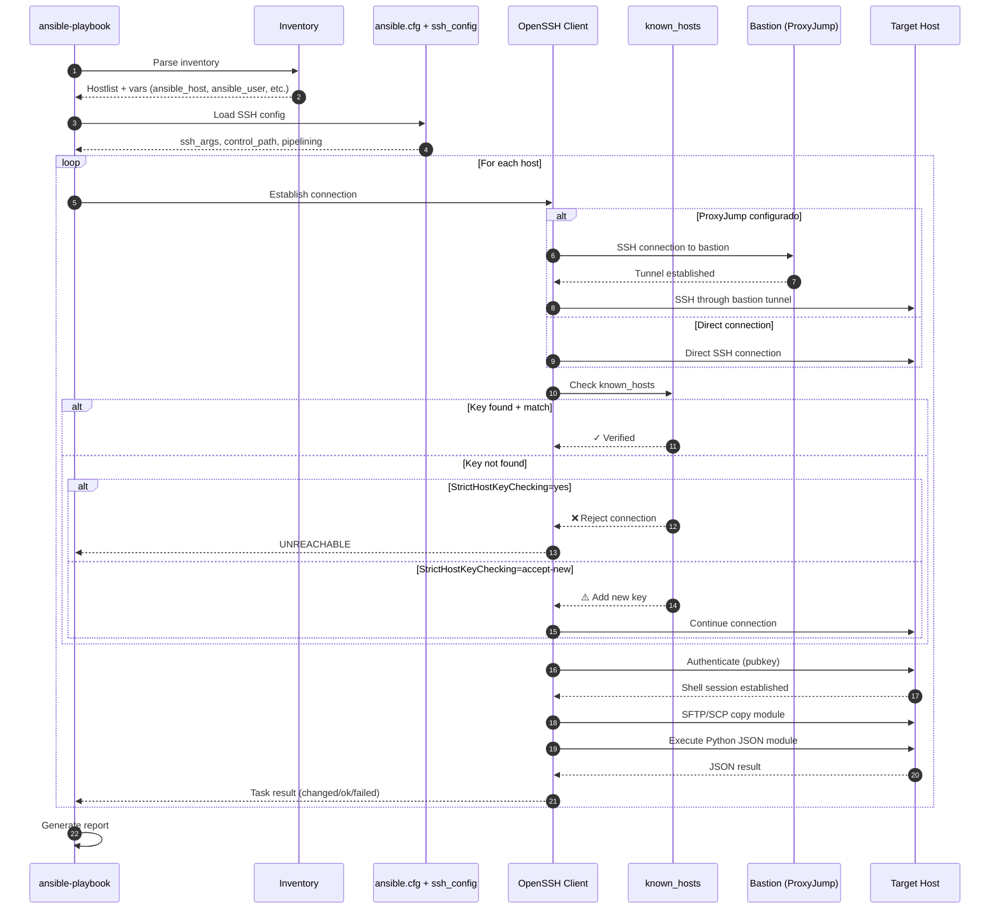

# 01 — Principios SSH en Ansible

**Audiencia**: DevOps engineers trabajando con Ansible 2.16+ en Debian 12 Bookworm  
**Objetivo**: Entender cómo Ansible gestiona conexiones SSH, autenticación y opciones de configuración críticas para entornos de producción.

---

## 📋 Tabla de Contenidos

1. [Fundamentos SSH en Ansible](#fundamentos)
2. [Gestión de known_hosts](#known-hosts)
3. [StrictHostKeyChecking](#strict-host-key-checking)
4. [ProxyJump para Hosts Intermedios](#proxyjump)
5. [Configuración ansible.cfg](#ansible-cfg)
6. [Configuración ssh_config](#ssh-config)
7. [Diagrama de Flujo: Conexión SSH](#diagrama-flujo)
8. [Troubleshooting Común](#troubleshooting)

---

## <a id="fundamentos"></a>1. Fundamentos SSH en Ansible

Ansible utiliza **OpenSSH** como transporte por defecto (connection plugin `ssh`). Desde Ansible 2.x, el plugin SSH usa `ControlMaster` y `ControlPersist` para multiplexar conexiones y reducir latencia.

### Flujo de Conexión SSH en Ansible

```
ansible-playbook → Inventory → foreach host:
  1. Resuelve hostname/IP
  2. Busca SSH key (ansible_ssh_private_key_file o ~/.ssh/id_rsa)
  3. Establece ControlMaster socket (si está habilitado)
  4. Ejecuta módulos vía SFTP/SCP → Python en remoto
  5. Limpia temp files y cierra conexión (o reutiliza socket)
```

### Variables SSH Importantes en Ansible

| Variable                       | Descripción                           | Ejemplo                        |
| ------------------------------ | ------------------------------------- | ------------------------------ |
| `ansible_host`                 | IP/hostname del host                  | `10.10.0.50`                   |
| `ansible_port`                 | Puerto SSH (default: 22)              | `2222`                         |
| `ansible_user`                 | Usuario SSH                           | `deploy`                       |
| `ansible_ssh_private_key_file` | Ruta a la clave privada               | `/run/secrets/ssh-key`         |
| `ansible_ssh_common_args`      | Args adicionales para todos los hosts | `-o ControlMaster=auto`        |
| `ansible_ssh_extra_args`       | Args adicionales específicos del host | `-o ProxyJump=bastion.vpn.int` |

---

## <a id="known-hosts"></a>2. Gestión de known_hosts

El archivo `~/.ssh/known_hosts` contiene las **huellas digitales (fingerprints)** de las claves públicas de servidores SSH conocidos. SSH verifica estas huellas para prevenir ataques **Man-in-the-Middle (MITM)**.

### Problema en Entornos Dinámicos

En producción con:

- IPs dinámicas (cloud autoscaling)
- Containers efímeros
- Kubernetes Jobs (cada Job = nuevo pod)

El archivo `known_hosts` puede quedar **obsoleto** o **inexistente**, causando fallos de conexión.

### Soluciones Producción

#### Opción 1: Pre-poblar known_hosts (Recomendado)

```bash
# En initContainer o entrypoint:
ssh-keyscan -H 10.10.0.50 >> ~/.ssh/known_hosts
ssh-keyscan -H server1.vpn.int >> ~/.ssh/known_hosts
chmod 600 ~/.ssh/known_hosts
```

**Ventajas**: Seguridad MITM, auditable  
**Desventajas**: Requiere conocer IPs de antemano

#### Opción 2: StrictHostKeyChecking=no (Solo Dev/Testing)

```ini
# ansible.cfg
[ssh_connection]
ssh_args = -o StrictHostKeyChecking=no -o UserKnownHostsFile=/dev/null
```

⚠️ **NUNCA en producción** — vulnerable a MITM

#### Opción 3: StrictHostKeyChecking=accept-new (Ansible 2.12+)

```bash
# Solo acepta nuevas claves, rechaza cambios
ssh -o StrictHostKeyChecking=accept-new user@host
```

**Balance**: Acepta nuevas IPs pero detecta cambios sospechosos.

---

## <a id="strict-host-key-checking"></a>3. StrictHostKeyChecking

Control de verificación de host keys SSH:

| Valor        | Comportamiento                                                  | Uso Recomendado |
| ------------ | --------------------------------------------------------------- | --------------- |
| `yes`        | Rechaza hosts desconocidos + claves cambiadas (default OpenSSH) | **Producción**  |
| `no`         | Acepta todo sin verificar (⚠️ inseguro)                         | Solo Lab local  |
| `accept-new` | Acepta nuevos, rechaza cambios                                  | Infra dinámica  |
| `ask`        | Pregunta al usuario (no funciona en automation)                 | N/A             |

### Configuración por Nivel

```ini
# 1. ansible.cfg — aplica a todos los hosts
[ssh_connection]
ssh_args = -o ControlMaster=auto -o ControlPersist=60s -o StrictHostKeyChecking=accept-new

# 2. ssh_config — aplica a SSH client globalmente
Host *.vpn.int
    StrictHostKeyChecking accept-new
    UserKnownHostsFile ~/.ssh/known_hosts_vpn

# 3. Inventory/Playbook — override por host
ansible_ssh_extra_args: '-o StrictHostKeyChecking=yes'
```

### Precedencia (Mayor → Menor)

```
Playbook/Inventory vars > ansible.cfg > ssh_config > SSH defaults
```

---

## <a id="proxyjump"></a>4. ProxyJump para Hosts Intermedios

`ProxyJump` (OpenSSH 7.3+) permite SSH a través de un **bastion host** sin túneles manuales.

### Escenario: Ansible → Bastion VPN → Hosts Privados

```
┌─────────────────┐      ┌──────────────────┐      ┌────────────────────┐
│ Ansible Control │──────▶│ Bastion (VPN GW) │──────▶│ Private Host       │
│ 172.17.0.2      │ SSH  │ 10.10.0.1        │ SSH  │ 10.10.0.50         │
└─────────────────┘      └──────────────────┘      └────────────────────┘
  Public network           VPN tunnel                Private subnet
```

### Configuración ssh_config

```
# ~/.ssh/config
Host bastion
    HostName 10.10.0.1
    User vpnuser
    IdentityFile /run/secrets/bastion-key
    StrictHostKeyChecking accept-new

Host *.private.int
    ProxyJump bastion
    User ansible
    IdentityFile /run/secrets/deploy-key
    StrictHostKeyChecking accept-new
```

### Alternativa: ansible_ssh_extra_args

```yaml
# inventories/prod/group_vars/all.yml
ansible_ssh_common_args: >-
  -o ControlMaster=auto
  -o ControlPersist=300s
  -o ProxyJump=bastion.vpn.int
  -o ServerAliveInterval=60
```

### Verificación Manual

```bash
# Test ProxyJump
ssh -J bastion.vpn.int ansible@server1.private.int whoami

# Debug verbose
ssh -vvv -J bastion.vpn.int ansible@server1.private.int
```

---

## <a id="ansible-cfg"></a>5. Configuración ansible.cfg (Debian 12)

Archivo ubicado en `/etc/ansible/ansible.cfg` o `./ansible.cfg` (proyecto).

```ini
[defaults]
inventory         = ./inventories/prod
roles_path        = ./roles
host_key_checking = True  # Habilitar verificación (default)
timeout           = 30
forks             = 10
gathering         = smart
filter_plugins    = ./plugins/filter

[ssh_connection]
# Control sockets para multiplexing
ssh_args = -o ControlMaster=auto -o ControlPersist=300s -o ServerAliveInterval=60 -o ServerAliveCountMax=3
control_path = /tmp/ansible-ssh-%%h-%%p-%%r

# Pipelining: ejecuta múltiples tareas en una conexión (requiere requiretty=false en sudoers)
pipelining = True

# Transfer method: smart (default), sftp, scp, piped
transfer_method = smart

# SFTP batch mode (reduce round-trips)
sftp_batch_mode = True

# Retries en conexión
ssh_retries = 3

[privilege_escalation]
become = True
become_method = sudo
become_user = root
become_ask_pass = False
```

### Notas Debian-Específicas

1. **Pipelining + sudo**: Requiere editar `/etc/sudoers`:

   ```
   Defaults !requiretty
   ```

2. **Python interpreter**: Debian 12 usa Python 3.11 por defecto:

   ```yaml
   ansible_python_interpreter: /usr/bin/python3
   ```

3. **Locales**: Asegurar UTF-8 para evitar warnings:
   ```bash
   export LC_ALL=en_US.UTF-8
   ```

---

## <a id="ssh-config"></a>6. Configuración ssh_config (Debian-Specific)

Archivo: `/etc/ssh/ssh_config` (sistema) o `~/.ssh/config` (usuario).

```
# ~/.ssh/config — Ansible-optimized SSH config

# Global defaults
Host *
    ServerAliveInterval 60
    ServerAliveCountMax 3
    TCPKeepAlive yes
    Compression yes
    StrictHostKeyChecking accept-new
    UserKnownHostsFile ~/.ssh/known_hosts
    IdentitiesOnly yes

# VPN-accessed hosts
Host *.vpn.int
    ProxyJump bastion.vpn.int
    User ansible
    IdentityFile /run/secrets/deploy-key
    ControlMaster auto
    ControlPersist 300s
    ControlPath /tmp/ssh-control-%h-%p-%r

# Bastion host
Host bastion.vpn.int
    HostName 10.10.0.1
    User vpnuser
    IdentityFile /run/secrets/bastion-key
    ForwardAgent no
    PermitLocalCommand no

# Dev environment (local testing)
Host dev-*.local
    StrictHostKeyChecking no
    UserKnownHostsFile /dev/null
    LogLevel ERROR
```

### Opciones Clave para Producción

| Opción                | Valor Recomendado | Razón                                         |
| --------------------- | ----------------- | --------------------------------------------- |
| `ServerAliveInterval` | `60`              | Mantiene conexión viva (NAT/firewalls)        |
| `ServerAliveCountMax` | `3`               | Reintentos antes de timeout                   |
| `ControlPersist`      | `300s` (5 min)    | Reutiliza conexión (reduce handshakes)        |
| `Compression`         | `yes`             | Útil en enlaces lentos/VPN                    |
| `IdentitiesOnly`      | `yes`             | Previene probar todas las claves en ssh-agent |
| `ForwardAgent`        | `no`              | Seguridad — evita agent hijacking             |

### Verificar Config Efectiva

```bash
# Ver config SSH parseada para un host
ssh -G server1.vpn.int

# Output muestra valores finales aplicados (incluye defaults)
```

---

## <a id="diagrama-flujo"></a>7. Diagrama de Flujo: Conexión SSH Ansible → Remoto



### Explicación de Pasos

1-3. **Inicialización**: Ansible parsea inventory y configuración SSH  
4-6. **Loop por Host**: Para cada host en inventory  
7-11. **ProxyJump**: Si configurado, establece túnel a través de bastion  
12-19. **Verificación known_hosts**: Valida fingerprint según StrictHostKeyChecking  
20-21. **Autenticación**: Clave pública SSH (pubkey)  
22-24. **Ejecución**: Copia módulo Python y ejecuta  
25. **Resultado**: Ansible procesa JSON y marca tarea como changed/ok/failed

---

## <a id="troubleshooting"></a>8. Troubleshooting Común

### 🔴 Error: "Host key verification failed"

```
fatal: [server1]: UNREACHABLE! => {"changed": false, "msg": "Failed to connect to the host via ssh:
Host key verification failed.", "unreachable": true}
```

**Causa**: Clave en `known_hosts` no coincide o falta  
**Solución**:

```bash
# Remover entrada antigua
ssh-keygen -R 10.10.0.50

# Añadir nueva
ssh-keyscan -H 10.10.0.50 >> ~/.ssh/known_hosts

# O temporalmente (dev only):
export ANSIBLE_HOST_KEY_CHECKING=False
```

---

### 🔴 Error: "Permission denied (publickey)"

```
fatal: [server1]: UNREACHABLE! => {"msg": "Failed to connect: Permission denied (publickey)."}
```

**Causa**: Clave SSH no autorizada o no encontrada  
**Diagnóstico**:

```bash
# Test manual con verbose
ssh -vvv -i /run/secrets/ssh-key ansible@10.10.0.50

# Verificar permisos (deben ser 600)
ls -la /run/secrets/ssh-key

# Verificar si clave está en authorized_keys del remoto
ssh root@10.10.0.50 "cat ~/.ssh/authorized_keys"
```

**Solución**:

```bash
# Copiar clave pública al remoto (una sola vez)
ssh-copy-id -i /run/secrets/ssh-key.pub ansible@10.10.0.50
```

---

### 🔴 Error: "Timeout waiting for privilege escalation prompt"

```
fatal: [server1]: FAILED! => {"msg": "Timeout (30s) waiting for privilege escalation prompt"}
```

**Causa**: `sudo` requiere password o TTY  
**Solución**:

```bash
# En target host, editar /etc/sudoers (visudo):
ansible ALL=(ALL) NOPASSWD: ALL
Defaults:ansible !requiretty
```

---

### 🔴 Error: "Control socket connect failed"

```
ControlSocket /tmp/ansible-ssh-10.10.0.50-22-ansible already exists
```

**Causa**: Socket de ControlMaster huérfano  
**Solución**:

```bash
# Limpiar sockets
rm -f /tmp/ansible-ssh-*

# O deshabilitar temporalmente ControlMaster
ansible-playbook -e 'ansible_ssh_args="-o ControlMaster=no"' playbook.yml
```

---

### 🟡 Warning: "Locale not found"

```
perl: warning: Setting locale failed.
perl: warning: Please check that your locale settings
```

**Causa**: Locales no configurados en Debian  
**Solución**:

```bash
# En Ansible control node (Debian 12):
sudo apt-get install locales
sudo dpkg-reconfigure locales
# Seleccionar: en_US.UTF-8 UTF-8

# Exportar en ~/.bashrc:
export LC_ALL=en_US.UTF-8
export LANG=en_US.UTF-8
```

---

### 🟡 Debug: Aumentar Verbosidad SSH

```bash
# Nivel 1 (básico)
ansible-playbook -v playbook.yml

# Nivel 3 (SSH debug)
ansible-playbook -vvv playbook.yml

# Nivel 4 (máximo - SSH + Python modules)
ansible-playbook -vvvv playbook.yml

# SSH debug manual
ssh -vvv ansible@10.10.0.50
```

---

## 🔗 Referencias

- [Ansible SSH Connection Plugin Docs](https://docs.ansible.com/ansible/latest/collections/ansible/builtin/ssh_connection.html)
- [OpenSSH Config Man Page](https://man.openbsd.org/ssh_config)
- [SSH ProxyJump Tutorial](https://www.redhat.com/sysadmin/ssh-proxy-bastion-proxyjump)
- [Debian 12 SSH Hardening](https://wiki.debian.org/SSH)

---

## ✅ Checklist Producción

- [ ] `StrictHostKeyChecking=accept-new` o `yes`
- [ ] `known_hosts` pre-poblado en initContainer
- [ ] `ControlPersist` habilitado (300s)
- [ ] `Pipelining=True` + `Defaults !requiretty`
- [ ] SSH keys con permisos `600`
- [ ] `ServerAliveInterval=60` para mantener conexiones
- [ ] ProxyJump configurado para bastion
- [ ] Locales UTF-8 instalados
- [ ] Timeout ajustado según latencia VPN

---

**Siguiente**: [02-docker-ansible-lab.md](02-docker-ansible-lab.md) — Lab práctico con Docker Compose
