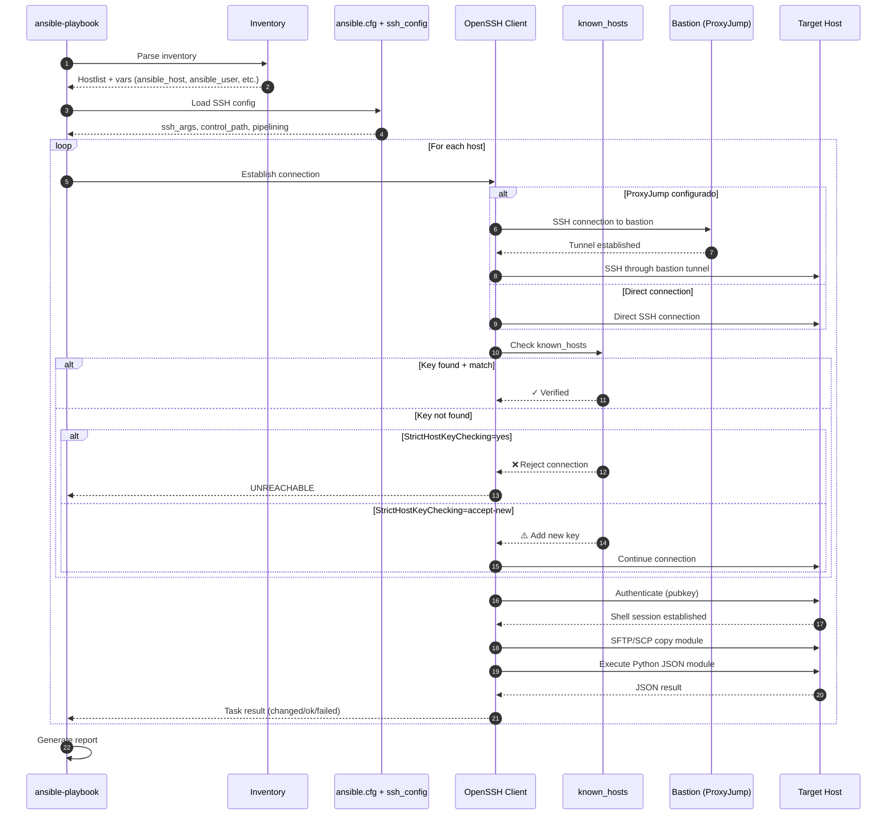

# 01 — Principios SSH en Ansible

**Audiencia**: DevOps engineers trabajando con Ansible 2.16+ en Debian 12 Bookworm
**Objetivo**: Entender cómo Ansible gestiona conexiones SSH, autenticación y opciones de configuración críticas para entornos de producción.

> **Prerrequisito**: [0-ssh-basics.md](0-ssh-basics.md) — Fundamentos OpenSSH (known_hosts, ProxyJump, ssh_config)

---

## 📋 Tabla de Contenidos

1. [Fundamentos SSH en Ansible](#fundamentos)
2. [Configuración ansible.cfg](#ansible-cfg)
3. [ProxyJump desde Ansible](#proxyjump)
4. [Diagrama de Flujo: Conexión SSH Ansible → Remoto](#diagrama-flujo)
5. [Troubleshooting Ansible](#troubleshooting)

---

## <a id="fundamentos"></a>1. Fundamentos SSH en Ansible

Ansible utiliza **OpenSSH** como transporte por defecto (connection plugin `ssh`). Desde Ansible 2.x, el plugin SSH usa `ControlMaster` y `ControlPersist` para multiplexar conexiones y reducir latencia.

### Flujo de Conexión SSH en Ansible

```
ansible-playbook → Inventory → foreach host:
  1. Resuelve hostname/IP
  2. Busca SSH key (ansible_ssh_private_key_file o ~/.ssh/id_rsa)
  3. Establece ControlMaster socket (si está habilitado)
  4. Ejecuta módulos vía SFTP/SCP → Python en remoto
  5. Limpia temp files y cierra conexión (o reutiliza socket)
```

### Variables SSH Importantes en Ansible

| Variable                       | Descripción                           | Ejemplo                        |
| ------------------------------ | ------------------------------------- | ------------------------------ |
| `ansible_host`                 | IP/hostname del host                  | `10.10.0.50`                   |
| `ansible_port`                 | Puerto SSH (default: 22)              | `2222`                         |
| `ansible_user`                 | Usuario SSH                           | `deploy`                       |
| `ansible_ssh_private_key_file` | Ruta a la clave privada               | `/run/secrets/ssh-key`         |
| `ansible_ssh_common_args`      | Args adicionales para todos los hosts | `-o ControlMaster=auto`        |
| `ansible_ssh_extra_args`       | Args adicionales específicos del host | `-o ProxyJump=bastion.vpn.int` |

---

## <a id="ansible-cfg"></a>2. Configuración ansible.cfg (Debian 12)

Archivo ubicado en `/etc/ansible/ansible.cfg` o `./ansible.cfg` (proyecto).

```ini
[defaults]
inventory         = ./inventories/prod
roles_path        = ./roles
host_key_checking = True  # Habilitar verificación (default)
timeout           = 30
forks             = 10
gathering         = smart
filter_plugins    = ./plugins/filter

[ssh_connection]
# Control sockets para multiplexing
ssh_args = -o ControlMaster=auto -o ControlPersist=300s -o ServerAliveInterval=60 -o ServerAliveCountMax=3
control_path = /tmp/ansible-ssh-%%h-%%p-%%r

# Pipelining: ejecuta múltiples tareas en una conexión (requiere requiretty=false en sudoers)
pipelining = True

# Transfer method: smart (default), sftp, scp, piped
transfer_method = smart

# SFTP batch mode (reduce round-trips)
sftp_batch_mode = True

# Retries en conexión
ssh_retries = 3

[privilege_escalation]
become = True
become_method = sudo
become_user = root
become_ask_pass = False
```

### Equivalente en YAML (Inventory Variables)

La mayoría de parámetros de `ansible.cfg` tienen equivalente como variables de inventario, lo que permite sobreescribirlos por grupo o por host individual.

**`group_vars/all.yml`** — aplica a todos los hosts:

```yaml
# [ssh_connection]
ansible_ssh_extra_args: "-o ControlMaster=auto -o ControlPersist=300s -o ServerAliveInterval=60 -o ServerAliveCountMax=3"
ansible_ssh_retries: 3
ansible_pipelining: true

# [privilege_escalation]
ansible_become: true
ansible_become_method: sudo
ansible_become_user: root
```

**`hosts.yml`** — configuración por host específico:

```yaml
all:
  hosts:
    remote-dev:
      ansible_host: 10.10.20.10
      ansible_user: debian
      ansible_ssh_extra_args: "-o ControlMaster=auto -o ControlPersist=300s -o ServerAliveInterval=60 -o ServerAliveCountMax=3"
      ansible_ssh_retries: 3
      ansible_pipelining: true
      ansible_become: true
      ansible_become_method: sudo
      ansible_become_user: root

    otro-host:
      ansible_host: 10.10.20.11
      # Deshabilitar pipelining si sudoers es restrictivo
      ansible_pipelining: false
      ansible_become: true
```

**Parámetros sin equivalente YAML** (solo disponibles en `ansible.cfg`):

| Parámetro `ansible.cfg` | Motivo                                  |
| ----------------------- | --------------------------------------- |
| `forks`                 | Global del proceso Ansible, no por host |
| `gathering`             | Política global de facts                |
| `control_path`          | Ruta del socket ControlMaster           |
| `transfer_method`       | Método de transferencia global          |
| `sftp_batch_mode`       | Opción de transporte global             |

**Prioridad**: `host_vars/` > `group_vars/` > `ansible.cfg`

---

### Notas Debian-Específicas

1. **Pipelining + sudo**: Requiere editar `/etc/sudoers`:

   ```
   Defaults !requiretty
   ```

2. **Python interpreter**: Debian 12 usa Python 3.11 por defecto:

   ```yaml
   ansible_python_interpreter: /usr/bin/python3
   ```

3. **Locales**: Asegurar UTF-8 para evitar warnings:
   ```bash
   export LC_ALL=en_US.UTF-8
   ```

---

## <a id="proxyjump"></a>3. ProxyJump desde Ansible

> Para la teoría de ProxyJump y configuración `~/.ssh/config`, ver [0-ssh-basics.md → ProxyJump](0-ssh-basics.md#proxyjump).

Ansible expone ProxyJump mediante `ansible_ssh_common_args` o `ansible.cfg`.

Para ProxyJump conviene ansible_ssh_common_args porque la transferencia de archivos (sftp/scp) también necesita pasar por el proxy. Con ansible_ssh_extra_args el tunel funciona para la ejecución pero las transferencias podrían fallar.

Para opciones como ControlMaster, ServerAliveInterval (que son solo de la conexión SSH), ansible_ssh_extra_args es suficiente — que es exactamente lo que hemos puesto en la sección que añadimos antes.

La configuración de ProxyJump se puede hacer a nivel global (todos los hosts) o por host específico:

```yaml
# inventories/prod/group_vars/all.yml >> aplica a todos los hosts
# host_vars/server1.yml >> aplica solo a server1
ansible_ssh_common_args: >-
  -o ControlMaster=auto
  -o ControlPersist=300s
  -o ProxyJump=bastion.vpn.int
  -o ServerAliveInterval=60
```

```ini
# ansible.cfg — alternativa global
[ssh_connection]
ssh_args = -o ProxyJump=bastion.vpn.int -o ControlMaster=auto -o ControlPersist=300s
```

Prioridad de configuración SSH en Ansible:

_Playbook/Inventory vars > ansible.cfg > ssh_config > SSH defaults_

---

## <a id="diagrama-flujo"></a>4. Diagrama de Flujo: Conexión SSH Ansible → Remoto



### Explicación de Pasos

1-3. **Inicialización**: Ansible parsea inventory y configuración SSH
4-6. **Loop por Host**: Para cada host en inventory
7-11. **ProxyJump**: Si configurado, establece túnel a través de bastion
12-19. **Verificación known_hosts**: Valida fingerprint según StrictHostKeyChecking
20-21. **Autenticación**: Clave pública SSH (pubkey)
22-24. **Ejecución**: Copia módulo Python y ejecuta 25. **Resultado**: Ansible procesa JSON y marca tarea como changed/ok/failed

---

## <a id="troubleshooting"></a>5. Troubleshooting Ansible

> Para errores genéricos de SSH (host key verification, permission denied), ver [0-ssh-basics.md → Troubleshooting](0-ssh-basics.md#troubleshooting).

### 🔴 Error: "Host key verification failed" (desde Ansible)

```
fatal: [server1]: UNREACHABLE! => {"changed": false, "msg": "Failed to connect to the host via ssh:
Host key verification failed.", "unreachable": true}
```

**Solución rápida para dev**:

```bash
export ANSIBLE_HOST_KEY_CHECKING=False
```

**Solución producción** — pre-poblar `known_hosts` en `ansible.cfg` o initContainer:

```bash
ssh-keyscan -H 10.10.0.50 >> ~/.ssh/known_hosts
```

---

### 🔴 Error: "Timeout waiting for privilege escalation prompt"

```
fatal: [server1]: FAILED! => {"msg": "Timeout (30s) waiting for privilege escalation prompt"}
```

**Causa**: `sudo` requiere password o TTY
**Solución**:

```bash
# En target host, editar /etc/sudoers (visudo):
ansible ALL=(ALL) NOPASSWD: ALL
Defaults:ansible !requiretty
```

---

### 🔴 Error: "Control socket connect failed"

```
ControlSocket /tmp/ansible-ssh-10.10.0.50-22-ansible already exists
```

**Causa**: Socket de ControlMaster huérfano
**Solución**:

```bash
# Limpiar sockets
rm -f /tmp/ansible-ssh-*

# O deshabilitar temporalmente ControlMaster
ansible-playbook -e 'ansible_ssh_args="-o ControlMaster=no"' playbook.yml
```

---

### 🟡 Warning: "Locale not found"

```
perl: warning: Setting locale failed.
perl: warning: Please check that your locale settings
```

**Causa**: Locales no configurados en Debian
**Solución**:

```bash
# En Ansible control node (Debian 12):
sudo apt-get install locales
sudo dpkg-reconfigure locales
# Seleccionar: en_US.UTF-8 UTF-8

# Exportar en ~/.bashrc:
export LC_ALL=en_US.UTF-8
export LANG=en_US.UTF-8
```

---

### 🟡 Debug: Verbosidad ansible-playbook

```bash
# Nivel 1 (básico)
ansible-playbook -v playbook.yml

# Nivel 3 (SSH debug — muestra comandos SSH ejecutados)
ansible-playbook -vvv playbook.yml

# Nivel 4 (máximo — SSH + Python modules)
ansible-playbook -vvvv playbook.yml
```

---

## 🔗 Referencias

- [Ansible SSH Connection Plugin Docs](https://docs.ansible.com/ansible/latest/collections/ansible/builtin/ssh_connection.html)
- [OpenSSH Config Man Page](https://man.openbsd.org/ssh_config)
- [Debian 12 SSH Hardening](https://wiki.debian.org/SSH)

---

## ✅ Checklist Producción

- [ ] `StrictHostKeyChecking=accept-new` o `yes`
- [ ] `known_hosts` pre-poblado en initContainer
- [ ] `ControlPersist` habilitado (300s)
- [ ] `Pipelining=True` + `Defaults !requiretty`
- [ ] SSH keys con permisos `600`
- [ ] `ServerAliveInterval=60` para mantener conexiones
- [ ] ProxyJump configurado para bastion
- [ ] Locales UTF-8 instalados
- [ ] Timeout ajustado según latencia VPN

---

**Siguiente**: [02-docker-ansible-lab.md](02-docker-ansible-lab.md) — Lab práctico con Docker Compose
