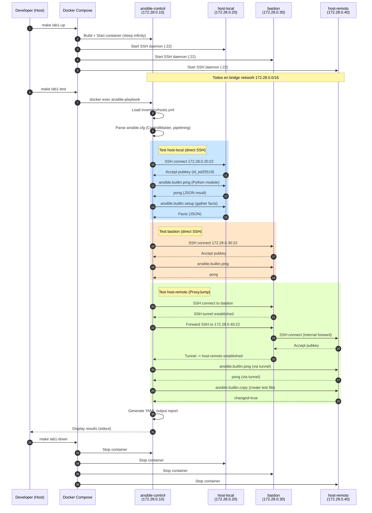

# 02 — Lab Docker Compose: Ansible + SSH Multi-Host

**Entorno**: Debian 12, Docker 24+, Ansible 2.16+  
**Objetivo**: Entorno local reproducible para experimentar con configuraciones SSH de Ansible sin infraestructura cloud.

---

## 📋 Tabla de Contenidos

1. [Arquitectura del Lab](#arquitectura)
2. [Prerequisitos](#prerequisitos)
3. [Estructura de Archivos](#estructura)
4. [Docker Compose Setup](#docker-compose)
5. [Inventory Ansible](#inventory)
6. [Playbook de Test](#playbook)
7. [Ejecución del Lab](#ejecucion)
8. [Diagrama de Secuencia](#diagrama-secuencia)
9. [Validación y Troubleshooting](#validacion)
10. [Ejercicios Propuestos](#ejercicios)

---

## <a id="arquitectura"></a>1. Arquitectura del Lab

Este lab simula un **entorno Ansible multi-host** usando Docker Compose con:

- **ansible-control**: Container con Ansible que ejecuta playbooks
- **host-local**: Target SSH en la misma red Docker (simulación LAN)
- **host-remoto**: Target SSH accesible solo vía ProxyJump (simulación WAN/VPN)
- **bastion**: Bastion host intermediario para ProxyJump

```
┌─────────────────────────────────────────────────────────────────────┐
│  Docker Network: ansible-lab-net (172.28.0.0/16)                    │
├─────────────────────────────────────────────────────────────────────┤
│                                                                      │
│  ┌──────────────────┐         ┌──────────────────┐                 │
│  │ ansible-control  │ SSH ────▶│ host-local       │                 │
│  │ Debian 12        │  :22     │ Debian 12        │                 │
│  │ Ansible 2.16     │          │ OpenSSH Server   │                 │
│  │ 172.28.0.10      │          │ 172.28.0.20      │                 │
│  └──────────────────┘          └──────────────────┘                 │
│           │                                                          │
│           │ SSH ProxyJump                                            │
│           ▼                                                          │
│  ┌──────────────────┐         ┌──────────────────┐                 │
│  │ bastion          │ SSH ────▶│ host-remoto      │                 │
│  │ Debian 12        │  :22     │ Debian 12        │                 │
│  │ OpenSSH Server   │          │ OpenSSH Server   │                 │
│  │ 172.28.0.30      │          │ 172.28.0.40      │                 │
│  └──────────────────┘          └──────────────────┘                 │
│                                                                      │
└─────────────────────────────────────────────────────────────────────┘

Flujo:
1. ansible-control → host-local (direct SSH)
2. ansible-control → bastion → host-remoto (ProxyJump)
```

---

## <a id="prerequisitos"></a>2. Prerequisitos

### Sistema Host (Debian 12)

```bash
# Docker Engine + Compose
sudo apt-get update
sudo apt-get install -y docker.io docker-compose-plugin

# Verificar versiones
docker --version          # Docker version 24.0+
docker compose version    # Docker Compose version v2.20+

# Usuario en grupo docker (evita sudo)
sudo usermod -aG docker $USER
newgrp docker

# Herramientas útiles
sudo apt-get install -y make tree ssh-audit
```

### VSCode Extensions (Opcional)

```bash
code --install-extension ms-azuretools.vscode-docker
code --install-extension redhat.ansible
```

---

## <a id="estructura"></a>3. Estructura de Archivos

Crear la siguiente estructura en tu workspace:

```
kubernetes-job-over-VPN/
├── lab1/                           # ← Lab Docker Compose SSH
│   ├── docker-compose.yml
│   ├── Dockerfile.ansible-control
│   ├── Dockerfile.ssh-target
│   ├── ssh-keys/                   # Generadas por script
│   │   ├── id_ed25519
│   │   ├── id_ed25519.pub
│   │   └── authorized_keys
│   ├── ansible/
│   │   ├── ansible.cfg
│   │   ├── inventory/
│   │   │   └── hosts.yml
│   │   └── playbooks/
│   │       └── test-ssh.yml
│   └── scripts/
│       └── generate-keys.sh
└── Makefile                         # Agregar target: make lab1-run
```

---

## <a id="docker-compose"></a>4. Docker Compose Setup

### lab1/docker-compose.yml

```yaml
---
# ══════════════════════════════════════════════════════════════════════
# Docker Compose — Lab 1: Ansible SSH Multi-Host
# ══════════════════════════════════════════════════════════════════════

services:
  # ── Ansible Control Node ────────────────────────────────────────────
  ansible-control:
    build:
      context: .
      dockerfile: Dockerfile.ansible-control
    container_name: lab1-ansible-control
    hostname: ansible-control
    networks:
      ansible-lab-net:
        ipv4_address: 172.28.0.10
    volumes:
      - ./ansible:/ansible:ro
      - ./ssh-keys:/root/.ssh:ro
    environment:
      - ANSIBLE_CONFIG=/ansible/ansible.cfg
      - ANSIBLE_HOST_KEY_CHECKING=False # Para lab, simplificar
    tty: true
    stdin_open: true
    command: sleep infinity # Keep alive para docker exec

  # ── SSH Target: Host Local ──────────────────────────────────────────
  host-local:
    build:
      context: .
      dockerfile: Dockerfile.ssh-target
    container_name: lab1-host-local
    hostname: host-local
    networks:
      ansible-lab-net:
        ipv4_address: 172.28.0.20
    volumes:
      - ./ssh-keys/authorized_keys:/root/.ssh/authorized_keys:ro
    environment:
      - SSH_ENABLE_PASSWORD_AUTH=false

  # ── SSH Target: Bastion ─────────────────────────────────────────────
  bastion:
    build:
      context: .
      dockerfile: Dockerfile.ssh-target
    container_name: lab1-bastion
    hostname: bastion
    networks:
      ansible-lab-net:
        ipv4_address: 172.28.0.30
    volumes:
      - ./ssh-keys/authorized_keys:/root/.ssh/authorized_keys:ro
    environment:
      - SSH_ENABLE_PASSWORD_AUTH=false

  # ── SSH Target: Host Remoto ─────────────────────────────────────────
  host-remoto:
    build:
      context: .
      dockerfile: Dockerfile.ssh-target
    container_name: lab1-host-remoto
    hostname: host-remoto
    networks:
      ansible-lab-net:
        ipv4_address: 172.28.0.40
    volumes:
      - ./ssh-keys/authorized_keys:/root/.ssh/authorized_keys:ro
    environment:
      - SSH_ENABLE_PASSWORD_AUTH=false

networks:
  ansible-lab-net:
    driver: bridge
    ipam:
      driver: default
      config:
        - subnet: 172.28.0.0/16
```

---

### lab1/Dockerfile.ansible-control

```dockerfile
# ══════════════════════════════════════════════════════════════════════
# Dockerfile — Ansible Control Node (Debian 12)
# ══════════════════════════════════════════════════════════════════════

FROM debian:12-slim AS base

ENV DEBIAN_FRONTEND=noninteractive \
    LANG=en_US.UTF-8 \
    LC_ALL=en_US.UTF-8 \
    PYTHONUNBUFFERED=1 \
    ANSIBLE_VERSION=2.16.*

# ── System packages ────────────────────────────────────────────────────
RUN apt-get update && apt-get install -y --no-install-recommends \
    python3 \
    python3-pip \
    python3-venv \
    openssh-client \
    sshpass \
    git \
    curl \
    vim \
    locales \
    ca-certificates \
    && locale-gen en_US.UTF-8 \
    && apt-get clean \
    && rm -rf /var/lib/apt/lists/*

# ── Ansible installation ───────────────────────────────────────────────
RUN pip3 install --no-cache-dir --break-system-packages \
    ansible-core==${ANSIBLE_VERSION} \
    jmespath \
    netaddr \
    passlib

# ── SSH config for ProxyJump ───────────────────────────────────────────
RUN mkdir -p /root/.ssh && chmod 700 /root/.ssh && \
    echo "Host bastion\n\
    HostName 172.28.0.30\n\
    User root\n\
    IdentityFile /root/.ssh/id_ed25519\n\
    StrictHostKeyChecking accept-new\n\
\n\
Host host-remoto\n\
    HostName 172.28.0.40\n\
    User root\n\
    ProxyJump bastion\n\
    IdentityFile /root/.ssh/id_ed25519\n\
    StrictHostKeyChecking accept-new\n\
" > /root/.ssh/config && chmod 600 /root/.ssh/config

WORKDIR /ansible

CMD ["/bin/bash"]
```

---

### lab1/Dockerfile.ssh-target

```dockerfile
# ══════════════════════════════════════════════════════════════════════
# Dockerfile — SSH Target Host (Debian 12)
# ══════════════════════════════════════════════════════════════════════

FROM debian:12-slim

ENV DEBIAN_FRONTEND=noninteractive \
    LANG=en_US.UTF-8 \
    LC_ALL=en_US.UTF-8

# ── SSH Server + Python ────────────────────────────────────────────────
RUN apt-get update && apt-get install -y --no-install-recommends \
    openssh-server \
    python3 \
    sudo \
    locales \
    && locale-gen en_US.UTF-8 \
    && apt-get clean \
    && rm -rf /var/lib/apt/lists/*

# ── SSH daemon config ──────────────────────────────────────────────────
RUN mkdir /var/run/sshd && \
    sed -i 's/#PermitRootLogin prohibit-password/PermitRootLogin prohibit-password/' /etc/ssh/sshd_config && \
    sed -i 's/#PubkeyAuthentication yes/PubkeyAuthentication yes/' /etc/ssh/sshd_config && \
    sed -i 's/#PasswordAuthentication yes/PasswordAuthentication no/' /etc/ssh/sshd_config

# ── Create .ssh directory for root ─────────────────────────────────────
RUN mkdir -p /root/.ssh && chmod 700 /root/.ssh

# ── Entrypoint ─────────────────────────────────────────────────────────
COPY <<'EOF' /entrypoint.sh
#!/bin/bash
set -e

# Regenerate host keys (cada container tiene su propia identidad)
ssh-keygen -A

# Start SSH daemon
/usr/sbin/sshd -D
EOF

RUN chmod +x /entrypoint.sh

EXPOSE 22

CMD ["/entrypoint.sh"]
```

---

## <a id="inventory"></a>5. Inventory Ansible

### lab1/ansible/inventory/hosts.yml

```yaml
---
all:
  vars:
    ansible_connection: ssh
    ansible_user: root
    ansible_ssh_private_key_file: /root/.ssh/id_ed25519
    ansible_python_interpreter: /usr/bin/python3

  children:
    local_hosts:
      hosts:
        host-local:
          ansible_host: 172.28.0.20

    remote_hosts:
      hosts:
        host-remoto:
          ansible_host: 172.28.0.40
          # ProxyJump se configura en ~/.ssh/config del control node
          ansible_ssh_extra_args: "-o ProxyJump=bastion"

    bastion_hosts:
      hosts:
        bastion:
          ansible_host: 172.28.0.30
```

---

### lab1/ansible/ansible.cfg

```ini
[defaults]
inventory         = inventory/hosts.yml
roles_path        = roles
host_key_checking = False  # Lab simplificado
timeout           = 30
forks             = 5
gathering         = smart
display_skipped_hosts = False
stdout_callback   = yaml

[ssh_connection]
ssh_args = -o ControlMaster=auto -o ControlPersist=60s
control_path = /tmp/ansible-ssh-%%h-%%p-%%r
pipelining = True
transfer_method = smart

[privilege_escalation]
become = False  # Ya somos root en lab
```

---

## <a id="playbook"></a>6. Playbook de Test

### lab1/ansible/playbooks/test-ssh.yml

```yaml
---
# ══════════════════════════════════════════════════════════════════════
# Playbook — Test SSH Connectivity Lab
# ══════════════════════════════════════════════════════════════════════

- name: "Test Ansible SSH Connections"
  hosts: all
  gather_facts: true
  tasks:
    - name: Ping hosts
      ansible.builtin.ping:
      register: ping_result

    - name: Display host info
      ansible.builtin.debug:
        msg: |
          ✓ Host: {{ inventory_hostname }}
          ✓ IP: {{ ansible_host }}
          ✓ OS: {{ ansible_distribution }} {{ ansible_distribution_version }}
          ✓ Hostname: {{ ansible_hostname }}
          ✓ Python: {{ ansible_python_version }}

    - name: Check SSH connection path
      ansible.builtin.command: echo $SSH_CONNECTION
      register: ssh_connection
      changed_when: false

    - name: Display SSH connection
      ansible.builtin.debug:
        msg: "SSH Connection from: {{ ssh_connection.stdout }}"

    - name: Test ProxyJump (solo remote_hosts)
      ansible.builtin.shell: |
        if netstat -tn | grep -q ':22.*ESTABLISHED'; then
          echo "✓ SSH connection established"
        else
          echo "⚠ No SSH connection found"
        fi
      register: ssh_check
      changed_when: false
      when: inventory_hostname in groups['remote_hosts']

    - name: Create test file
      ansible.builtin.copy:
        content: |
          Lab: Docker Compose Ansible SSH
          Host: {{ inventory_hostname }}
          Deployed: {{ ansible_date_time.iso8601 }}
        dest: /tmp/ansible-test.txt
        mode: "0644"

    - name: Read test file
      ansible.builtin.slurp:
        src: /tmp/ansible-test.txt
      register: test_file

    - name: Display test file content
      ansible.builtin.debug:
        msg: "{{ test_file['content'] | b64decode }}"
```

---

## <a id="ejecucion"></a>7. Ejecución del Lab

### Script: lab1/scripts/generate-keys.sh

```bash
#!/usr/bin/env bash
# ══════════════════════════════════════════════════════════════════════
# Generate SSH keys for Lab 1
# ══════════════════════════════════════════════════════════════════════

set -euo pipefail

SCRIPT_DIR="$( cd "$( dirname "${BASH_SOURCE[0]}" )" && pwd )"
KEY_DIR="${SCRIPT_DIR}/../ssh-keys"

mkdir -p "${KEY_DIR}"

# Generate ED25519 key pair (modern, secure)
if [[ ! -f "${KEY_DIR}/id_ed25519" ]]; then
    echo "🔑 Generando par de claves SSH ED25519..."
    ssh-keygen -t ed25519 -f "${KEY_DIR}/id_ed25519" -N "" -C "ansible-lab1"
else
    echo "✓ Claves SSH ya existen"
fi

# Create authorized_keys
cp "${KEY_DIR}/id_ed25519.pub" "${KEY_DIR}/authorized_keys"

# Set permissions
chmod 600 "${KEY_DIR}/id_ed25519"
chmod 644 "${KEY_DIR}/id_ed25519.pub"
chmod 644 "${KEY_DIR}/authorized_keys"

echo "✓ SSH keys generadas en: ${KEY_DIR}"
ls -lh "${KEY_DIR}"
```

---

### Agregar Target al Makefile Principal

Editar `Makefile` en la raíz del repo:

```makefile
## ── Lab 1: Docker Compose SSH ──────────────────────────────────────────

.PHONY: lab1-setup
lab1-setup: ## Setup Lab 1 SSH keys and structure
	@echo "Setting up Lab 1..."
	mkdir -p lab1/ansible/{inventory,playbooks,roles}
	mkdir -p lab1/ssh-keys
	mkdir -p lab1/scripts
	chmod +x lab1/scripts/generate-keys.sh
	cd lab1 && bash scripts/generate-keys.sh

.PHONY: lab1-up
lab1-up: lab1-setup ## Start Lab 1 containers
	@echo "Starting Lab 1 containers..."
	cd lab1 && docker compose up -d
	@echo "Waiting for SSH services..."
	sleep 5
	@echo ""
	@echo "✓ Lab 1 ready!"
	@echo "  Containers:"
	@docker compose -f lab1/docker-compose.yml ps
	@echo ""
	@echo "Run: make lab1-test"

.PHONY: lab1-test
lab1-test: ## Run Ansible test playbook (Lab 1)
	@echo "Running Ansible playbook..."
	cd lab1 && docker compose exec ansible-control \
	  ansible-playbook -i inventory/hosts.yml playbooks/test-ssh.yml

.PHONY: lab1-shell
lab1-shell: ## Shell into ansible-control container
	cd lab1 && docker compose exec ansible-control /bin/bash

.PHONY: lab1-down
lab1-down: ## Stop and remove Lab 1 containers
	cd lab1 && docker compose down -v
	@echo "✓ Lab 1 stopped"

.PHONY: lab1-logs
lab1-logs: ## Follow Lab 1 logs
	cd lab1 && docker compose logs -f

.PHONY: lab1-clean
lab1-clean: lab1-down ## Clean Lab 1 (remove keys)
	rm -rf lab1/ssh-keys/*
	@echo "✓ Lab 1 cleaned"
```

---

### Comandos de Ejecución

```bash
# 1. Setup inicial (genera claves SSH)
make lab1-setup

# 2. Levantar containers
make lab1-up

# 3. Ejecutar playbook de test
make lab1-test

# 4. Shell interactivo en ansible-control
make lab1-shell

# Dentro del container, probar manualmente:
ansible all -m ping
ansible host-local -m setup -a 'filter=ansible_distribution*'
ansible remote_hosts -m command -a 'ip addr show'

# 5. Ver logs
make lab1-logs

# 6. Limpiar
make lab1-down
make lab1-clean
```

---

## <a id="diagrama-secuencia"></a>8. Diagrama de Secuencia: Docker Networking + SSH



### Descripción de Fases

**Fase 1 (Steps 1-5)**: Docker Compose levanta 4 containers en red bridge compartida  
**Fase 2 (Steps 6-9)**: Ansible parsea inventory y configuración  
**Fase 3 (Steps 10-15)**: Test SSH directo a host-local (sin ProxyJump)  
**Fase 4 (Steps 16-19)**: Test SSH directo a bastion  
**Fase 5 (Steps 20-29)**: Test SSH a host-remoto vía ProxyJump (túnel a través de bastion)  
**Fase 6 (Steps 30-31)**: Output y cleanup

---

## <a id="validacion"></a>9. Validación y Troubleshooting

### ✅ Verificaciones Exitosas

```bash
# 1. Containers running
docker compose -f lab1/docker-compose.yml ps
# Todos en state "Up"

# 2. Red Docker creada
docker network inspect lab1_ansible-lab-net
# Ver IPs asignadas

# 3. SSH accesible desde ansible-control
docker compose -f lab1/docker-compose.yml exec ansible-control ssh -v root@172.28.0.20 hostname
# Output: host-local

# 4. ProxyJump funcional
docker compose -f lab1/docker-compose.yml exec ansible-control ssh -J bastion root@host-remoto hostname
# Output: host-remoto

# 5. Ansible ping
docker compose -f lab1/docker-compose.yml exec ansible-control ansible all -m ping
# Todos "pong"
```

---

### 🔴 Problema: "Connection refused"

```
fatal: [host-local]: UNREACHABLE! => {"msg": "Failed to connect to the host via ssh:
ssh: connect to host 172.28.0.20 port 22: Connection refused"}
```

**Diagnóstico**:

```bash
# Verificar que SSH daemon está running
docker compose -f lab1/docker-compose.yml exec host-local ps aux | grep sshd

# Ver logs del container
docker logs lab1-host-local

# Test manual desde control node
docker compose -f lab1/docker-compose.yml exec ansible-control \
  ssh -vvv -i /root/.ssh/id_ed25519 root@172.28.0.20
```

**Solución**:

```bash
# Reiniciar SSH daemon en target
docker compose -f lab1/docker-compose.yml exec host-local /usr/sbin/sshd -D &

# O recrear container
docker compose -f lab1/docker-compose.yml up -d --force-recreate host-local
```

---

### 🔴 Problema: "Permission denied (publickey)"

```
fatal: [host-local]: UNREACHABLE! => {"msg": "Failed to connect: Permission denied (publickey)."}
```

**Causas comunes**:

- Permisos incorrectos en SSH key (debe ser 600)
- `authorized_keys` no montado correctamente
- Clave pública no coincide

**Diagnóstico**:

```bash
# Verificar permisos
docker compose -f lab1/docker-compose.yml exec ansible-control ls -la /root/.ssh/

# Verificar authorized_keys en target
docker compose -f lab1/docker-compose.yml exec host-local cat /root/.ssh/authorized_keys

# Comparar claves
docker compose -f lab1/docker-compose.yml exec ansible-control cat /root/.ssh/id_ed25519.pub
```

**Solución**:

```bash
# Regenerar claves
cd lab1 && bash scripts/generate-keys.sh

# Recrear containers
make lab1-down
make lab1-up
```

---

### 🔴 Problema: ProxyJump falla

```
fatal: [host-remoto]: UNREACHABLE! => {"msg": "Failed to connect to the host via ssh:
ssh: Could not resolve hostname bastion: Name or service not known"}
```

**Causa**: SSH config no cargado o DNS interno no resuelve

**Solución**:

```bash
# Verificar ssh_config en ansible-control
docker compose -f lab1/docker-compose.yml exec ansible-control cat /root/.ssh/config

# Test minimal ProxyJump con IP
docker compose -f lab1/docker-compose.yml exec ansible-control \
  ssh -J root@172.28.0.30 -i /root/.ssh/id_ed25519 root@172.28.0.40 hostname

# Si funciona con IP, problema es DNS. Editar /etc/hosts o usar IPs en ssh_config
```

---

## <a id="ejercicios"></a>10. Ejercicios Propuestos

### 🔧 Ejercicio 1: Añadir Host con ProxyCommand

**Objetivo**: Configurar un host usando `ProxyCommand` en lugar de `ProxyJump`.

**Pasos**:

1. Editar `Dockerfile.ansible-control`, añadir en `/root/.ssh/config`:

   ```
   Host host-remoto-alt
       HostName 172.28.0.40
       User root
       ProxyCommand ssh -W %h:%p bastion
       IdentityFile /root/.ssh/id_ed25519
   ```

2. Añadir en inventory:

   ```yaml
   remote_hosts:
     hosts:
       host-remoto-alt:
         ansible_host: 172.28.0.40
   ```

3. Reconstruir: `make lab1-down && make lab1-up`
4. Test: `make lab1-test`

---

### 🔧 Ejercicio 2: Habilitar StrictHostKeyChecking

**Objetivo**: Usar `accept-new` en lugar de `False` para seguridad.

**Pasos**:

1. Editar `ansible.cfg`:

   ```ini
   [defaults]
   host_key_checking = True

   [ssh_connection]
   ssh_args = -o ControlMaster=auto -o ControlPersist=60s -o StrictHostKeyChecking=accept-new
   ```

2. Pre-poblar known_hosts en `Dockerfile.ansible-control`:

   ```dockerfile
   RUN ssh-keyscan 172.28.0.20 172.28.0.30 172.28.0.40 > /root/.ssh/known_hosts
   ```

3. Rebuild: `cd lab1 && docker compose build`
4. Test: `make lab1-test`

---

### 🔧 Ejercicio 3: Playbook con Roles

**Objetivo**: Crear role `common` que instala paquetes.

**Estructura**:

```
lab1/ansible/roles/common/
├── tasks/
│   └── main.yml
└── defaults/
    └── main.yml
```

**tasks/main.yml**:

```yaml
---
- name: Update apt cache
  ansible.builtin.apt:
    update_cache: yes
    cache_valid_time: 3600

- name: Install common packages
  ansible.builtin.apt:
    name: "{{ common_packages }}"
    state: present
```

**defaults/main.yml**:

```yaml
---
common_packages:
  - curl
  - htop
  - vim
```

**Playbook**:

```yaml
- hosts: all
  roles:
    - common
```

---

### 🔧 Ejercicio 4: Test de Latencia SSH

**Objetivo**: Medir latencia con y sin ControlMaster.

**Script**:

```bash
# Desde ansible-control
time ssh root@host-local hostname  # Primera vez (handshake completo)
time ssh root@host-local hostname  # Segunda vez (reutiliza socket)

# Deshabilitar ControlMaster
time ssh -o ControlMaster=no root@host-local hostname
time ssh -o ControlMaster=no root@host-local hostname
```

**Medir con Ansible**:

```bash
# Con ControlMaster (default)
time ansible host-local -m ping

# Sin ControlMaster
time ansible host-local -m ping -e 'ansible_ssh_args="-o ControlMaster=no"'
```

---

## 🔗 Referencias

- [Docker Compose Networking](https://docs.docker.com/compose/networking/)
- [Ansible Inventory Guide](https://docs.ansible.com/ansible/latest/user_guide/intro_inventory.html)
- [SSH ProxyJump OpenSSH 7.3+](https://www.redhat.com/sysadmin/ssh-proxy-bastion-proxyjump)
- [Lab Repo Completo](https://github.com/ansible/test-playbooks)

---

## 📝 Notas Finales

- Este lab es **solo educativo** — en producción usar StrictHostKeyChecking=yes
- Los containers usan `root` para simplificar — en producción crear usuarios dedicados
- Red Docker **no tiene salida internet** por defecto (aislamiento)
- Para simular latencia, usar `tc` (Traffic Control) en host Docker

---

**Siguiente**: [03-ssh-vpn-basics.md](03-ssh-vpn-basics.md) — SSH sobre túneles VPN
