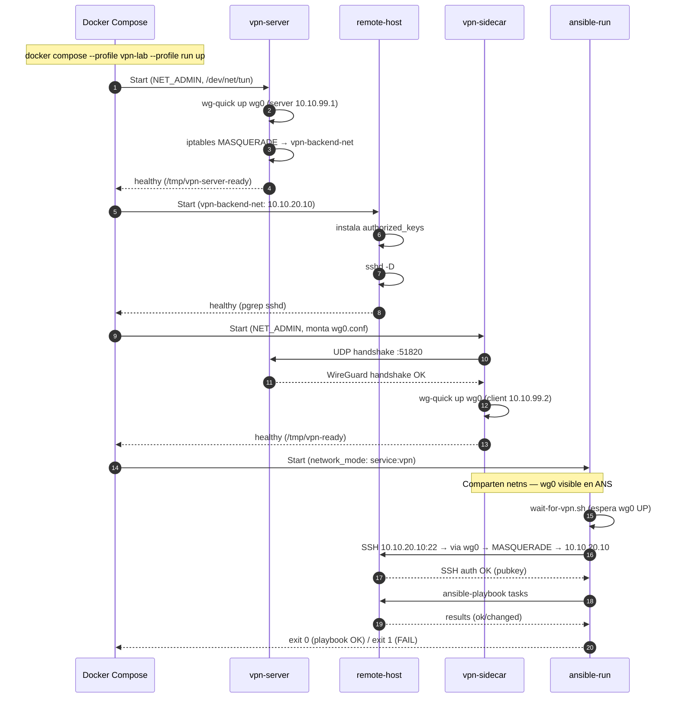

# 02 — Lab Docker Compose: Ansible + SSH sobre VPN

**Entorno**: Debian 12, Docker 24+, WireGuard kernel module
**Objetivo**: Probar localmente el ciclo completo — túnel WireGuard + Ansible ejecutando playbooks sobre SSH — sin necesitar infraestructura cloud.

---

## 📋 Tabla de Contenidos

1. [Arquitectura](#arquitectura)
2. [Prerequisitos](#prerequisitos)
3. [Estructura de Archivos](#estructura)
4. [Puesta en marcha](#ejecucion)
5. [Diagrama de Secuencia](#diagrama-secuencia)
6. [Validación y Troubleshooting](#validacion)

---

## <a id="arquitectura"></a>1. Arquitectura

El proyecto usa Docker Compose para simular exactamente el patrón Kubernetes: el sidecar VPN y el executor Ansible comparten el mismo namespace de red, igual que en un Pod.

```
┌──────────────────────────────────────────────────────────────────┐
│  vpn-net  (bridge, auto-subnet)                                  │
│                                                                  │
│   ┌─────────────────────┐        ┌──────────────────────────┐   │
│   │  vpn-sidecar        │◀──UDP──│  vpn-server              │   │
│   │  WireGuard client   │ :51820 │  WireGuard server        │   │
│   │  wg0: 10.10.99.2    │        │  wg0: 10.10.99.1         │   │
│   │                     │        │                          │   │
│   │  ┌───────────────┐  │        │  vpn-backend-net ────────┼─┐ │
│   │  │ ansible       │  │        └──────────────────────────┘ │ │
│   │  │ (network_mode │  │                                      │ │
│   │  │  service:vpn) │  │        ┌──────────────────────────┐ │ │
│   │  │               │──┼─SSH────▶  remote-host             │◀┘ │
│   │  │ wg0 visible   │  │  via   │  10.10.20.10             │   │
│   │  │ aquí también  │  │  túnel │  sshd :22                │   │
│   │  └───────────────┘  │        └──────────────────────────┘   │
│   └─────────────────────┘                                        │
└──────────────────────────────────────────────────────────────────┘

Flujo:
1. vpn-server arranca como WireGuard server (UDP 51820)
2. vpn-sidecar conecta → establece túnel wg0 (10.10.99.1 ↔ 10.10.99.2)
3. vpn-server hace MASQUERADE → reenvía tráfico a vpn-backend-net
4. ansible (comparte netns con vpn-sidecar) → SSH a 10.10.20.10 via wg0
```

**Por qué `network_mode: service:vpn`**: replica el comportamiento de Kubernetes donde todos los containers de un Pod comparten el mismo namespace de red. El executor Ansible ve la interfaz `wg0` del sidecar y todo el tráfico SSH sale por el túnel.

---

## <a id="prerequisitos"></a>2. Prerequisitos

```bash
# Módulo WireGuard en el kernel host
sudo modprobe wireguard
lsmod | grep wireguard

# Docker Compose v2
docker compose version   # v2.20+

# make
sudo apt-get install -y make
```

---

## <a id="estructura"></a>3. Estructura de Archivos

Los archivos relevantes del proyecto:

```
kubernetes-job-over-VPN/
├── docker/
│   ├── vpn/                     # WireGuard client sidecar
│   │   ├── Dockerfile
│   │   ├── entrypoint.sh        # wg-quick up + monitor loop
│   │   └── healthcheck.sh       # comprueba /tmp/vpn-ready
│   ├── vpn-server/              # WireGuard server (lab)
│   │   ├── Dockerfile
│   │   ├── entrypoint.sh
│   │   └── healthcheck.sh
│   ├── remote-host/             # Debian SSH target (lab)
│   │   ├── Dockerfile           # openssh-server + usuario ansible
│   │   └── entrypoint.sh        # instala authorized_keys + sshd
│   ├── ssh-test-server/         # servidor SSH genérico para tests básicos
│   │   ├── Dockerfile
│   │   ├── entrypoint.sh
│   │   └── README.md
│   └── ansible/
│       ├── Dockerfile
│       ├── scripts/
│       │   ├── entrypoint.sh    # espera wg0 → ejecuta ansible-playbook
│       │   └── wait-for-vpn.sh
│       └── ssh_config
├── ansible/
│   ├── ansible.cfg
│   ├── inventories/
│   │   └── dev/
│   │       ├── hosts.yml        # remote-dev → 10.10.20.10
│   │       └── group_vars/all.yml
│   ├── playbooks/
│   │   └── test-connectivity.yml  # playbook unificado
│   └── roles/               # (opcional, tareas integradas en playbook)
├── test/
│   ├── vpn-lab/
│   │   ├── setup.sh             # genera claves WireGuard + SSH
│   │   ├── wg0-server.conf      # config servidor (generado)
│   │   └── wg0-server.conf.example
│   ├── vpn/
│   │   └── wg0.conf             # config cliente sidecar (generado)
│   └── secrets/
│       ├── ssh-private-key      # clave SSH Ansible (generada)
│       └── ssh-public-key       # montada en remote-host (generada)
├── docker-compose.yml           # stack completo (profiles: vpn-lab, run, dev)
├── docker-compose.vpn-lab.yml   # lab standalone: solo server + remote-host
└── docker-compose.ssh-lab.yml   # lab SSH simple sin VPN (ssh-server + ssh-client)
```

---

## <a id="ejecucion"></a>4. Puesta en marcha

### Primera vez

```bash
# Genera keypairs WireGuard (server + client) y SSH (Ansible)
make dev-setup
```

Esto crea:

- `test/vpn-lab/wg0-server.conf` — config del servidor WireGuard
- `test/vpn/wg0.conf` — config del cliente sidecar (Endpoint: `vpn-server:51820`)
- `test/secrets/ssh-private-key` / `ssh-public-key` — par de claves para Ansible

### Opción A — Lab VPN standalone (solo server + remote-host)

Útil para probar la conectividad VPN desde Kubernetes dev o desde la máquina host:

```bash
make lab-up            # construye imágenes y arranca el lab
make lab-vpn-status    # wg show wg0 en el servidor
make lab-shell         # shell en remote-host para inspeccionar
make lab-logs          # logs en tiempo real
make lab-down          # para los containers
```

### Opción B — Stack completo (VPN + Ansible executor)

Simula el Job de Kubernetes completo de forma local:

```bash
SKIP_VPN=false docker compose --profile vpn-lab --profile run up
```

Esto arranca en orden:

1. `vpn-server` (WireGuard server, sano antes de continuar)
2. `remote-host` (sshd, IP fija 10.10.20.10)
3. `vpn` sidecar (conecta al servidor, levanta `wg0`)
4. `ansible-run` (espera `wg0`, ejecuta el playbook y sale)

Equivalente con make:

```bash
SKIP_VPN=false ANSIBLE_INVENTORY=inventories/dev make dev-up
```

### Opción C — Sin VPN real (modo no-op)

Para probar la imagen Ansible aislada, sin túnel:

```bash
SKIP_VPN=true docker compose up vpn
# ansible puede arrancar pero no alcanzará 10.10.20.10
```

---

## <a id="diagrama-secuencia"></a>5. Diagrama de Secuencia



---

## <a id="validacion"></a>6. Validación y Troubleshooting

### Checklist de validación

```bash
# 1. VPN server: WireGuard activo y con handshake
make lab-vpn-status
# Debe mostrar: peer con latest-handshake reciente

# 2. Remote-host: sshd corriendo y authorized_keys OK
make lab-shell
# Dentro: cat /home/ansible/.ssh/authorized_keys   ← debe tener la pubkey
#         ss -tnl | grep :22                        ← sshd escuchando

# 3. Túnel establecido: ping desde vpn-sidecar a remote-host
make lab-test
# Debe responder ping a 10.10.20.10

# 4. Ansible llega al host
docker exec vpn-sidecar wg show wg0
# Ver: allowed ips = 10.10.99.2/32 en el peer (cliente)

# 5. Playbook completo
SKIP_VPN=false docker compose --profile vpn-lab run --rm ansible-run
# Debe terminar con "Playbook SUCCEEDED"
```

### 🔴 vpn-sidecar no levanta wg0

```bash
# Ver logs del sidecar
docker logs vpn-sidecar

# Causas habituales:
#   - wg0.conf tiene placeholders → re-ejecutar make lab-setup
#   - módulo wireguard no cargado → sudo modprobe wireguard
#   - SKIP_VPN=true activo → asegúrate de pasar SKIP_VPN=false
```

### 🔴 Ansible no alcanza 10.10.20.10

```bash
# 1. Verificar que wg0 existe en el netns compartido
docker exec ansible-run ip addr show wg0

# 2. Verificar ruta hacia 10.10.20.0/24
docker exec ansible-run ip route get 10.10.20.10
# Esperado: via dev wg0

# 3. Ping manual desde el sidecar
docker exec vpn-sidecar ping -c 3 10.10.20.10
```

### 🔴 Permission denied (publickey) en SSH

```bash
# Verificar que la pubkey coincide
diff <(docker exec remote-host cat /home/ansible/.ssh/authorized_keys) \
     test/secrets/ssh-public-key

# Si no coincide: regenerar claves y reiniciar
make lab-clean && make lab-setup && make lab-up
```

### 🔴 vpn-server crashea al arrancar

```bash
docker compose -f docker-compose.vpn-lab.yml logs vpn-server
# Si dice "placeholder values": ejecutar make lab-setup primero
# Si dice "wg-quick up failed": verificar NET_ADMIN capability y módulo wireguard
```

---

**Siguiente**: [03-ssh-vpn-basics.md](03-ssh-vpn-basics.md) — SSH sobre túneles VPN
