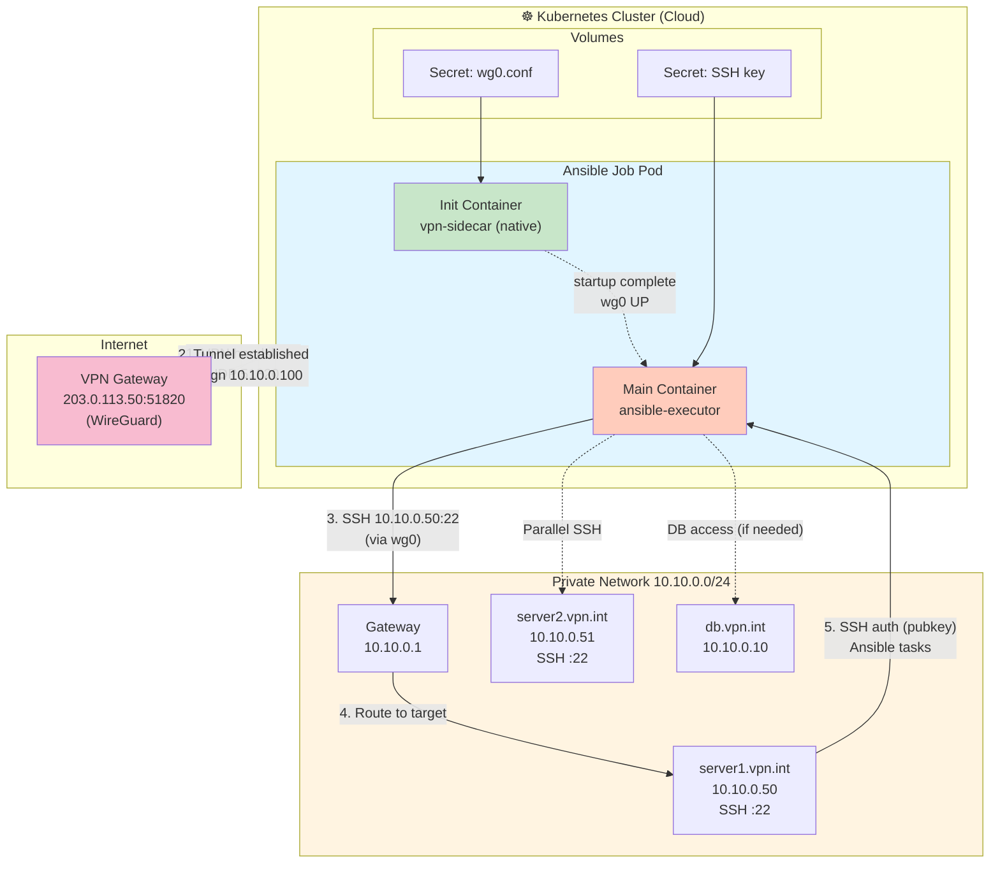

# 03 — SSH sobre Túneles VPN: Fundamentos

**Entorno**: Debian 12, WireGuard, OpenVPN, Ansible  
**Objetivo**: Comprender cómo SSH funciona sobre túneles VPN (OpenVPN/WireGuard) en producción, incluyendo configuraciones de red, routing y troubleshooting.

---

## 📋 Tabla de Contenidos

1. [¿Por qué SSH sobre VPN?](#por-que)
2. [VPN Fundamentals: OpenVPN vs WireGuard](#vpn-fundamentals)
3. [Arquitectura: SSH + VPN](#arquitectura)
4. [Configuración WireGuard](#wireguard-config)
5. [Configuración OpenVPN](#openvpn-config)
6. [SSH Tunneling Techniques](#ssh-tunneling)
7. [ProxyCommand para VPN Gateways](#proxycommand)
8. [ControlPersist + VPN](#controlpersist)
9. [Debian: Networking y Routing](#debian-networking)
10. [sshd_config: Hardening Server-Side](#sshd-config)
11. [iptables: Forwarding Rules](#iptables)
12. [Diagrama: Control → VPN Pod → Remoto](#diagrama-arquitectura)
13. [Troubleshooting VPN + SSH](#troubleshooting)

---

## <a id="por-que"></a>1. ¿Por qué SSH sobre VPN?

### Escenario Típico: Infraestructura Cloud Privada

```
┌────────────────────────────────────────────────────────────────────┐
│  On-Premises / Cloud Private Network                               │
│                                                                     │
│  ┌──────────────┐  ┌──────────────┐  ┌──────────────┐             │
│  │ DB Server    │  │ App Server   │  │ Backup       │             │
│  │ 10.10.0.10   │  │ 10.10.0.20   │  │ 10.10.0.30   │             │
│  └──────────────┘  └──────────────┘  └──────────────┘             │
│         ▲                  ▲                  ▲                     │
│         └──────────────────┴──────────────────┘                     │
│                            │                                        │
│                   ┌────────▼──────────┐                             │
│                   │ VPN Gateway       │                             │
│                   │ 10.10.0.1         │                             │
│                   │ Public: 203.0.113.50                            │
│                   └────────┬──────────┘                             │
└────────────────────────────┼───────────────────────────────────────┘
                             │ WireGuard/OpenVPN
                             │ Port: 51820/1194
                             ▼
                    ┌─────────────────┐
                    │ Kubernetes Pod  │
                    │ Ansible Control │
                    │ (Cloud/CI)      │
                    └─────────────────┘
```

### Ventajas vs SSH Directo

| Aspecto             | SSH Directo (Port 22 exposed)     | SSH sobre VPN                      |
| ------------------- | --------------------------------- | ---------------------------------- |
| **Seguridad**       | ⚠️ Puerto SSH expuesto a internet | ✅ Solo puerto VPN expuesto        |
| **Attack Surface**  | Brute-force, exploits SSH         | VPN autenticado primero            |
| **Firewall Rules**  | Múltiples reglas por host         | Una regla VPN → full subnet access |
| **Rotación de IPs** | Difícil con IP whitelisting       | VPN IP estable (10.10.0.x)         |
| **Multi-tenant**    | Complejo (SSH keys por proyecto)  | VPN config por cliente/env         |
| **Auditoría**       | SSH logs distribuidos             | VPN logs centralizados             |

### Caso de Uso: Ansible en Kubernetes Jobs

- **Job efímero** (cada ejecución = nuevo pod)
- **No puede exponer puerto 22 públicamente** (IP pod cambia)
- **VPN sidecar** establece túnel estable
- Ansible usa **red privada del VPN** (10.10.0.0/24)

---

## <a id="vpn-fundamentals"></a>2. VPN Fundamentals: OpenVPN vs WireGuard

### Comparación Técnica (2026)

| Feature                | WireGuard                        | OpenVPN                          |
| ---------------------- | -------------------------------- | -------------------------------- |
| **Protocol**           | UDP (default port 51820)         | UDP/TCP (1194 default)           |
| **Codebase**           | ~4,000 líneas C                  | ~100,000+ líneas C               |
| **Performance**        | ⚡ ~1 Gbps (bajo overhead)       | ~600 Mbps (más overhead)         |
| **Cryptography**       | ChaCha20, Poly1305, BLAKE2s      | AES-256, RSA, SHA-256            |
| **Key Rotation**       | Automático cada 2 min            | Manual/script                    |
| **Roaming**            | ✅ Cambia IP sin reconectar      | ⚠️ Requiere reconexión           |
| **Kernel Integration** | ✅ Linux 5.6+ (mainline)         | Module externo (`tun`)           |
| **Config Complexity**  | Simple (INI-style)               | Complejo (many options)          |
| **Debian 12 Support**  | Nativo (`apt install wireguard`) | Nativo (`apt install openvpn`)   |
| **Use Case Ideal**     | Cloud-native, Kubernetes, IoT    | Enterprise, legacy compatibility |

### Recomendación 2026

**WireGuard** para:

- Nuevos proyectos
- Kubernetes sidecar containers
- Bajo mantenimiento
- Performance crítico

**OpenVPN** para:

- Integración con infraestructura existente
- Requisitos de compliance legacy
- Necesidad de TCP fallback (firewalls restrictivos)

---

## <a id="arquitectura"></a>3. Arquitectura: SSH + VPN

### Layers del Stack

```
┌─────────────────────────────────────────────────────────────────┐
│  Layer 7: Application                                           │
│  ┌───────────────────────────────────────────────────────────┐  │
│  │ Ansible Playbook (Python modules)                         │  │
│  └───────────────────────────────────────────────────────────┘  │
├─────────────────────────────────────────────────────────────────┤
│  Layer 6-5: Session/Presentation                                │
│  ┌───────────────────────────────────────────────────────────┐  │
│  │ SSH Protocol (port 22)                                    │  │
│  │ - Key exchange (ECDH, Ed25519)                            │  │
│  │ - Authentication (pubkey/password)                        │  │
│  │ - Encryption (ChaCha20-Poly1305)                          │  │
│  └───────────────────────────────────────────────────────────┘  │
├─────────────────────────────────────────────────────────────────┤
│  Layer 4: Transport                                             │
│  ┌───────────────────────────────────────────────────────────┐  │
│  │ TCP (SSH session)                                         │  │
│  └───────────────────────────────────────────────────────────┘  │
├─────────────────────────────────────────────────────────────────┤
│  Layer 3: Network                                               │
│  ┌───────────────────────────────────────────────────────────┐  │
│  │ VPN Tunnel (WireGuard/OpenVPN)                            │  │
│  │ - Encapsulation: IP-in-UDP                                │  │
│  │ - Routing: 10.10.0.0/24                                   │  │
│  └───────────────────────────────────────────────────────────┘  │
│  ┌───────────────────────────────────────────────────────────┐  │
│  │ IP Layer (Public internet)                                │  │
│  └───────────────────────────────────────────────────────────┘  │
├─────────────────────────────────────────────────────────────────┤
│  Layer 2: Data Link                                             │
│  ┌───────────────────────────────────────────────────────────┐  │
│  │ Ethernet (eth0, wg0)                                      │  │
│  └───────────────────────────────────────────────────────────┘  │
└─────────────────────────────────────────────────────────────────┘
```

### Flujo de Paquete: Ansible → Target

1. **Ansible** ejecuta `ssh ansible@10.10.0.50`
2. **SSH client** crea paquete TCP a `10.10.0.50:22`
3. **Routing table** envía a interface `wg0` (VPN)
4. **WireGuard** encapsula paquete en UDP
5. **Kernel** envía por internet a VPN gateway público
6. **VPN gateway** desencapsula y routea a `10.10.0.50`
7. **Target host** recibe SSH handshake

---

## <a id="wireguard-config"></a>4. Configuración WireGuard

### Instalación Debian 12

```bash
# WireGuard ya incluido en Debian 12 kernel 6.x
sudo apt-get update
sudo apt-get install -y wireguard wireguard-tools

# Verificar module cargado
lsmod | grep wireguard

# Si no está:
sudo modprobe wireguard
```

---

### Generar Claves

```bash
# Generar private key
wg genkey | tee privatekey | wg pubkey > publickey

# Visualizar (nunca compartir privatekey)
cat privatekey  # Ejemplo: gH8s9k...
cat publickey   # Ejemplo: X3fG7a...

# Permisos seguros
chmod 600 privatekey
```

---

### Config File: /etc/wireguard/wg0.conf (Client)

```ini
# ══════════════════════════════════════════════════════════════════════
# WireGuard Client Config — Ansible Control Node
# Location: /etc/wireguard/wg0.conf
# ══════════════════════════════════════════════════════════════════════

[Interface]
# IP del cliente en la VPN (asignado por server)
Address = 10.10.0.100/24

# Clave privada del cliente
PrivateKey = gH8s9k...REDACTED...

# DNS servers (opcional, útil para resolver nombres internos)
DNS = 10.10.0.1, 8.8.8.8

# MTU (default 1420, ajustar si hay fragmentación)
MTU = 1420

# ── PostUp/PostDown Scripts (opcional) ────────────────────────────────
# Ejecutados al levantar/bajar interface
# Ejemplo: iptables rules, routing
PostUp = iptables -A FORWARD -i wg0 -j ACCEPT
PostDown = iptables -D FORWARD -i wg0 -j ACCEPT

[Peer]
# Clave pública del VPN server
PublicKey = X3fG7a...REDACTED...

# IP:Puerto público del VPN server
Endpoint = 203.0.113.50:51820

# Rutas permitidas (0.0.0.0/0 = todo el tráfico, 10.10.0.0/24 = solo VPN)
AllowedIPs = 10.10.0.0/24

# PersistentKeepalive: mantiene NAT traversal (útil en cloud)
# Envía keepalive cada 25s
PersistentKeepalive = 25
```

### Notas Importantes

- **AllowedIPs = 10.10.0.0/24**: Solo rutea tráfico VPN, internet va por defecto
- **AllowedIPs = 0.0.0.0/0**: Todo el tráfico pasa por VPN (full tunnel)
- **PersistentKeepalive**: Crítico para K8s pods detrás de NAT

---

### Levantar Interface

```bash
# Método 1: wg-quick (recomendado)
sudo wg-quick up wg0

# Verificar estado
sudo wg show

# Output esperado:
# interface: wg0
#   public key: (client pubkey)
#   private key: (hidden)
#   listening port: random
#
# peer: X3fG7a...
#   endpoint: 203.0.113.50:51820
#   allowed ips: 10.10.0.0/24
#   latest handshake: 30 seconds ago
#   transfer: 5.12 MiB received, 2.03 MiB sent

# Bajar interface
sudo wg-quick down wg0

# Método 2: systemd service (persistente)
sudo systemctl enable wg-quick@wg0
sudo systemctl start wg-quick@wg0
sudo systemctl status wg-quick@wg0
```

---

### Test Conectividad

```bash
# Ping al VPN gateway
ping -c 3 10.10.0.1

# Ping a host interno
ping -c 3 10.10.0.50

# Test SSH
ssh ansible@10.10.0.50 id

# Ver routing table
ip route show dev wg0
# Output: 10.10.0.0/24 dev wg0 scope link
```

---

## <a id="openvpn-config"></a>5. Configuración OpenVPN

### Instalación Debian 12

```bash
sudo apt-get install -y openvpn easy-rsa

# Verificar versión
openvpn --version
```

---

### Config File: /etc/openvpn/client.conf

```
# ══════════════════════════════════════════════════════════════════════
# OpenVPN Client Config
# Location: /etc/openvpn/client.conf
# ══════════════════════════════════════════════════════════════════════

client
dev tun
proto udp

# VPN server público
remote 203.0.113.50 1194

resolv-retry infinite
nobind

# Persist options (mantiene TUN/keys entre reinicios)
persist-key
persist-tun

# Certificados (PKI)
ca /etc/openvpn/ca.crt
cert /etc/openvpn/client.crt
key /etc/openvpn/client.key

# TLS authentication (opcional pero recomendado)
tls-auth /etc/openvpn/ta.key 1

# Cipher y auth
cipher AES-256-GCM
auth SHA256

# Compression (deprecated en OpenVPN 2.5+, deshabilitar)
compress lz4-v2
push "compress lz4-v2"

# Logging
verb 3
mute 20

# Script para actualizar DNS (opcional)
script-security 2
up /etc/openvpn/update-resolv-conf
down /etc/openvpn/update-resolv-conf
```

---

### Levantar OpenVPN

```bash
# Método 1: manual
sudo openvpn --config /etc/openvpn/client.conf

# Método 2: systemd
sudo systemctl start openvpn@client
sudo systemctl enable openvpn@client

# Ver estado
sudo systemctl status openvpn@client

# Ver interface TUN
ip addr show tun0
```

---

### Test Conectividad

```bash
ping -c 3 10.10.0.1
ssh ansible@10.10.0.50
```

---

## <a id="ssh-tunneling"></a>6. SSH Tunneling Techniques

### Local Port Forwarding

Redirige puerto local → remoto a través de SSH.

```bash
# Syntax: ssh -L local_port:target_host:target_port user@ssh_server

# Ejemplo: Acceder a DB remoto (10.10.0.10:5432) desde localhost:5432
ssh -L 5432:10.10.0.10:5432 ansible@bastion.vpn.int

# Ahora: psql -h localhost -p 5432 conecta a 10.10.0.10:5432
```

**Ansible use case**: No aplicable directamente, pero útil para debug.

---

### Remote Port Forwarding

Redirige puerto remoto → local.

```bash
# Syntax: ssh -R remote_port:localhost:local_port user@remote_host

# Ejemplo: Exponer servicio local (8080) en servidor remoto puerto 9090
ssh -R 9090:localhost:8080 ansible@10.10.0.50

# Ahora en 10.10.0.50: curl http://localhost:9090 → tu localhost:8080
```

---

### Dynamic Port Forwarding (SOCKS Proxy)

Crea un proxy SOCKS5 local → todas las conexiones pasan por SSH.

```bash
# Syntax: ssh -D local_port user@ssh_server
ssh -D 1080 ansible@bastion.vpn.int

# Configurar app para usar proxy SOCKS5 localhost:1080
# Firefox: Preferences → Network → SOCKS5 → localhost:1080
# curl: curl --socks5 localhost:1080 http://10.10.0.50
```

---

## <a id="proxycommand"></a>7. ProxyCommand para VPN Gateways

`ProxyCommand` ejecuta un comando arbitrario para establecer la conexión SSH.

### Ejemplo: SSH a través de netcat proxy

```
# ~/.ssh/config
Host internal-server
    HostName 10.10.0.50
    User ansible
    ProxyCommand nc -X connect -x bastion.vpn.int:1080 %h %p
```

### Ejemplo: SSH a través de otro SSH (antes de ProxyJump)

```
Host internal-server
    HostName 10.10.0.50
    User ansible
    ProxyCommand ssh bastion.vpn.int -W %h:%p
```

**Nota**: `ProxyJump` (OpenSSH 7.3+) es la sintaxis moderna preferida.

---

## <a id="controlpersist"></a>8. ControlPersist + VPN

### Problema: Latencia de Handshake VPN

Cada conexión SSH sobre VPN:

1. WireGuard handshake (~50-100ms)
2. SSH handshake (~100-200ms)
3. **Total**: 150-300ms por tarea Ansible

Con 100 tasks → **15-30 segundos solo en handshakes**.

### Solución: ControlMaster + ControlPersist

Multiplexing: reutiliza una conexión TCP para múltiples sesiones SSH.

```ini
# ~/.ssh/config
Host *.vpn.int
    ControlMaster auto
    ControlPersist 600s
    ControlPath /tmp/ssh-control-%h-%p-%r
```

### Benchmark

```bash
# Sin ControlMaster (primera conexión)
time ssh ansible@10.10.0.50 hostname
# real    0m0.250s

# Segunda conexión (reutiliza socket)
time ssh ansible@10.10.0.50 hostname
# real    0m0.030s  ← 8x más rápido

# Ansible con 50 tasks
# Sin ControlMaster: ~30s
# Con ControlMaster: ~8s
```

---

## <a id="debian-networking"></a>9. Debian: Networking y Routing

### Interfaces de Red

```bash
# Ver interfaces
ip link show

# Output típico:
# 1: lo: <LOOPBACK,UP,LOWER_UP>
# 2: eth0: <BROADCAST,MULTICAST,UP,LOWER_UP>
# 3: wg0: <POINTOPOINT,NOARP,UP,LOWER_UP>  ← VPN interface

# IP addresses
ip addr show wg0
# 3: wg0: <POINTOPOINT,NOARP,UP,LOWER_UP>
#     inet 10.10.0.100/24 scope global wg0
```

---

### Routing Table

```bash
# Ver rutas
ip route show

# Output típico:
# default via 192.168.1.1 dev eth0        ← Internet default gateway
# 10.10.0.0/24 dev wg0 scope link         ← VPN subnet route
# 192.168.1.0/24 dev eth0 scope link      ← LAN

# Añadir ruta manual (ejemplo: subnet adicional via VPN)
sudo ip route add 10.20.0.0/24 via 10.10.0.1 dev wg0

# Eliminar ruta
sudo ip route del 10.20.0.0/24
```

---

### DNS Resolution

```bash
# Ver DNS actual
cat /etc/resolv.conf

# Típico Debian 12:
# nameserver 127.0.0.53  ← systemd-resolved

# Test DNS
dig server1.vpn.int
nslookup server1.vpn.int

# Forzar DNS del VPN (temporal)
echo "nameserver 10.10.0.1" | sudo tee /etc/resolv.conf

# Persistente: editar WireGuard config
# [Interface]
# DNS = 10.10.0.1
```

---

### IP Forwarding (si actúas como gateway)

```bash
# Ver estado
sysctl net.ipv4.ip_forward
# Output: net.ipv4.ip_forward = 0  ← Deshabilitado

# Habilitar temporal
sudo sysctl -w net.ipv4.ip_forward=1

# Persistente: editar /etc/sysctl.conf
echo "net.ipv4.ip_forward = 1" | sudo tee -a /etc/sysctl.conf
sudo sysctl -p
```

---

## <a id="sshd-config"></a>10. sshd_config: Hardening Server-Side

En los **target hosts** (10.10.0.50, etc.), configurar `/etc/ssh/sshd_config`:

```bash
# ══════════════════════════════════════════════════════════════════════
# /etc/ssh/sshd_config — Hardened for VPN-only access
# ══════════════════════════════════════════════════════════════════════

# Listen solo en interface VPN (no exponer en internet)
ListenAddress 10.10.0.50
Port 22

# Protocol 2 (SSH-1 deprecated)
Protocol 2

# ── Authentication ─────────────────────────────────────────────────────
PubkeyAuthentication yes
PasswordAuthentication no
PermitEmptyPasswords no
ChallengeResponseAuthentication no

# Root login: solo con key (o no en producción)
PermitRootLogin prohibit-password

# Limitar usuarios
AllowUsers ansible deploy
#AllowGroups sshusers

# ── Security ────────────────────────────────────────────────────────────
# Ciphers modernos (Debian 12 default ya es bueno)
Ciphers chacha20-poly1305@openssh.com,aes256-gcm@openssh.com,aes128-gcm@openssh.com

# MACs seguros
MACs hmac-sha2-512-etm@openssh.com,hmac-sha2-256-etm@openssh.com

# Key exchange algorithms
KexAlgorithms curve25519-sha256,curve25519-sha256@libssh.org,diffie-hellman-group18-sha512

# Disable weak algorithms
HostKeyAlgorithms ssh-ed25519,rsa-sha2-512,rsa-sha2-256

# ── Timeouts ───────────────────────────────────────────────────────────
ClientAliveInterval 300
ClientAliveCountMax 2
LoginGraceTime 60

# ── Logging ────────────────────────────────────────────────────────────
SyslogFacility AUTH
LogLevel VERBOSE  # Producción: captura fingerprints

# ── Tunneling ──────────────────────────────────────────────────────────
AllowTcpForwarding no      # Deshabilitar si no es necesario
X11Forwarding no
AllowAgentForwarding no

# ── Subsystems ─────────────────────────────────────────────────────────
Subsystem sftp /usr/lib/openssh/sftp-server  # Ansible necesita SFTP

# ── Hardening Adicional ────────────────────────────────────────────────
PermitUserEnvironment no
PermitTunnel no
MaxAuthTries 3
MaxSessions 10
```

### Aplicar Config

```bash
# Test config (detecta errores de sintaxis)
sudo sshd -t

# Reload (no corta conexiones activas)
sudo systemctl reload sshd

# Restart (corta conexiones)
sudo systemctl restart sshd
```

---

## <a id="iptables"></a>11. iptables: Forwarding Rules

### En VPN Gateway (10.10.0.1)

```bash
# ── Allow forwarding entre VPN y LAN ────────────────────────────────
# Habilitar IP forwarding
sudo sysctl -w net.ipv4.ip_forward=1

# iptables rules
sudo iptables -A FORWARD -i wg0 -o eth0 -j ACCEPT        # VPN → LAN
sudo iptables -A FORWARD -i eth0 -o wg0 -m state --state RELATED,ESTABLISHED -j ACCEPT  # LAN → VPN (replies)

# NAT (si VPN clients necesitan salir a internet)
sudo iptables -t nat -A POSTROUTING -o eth0 -j MASQUERADE

# Guardar rules (Debian 12)
sudo apt-get install iptables-persistent
sudo netfilter-persistent save
```

---

### En Ansible Control Node (restricción opcional)

```bash
# Solo permitir SSH saliente a VPN subnet
sudo iptables -A OUTPUT -d 10.10.0.0/24 -p tcp --dport 22 -j ACCEPT
sudo iptables -A OUTPUT -p tcp --dport 22 -j DROP  # Bloquear SSH a otras IPs
```

---

## <a id="diagrama-arquitectura"></a>12. Diagrama: Control → VPN Pod → Remoto



### Flujo Detallado

1. **Init Container (vpn-sidecar)**:
   - Lee `/etc/wireguard/wg0.conf` (montado desde Secret)
   - Ejecuta `wg-quick up wg0`
   - Healthcheck: `ping 10.10.0.1`
   - Marca como "ready" → Main container inicia

2. **Main Container (ansible-executor)**:
   - Espera que `wg0` esté UP (`wait-for-vpn.sh`)
   - Carga SSH key desde Secret
   - Ejecuta `ansible-playbook -i inventories/prod playbooks/test-connectivity.yml`

3. **SSH sobre VPN**:
   - Ansible resuelve `10.10.0.50` (inventory)
   - Routing table envía por `wg0`
   - WireGuard encapsula → VPN gateway
   - Gateway routea a target host interno
   - SSH handshake + autenticación pubkey
   - Ansible ejecuta módulos Python

4. **Job Completion**:
   - Main container termina (exit 0/1)
   - Kubernetes marca Job como Complete/Failed
   - Logs persisten en stdout (ArgoCD/Fluentd los captura)

---

## <a id="troubleshooting"></a>13. Troubleshooting VPN + SSH

### 🔴 Problema: "Network is unreachable"

```bash
ssh ansible@10.10.0.50
# ssh: connect to host 10.10.0.50 port 22: Network is unreachable
```

**Diagnóstico**:

```bash
# 1. Verificar interface VPN UP
ip link show wg0
# Si no existe: sudo wg-quick up wg0

# 2. Verificar IP asignada
ip addr show wg0
# Debe tener: inet 10.10.0.100/24

# 3. Verificar routing
ip route get 10.10.0.50
# Esperado: 10.10.0.50 dev wg0 src 10.10.0.100

# 4. Ping VPN gateway
ping -c 3 10.10.0.1
```

**Solución**:

```bash
# Recrear interface
sudo wg-quick down wg0
sudo wg-quick up wg0
```

---

### 🔴 Problema: "Handshake did not complete"

```bash
sudo wg show
# peer: X3fG7a...
#   latest handshake: 5 minutes ago  ← MALO (debe ser < 3 min)
```

**Causas**:

- Firewall bloquea UDP 51820
- Server WireGuard down
- Clave pública incorrecta

**Diagnóstico**:

```bash
# Test UDP reachability
nc -u -v 203.0.113.50 51820

# Ver logs WireGuard (client)
sudo journalctl -u wg-quick@wg0 -f

# Ver logs WireGuard (server)
sudo journalctl -u wg-quick@wg0 | grep handshake
```

**Solución**:

```bash
# Verificar config
sudo wg show wg0

# Comparar public keys con server
# Client debe tener server pubkey en [Peer]
# Server debe tener client pubkey en sus peers
```

---

### 🔴 Problema: SSH conecta pero Ansible falla

```bash
# SSH manual funciona:
ssh ansible@10.10.0.50 hostname
# Output: server1

# Ansible falla:
ansible all -m ping
# fatal: [server1]: UNREACHABLE!
```

**Diagnóstico**:

```bash
# Ansible verbose
ansible all -m ping -vvv

# Ver qué comando SSH ejecuta Ansible
# Buscar línea: <10.10.0.50> SSH: EXEC ssh ...

# Test con mismo comando
ssh -C -o ControlMaster=auto -o ControlPersist=60s ansible@10.10.0.50 /bin/sh
```

**Causas comunes**:

- Python no instalado en target (`ansible_python_interpreter`)
- SFTP no habilitado en sshd_config
- Timeout muy corto

**Solución**:

```yaml
# Inventory
ansible_python_interpreter: /usr/bin/python3
ansible_ssh_timeout: 60
```

---

### 🟡 Debug: tcpdump en Interface VPN

```bash
# Capturar tráfico en wg0
sudo tcpdump -i wg0 -n

# Filtrar solo SSH
sudo tcpdump -i wg0 -n 'port 22'

# Guardar a archivo
sudo tcpdump -i wg0 -w /tmp/vpn-debug.pcap

# Analizar con Wireshark
wireshark /tmp/vpn-debug.pcap
```

---

### 🟡 Verificar MTU (fragmentación)

```bash
# Ping con MTU máximo
ping -M do -s 1400 10.10.0.1
# Si falla: reducir MTU

# Ajustar MTU en WireGuard config
# [Interface]
# MTU = 1380  ← Restar 80 bytes (WireGuard overhead)
```

---

## 🔗 Referencias

- [WireGuard Official Docs](https://www.wireguard.com/)
- [OpenVPN Debian Wiki](https://wiki.debian.org/OpenVPN)
- [SSH Port Forwarding Guide](https://www.ssh.com/academy/ssh/tunneling-example)
- [iptables Tutorial](https://www.frozentux.net/iptables-tutorial/iptables-tutorial.html)
- [Debian Networking Handbook](https://www.debian.org/doc/manuals/debian-reference/ch05.en.html)

---

## ✅ Checklist Producción

- [ ] WireGuard/OpenVPN configurado con PersistentKeepalive
- [ ] IP forwarding habilitado en VPN gateway
- [ ] iptables rules para FORWARD persistentes
- [ ] SSH server escuchando solo en VPN interface
- [ ] PasswordAuthentication deshabilitado
- [ ] ControlMaster + ControlPersist en ansible.cfg
- [ ] Healthcheck script en VPN sidecar container
- [ ] Logs centralizados (journalctl → Fluentd/Loki)
- [ ] MTU ajustado si hay VPN sobre VPN (cloud nested)

---

**Siguiente**: [04-vpn-tunnel-lab.md](04-vpn-tunnel-lab.md) — Lab práctico con OpenVPN/WireGuard + Ansible
