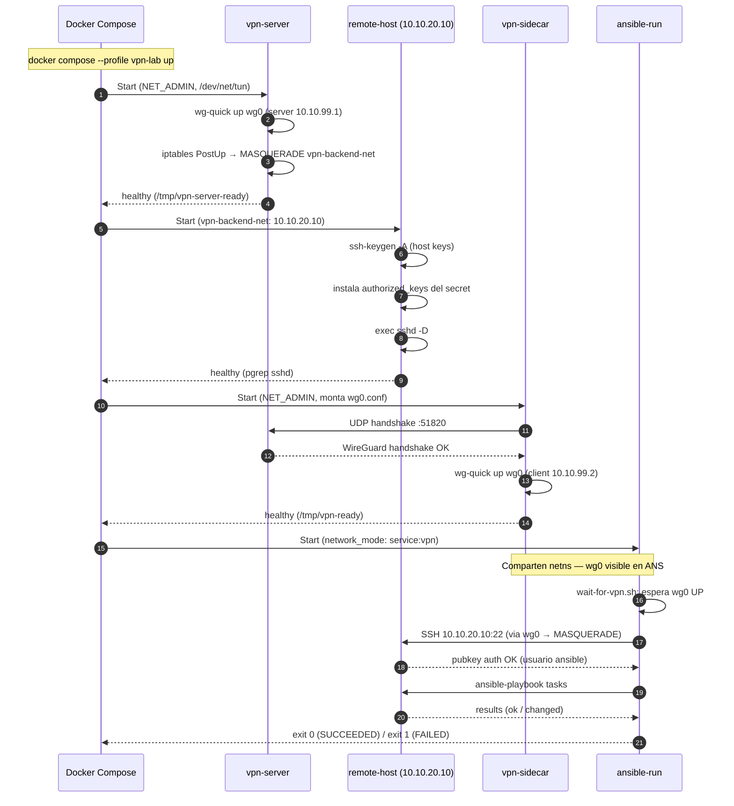

# 04 — Lab VPN Tunnel: WireGuard + Ansible

**Entorno**: Debian 12, Docker 24+, WireGuard kernel module
**Objetivo**: Simular el ciclo completo en local — servidor WireGuard real + host remoto Debian + Ansible executor — sin necesitar infraestructura cloud.

---

## 📋 Tabla de Contenidos

1. [Arquitectura](#arquitectura)
2. [Prerequisitos](#prerequisitos)
3. [Estructura de Archivos](#estructura)
4. [Cómo funciona la red](#red)
5. [Diagrama de Secuencia](#diagrama-secuencia)
6. [Ejecución del Lab](#ejecucion)
7. [Validación y Troubleshooting](#validacion)

---

## <a id="arquitectura"></a>1. Arquitectura

```
┌─────────────────────────────────────────────────────────────────────────┐
│  vpn-net  (bridge, auto-subnet)                                         │
│                                                                         │
│   ┌──────────────────────┐   UDP :51820    ┌──────────────────────┐    │
│   │  vpn-sidecar         │ ◀────────────── │  vpn-server          │    │
│   │  WireGuard client    │                 │  WireGuard server    │    │
│   │  wg0: 10.10.99.2/24  │ ──────────────▶ │  wg0: 10.10.99.1/24 │    │
│   │                      │    Tunnel OK    │                      │    │
│   │  ┌────────────────┐  │                 │  vpn-backend-net ────┼──┐ │
│   │  │ ansible-run    │  │                 └──────────────────────┘  │ │
│   │  │ network_mode:  │  │                                           │ │
│   │  │ service:vpn    │  │                 ┌──────────────────────┐  │ │
│   │  │                │──┼─── SSH via ────▶│  remote-host         │◀─┘ │
│   │  │ wg0 visible    │  │    wg0 + NAT    │  10.10.20.10         │    │
│   │  └────────────────┘  │                 │  sshd :22 (usuario   │    │
│   └──────────────────────┘                 │  ansible + sudo)     │    │
│                                            └──────────────────────┘    │
└─────────────────────────────────────────────────────────────────────────┘

Redes Docker:
  vpn-net         → vpn-sidecar + vpn-server (WireGuard UDP)
  vpn-backend-net → vpn-server + remote-host (10.10.20.0/24)

WireGuard virtual: 10.10.99.0/24
  Server: 10.10.99.1   Client: 10.10.99.2
  Client AllowedIPs: 10.10.99.0/24, 10.10.20.0/24
```

**Por qué funciona el enrutamiento**: `vpn-server` hace MASQUERADE (`iptables PostUp`) para el tráfico del tunnel hacia `vpn-backend-net`. `remote-host` no está en `vpn-net`, por lo que solo es accesible a través del túnel WireGuard.

---

## <a id="prerequisitos"></a>2. Prerequisitos

```bash
# Módulo WireGuard cargado en el kernel del host
sudo modprobe wireguard
lsmod | grep wireguard

# Docker Compose v2 y make
docker compose version   # v2.20+
sudo apt-get install -y make

# Debug de red (opcional)
sudo apt-get install -y iputils-ping iproute2 tcpdump
```

---

## <a id="estructura"></a>3. Estructura de Archivos

```
kubernetes-job-over-VPN/
├── docker/
│   ├── vpn/                        # WireGuard client sidecar
│   │   ├── Dockerfile
│   │   ├── entrypoint.sh           # wg-quick up + monitor loop
│   │   └── healthcheck.sh          # /tmp/vpn-ready
│   ├── vpn-server/                 # WireGuard server (lab)
│   │   ├── Dockerfile
│   │   ├── entrypoint.sh           # iptables MASQUERADE + wg-quick up
│   │   └── healthcheck.sh          # /tmp/vpn-server-ready
│   ├── remote-host/                # Debian SSH target (lab)
│   │   ├── Dockerfile              # openssh-server + usuario ansible + sudo
│   │   └── entrypoint.sh           # instala authorized_keys + exec sshd
│   └── ansible/
│       ├── Dockerfile
│       └── scripts/
│           ├── entrypoint.sh       # wait wg0 → ansible-playbook → exit code
│           └── wait-for-vpn.sh
├── ansible/
│   ├── ansible.cfg
│   ├── inventories/dev/
│   │   ├── hosts.yml               # remote-dev → ansible_host: 10.10.20.10
│   │   └── group_vars/all.yml
│   └── playbooks/
│       ├── test-connectivity.yml
│       └── site.yml
├── test/
│   ├── vpn-lab/
│   │   ├── setup.sh                # genera WireGuard + SSH keypairs
│   │   ├── wg0-server.conf         # config servidor (generado por setup.sh)
│   │   └── wg0-server.conf.example
│   ├── vpn/
│   │   └── wg0.conf                # config cliente sidecar (generado)
│   └── secrets/
│       ├── ssh-private-key         # clave Ansible (generada)
│       └── ssh-public-key          # montada en remote-host (generada)
├── docker-compose.yml              # stack completo; --profile vpn-lab incluye lab
└── docker-compose.vpn-lab.yml      # standalone: solo vpn-server + remote-host
```

---

## <a id="red"></a>4. Cómo funciona la red

### Generación de claves

`test/vpn-lab/setup.sh` genera los keypairs WireGuard y SSH de forma automática. Los escribe directamente en las rutas que Docker Compose monta como volúmenes — no hay que editar ningún archivo manualmente.

| Archivo generado | Dónde se monta |
|---|---|
| `test/vpn-lab/wg0-server.conf` | `vpn-server:/etc/wireguard/wg0.conf` |
| `test/vpn/wg0.conf` | `vpn-sidecar:/etc/wireguard/wg0.conf` |
| `test/secrets/ssh-private-key` | `ansible-run:/run/secrets/` |
| `test/secrets/ssh-public-key` | `remote-host:/run/secrets/` |

### Routing end-to-end

```
ansible-run → [wg0 10.10.99.2] → [túnel UDP] → [wg0 10.10.99.1 vpn-server]
           → [iptables MASQUERADE] → [eth1 vpn-backend-net] → remote-host 10.10.20.10
```

El `remote-host` ve las conexiones provenientes de la IP del `vpn-server` en `vpn-backend-net` (MASQUERADE), por lo que responde directamente sin necesitar rutas adicionales.

### SKIP_VPN flag

El `vpn-sidecar` tiene un modo no-op controlado por `SKIP_VPN`:

| Valor | Comportamiento |
|---|---|
| `SKIP_VPN=true` (default) | sidecar arranca en modo no-op, sin tunnel; `remote-host` no es alcanzable |
| `SKIP_VPN=false` | sidecar levanta `wg0` conectando al `vpn-server`; `remote-host` accesible |

---

## <a id="diagrama-secuencia"></a>5. Diagrama de Secuencia



### Puntos clave

- **Steps 2–3**: `vpn-server` actúa como gateway — levanta `wg0` y configura `iptables` para reenviar tráfico VPN a `vpn-backend-net`
- **Steps 5–8**: `remote-host` solo tiene interfaz en `vpn-backend-net`; es invisible desde `vpn-net`
- **Steps 9–12**: `vpn-sidecar` establece el handshake WireGuard con `vpn-server` y levanta `wg0`
- **Steps 13–14**: `ansible-run` comparte el netns del sidecar — `wg0` es visible aquí también
- **Steps 15–16**: `wait-for-vpn.sh` bloquea hasta que `wg0` esté `UP` (simula el init container de K8s)
- **Steps 17–20**: SSH viaja por `wg0 → túnel → MASQUERADE → remote-host`

---

## <a id="ejecucion"></a>6. Ejecución del Lab

### Targets del Makefile

```
make dev-setup        → Primera vez: genera claves WireGuard + SSH + vault password
make lab-setup        → Solo genera claves WireGuard + SSH (sin vault)
make lab-build        → Construye las imágenes Docker del lab
make lab-up           → Levanta vpn-server + remote-host (genera claves si faltan)
make lab-down         → Para y elimina los containers del lab
make lab-logs         → Sigue los logs en tiempo real
make lab-vpn-status   → wg show wg0 en el servidor
make lab-test         → Prueba conectividad: ping remote-host desde vpn-sidecar
make lab-shell        → Shell interactivo en remote-host
make lab-clean        → Para el lab y borra todas las claves generadas
```

### Flujo — Lab standalone (para probar desde K8s dev)

```bash
# 1. Generar claves (una sola vez)
make lab-setup
#    Escribe:
#      test/vpn-lab/wg0-server.conf   ← montado en vpn-server
#      test/vpn/wg0.conf              ← montado en vpn-sidecar
#      test/secrets/ssh-private-key   ← usado por Ansible
#      test/secrets/ssh-public-key    ← montado en remote-host

# 2. Levantar el lab
make lab-up
#      VPN Lab is up.
#      WireGuard server : UDP <HOST_IP>:51820
#      Remote host (VPN): 10.10.20.10  (reachable only via tunnel)

# 3. Inspeccionar
make lab-vpn-status      # wg show wg0 — debe aparecer el peer cliente
make lab-shell           # bash en remote-host

# 4. Parar / limpiar
make lab-down
make lab-clean           # también borra las claves generadas
```

### Flujo — Stack completo (VPN + Ansible executor local)

```bash
# Prerequisito: claves generadas
make lab-setup

# Levantar todo: vpn-server, remote-host, vpn-sidecar, ansible-run
SKIP_VPN=false docker compose --profile vpn-lab up

# Test end-to-end
make lab-test
#   1. wg show wg0 en vpn-server (debe haber handshake reciente)
#   2. ping 10.10.20.10 desde vpn-sidecar (pasa por el túnel)
```

### Conectar desde Kubernetes (entorno dev)

Con `make lab-up` corriendo, el puerto UDP 51820 queda expuesto en el host. Pasos:

1. Editar (o generar de nuevo) el `wg0.conf` del Job apuntando al nodo host:
   ```ini
   [Peer]
   Endpoint   = <NODE_IP>:51820
   AllowedIPs = 10.10.99.0/24, 10.10.20.0/24
   ```

2. Aplicar los secrets en el namespace dev:
   ```bash
   make k8s-secrets-dev
   ```

3. Desplegar el Job — `remote-host` responde en `10.10.20.10:22` a través del túnel.

---

## <a id="validacion"></a>7. Validación y Troubleshooting

### Checklist

```bash
# 1. vpn-server: WireGuard activo
make lab-vpn-status
# Debe mostrar el peer cliente con latest-handshake < 3 min

# 2. vpn-sidecar: wg0 levantado con IP correcta
docker exec vpn-sidecar ip addr show wg0
# inet 10.10.99.2/24

# 3. ansible-run: también ve wg0 (netns compartido)
docker exec ansible-run ip addr show wg0

# 4. Ruta hacia remote-host sale por wg0
docker exec vpn-sidecar ip route get 10.10.20.10
# via dev wg0

# 5. Ping a remote-host
make lab-test

# 6. SSH manual al remote-host
docker exec vpn-sidecar ssh -i /run/secrets/ssh-private-key \
  -o StrictHostKeyChecking=no ansible@10.10.20.10 hostname

# 7. Ansible ping
docker exec ansible-run ansible all -i inventories/dev -m ping
```

### 🔴 "Cannot open TUN/TAP dev /dev/net/tun"

```bash
sudo modprobe tun
ls -l /dev/net/tun    # debe existir
# Verificar que docker-compose tiene: devices: - /dev/net/tun:/dev/net/tun
```

### 🔴 vpn-sidecar no levanta wg0

```bash
docker logs vpn-sidecar
# "placeholder values" → ejecutar make lab-setup
# "wg-quick up failed" → modprobe wireguard en el host
# SKIP_VPN=true activo → pasar SKIP_VPN=false
```

### 🔴 "wg0 already exists"

```bash
# El módulo quedó cargado de una ejecución anterior
docker exec vpn-sidecar wg-quick down wg0
docker restart vpn-sidecar
```

### 🔴 ansible-run no alcanza 10.10.20.10

```bash
# 1. Verificar network_mode correcto
docker inspect ansible-run | grep NetworkMode
# Debe ser: "container:vpn-sidecar"

# 2. Verificar que wg0 existe en el netns compartido
docker exec ansible-run ip link show wg0

# 3. Ping desde el sidecar directamente
docker exec vpn-sidecar ping -c 2 10.10.20.10

# Si el sidecar no alcanza: verificar handshake en vpn-server
make lab-vpn-status
```

### 🔴 "Permission denied (publickey)"

```bash
# Comparar pubkeys
diff <(docker exec remote-host cat /home/ansible/.ssh/authorized_keys) \
     test/secrets/ssh-public-key

# Si no coinciden: regenerar y reiniciar
make lab-clean && make lab-setup && make lab-up
```

---

## 🔗 Referencias

- [WireGuard Quick Start](https://www.wireguard.com/quickstart/)
- [Docker network_mode: service](https://docs.docker.com/compose/compose-file/05-services/#network_mode)
- [K8s Native Sidecars](https://kubernetes.io/docs/concepts/workloads/pods/sidecar-containers/)
- [Ansible SSH connection plugin](https://docs.ansible.com/ansible/latest/collections/ansible/builtin/ssh_connection.html)

---

**Siguiente**: [05-ssh-params-reference.md](05-ssh-params-reference.md) — Referencia completa parámetros SSH
