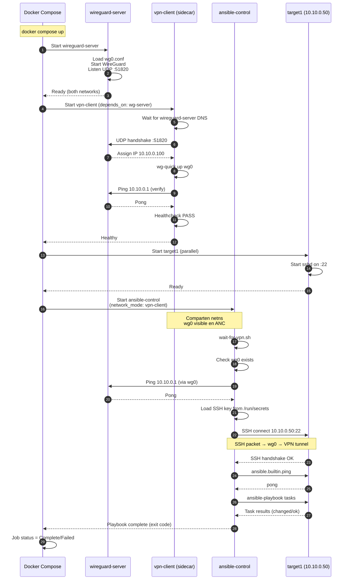

# 04 — Lab VPN Tunnel: WireGuard + OpenVPN + Ansible

**Entorno**: con Debian 12, Docker 24+, Ansible 2.16+  
**Objetivo**: Lab completo reproducible que simula la arquitectura Kubernetes con VPN sidecar + Ansible, usando Docker Compose. Incluye WireGuard (principal) y OpenVPN (alternativo).

---

## 📋 Tabla de Contenidos

1. [Arquitectura del Lab 2](#arquitectura)
2. [Prerequisitos](#prerequisitos)
3. [Estructura de Archivos](#estructura)
4. [Componente 1: WireGuard Server](#wireguard-server)
5. [Componente 2: VPN Client Sidecar](#vpn-client)
6. [Componente 3: Ansible Executor](#ansible-executor)
7. [Componente 4: SSH Targets](#ssh-targets)
8. [Docker Compose Completo](#docker-compose)
9. [Scripts de Inicialización](#scripts)
10. [Diagrama de Secuencia: InitContainers](#diagrama-secuencia)
11. [Ejecución del Lab](#ejecucion)
12. [Validación y Testing](#validacion)
13. [Alternativa: OpenVPN](#openvpn-alt)
14. [Troubleshooting](#troubleshooting)
15. [Ejercicios Avanzados](#ejercicios)

---

## <a id="arquitectura"></a>1. Arquitectura del Lab 2

Este lab simula la **arquitectura real de Kubernetes** con:

- **wireguard-server**: VPN server (simula VPN gateway en producción)
- **vpn-client**: WireGuard client sidecar (comparte netns con ansible)
- **ansible-control**: Ansible executor que usa la red del VPN client
- **bastion**: Bastion host detrás del VPN
- **target1, target2**: SSH targets en red privada del VPN

```
┌──────────────────────────────────────────────────────────────────────────┐
│  Docker Compose Networks                                                 │
├──────────────────────────────────────────────────────────────────────────┤
│                                                                           │
│  PUBLIC NET (172.29.1.0/24)                    PRIVATE NET (10.10.0.0/24)│
│  ┌───────────────────┐                         ┌────────────────────────┐│
│  │ ansible-control   │                         │ wireguard-server       ││
│  │ 172.29.1.10       │                         │ Public: 172.29.1.100   ││
│  │                   │                         │ Private: 10.10.0.1     ││
│  │  ┌─────────────┐  │   WireGuard UDP 51820   └───────────┬────────────┘│
│  │  │ vpn-client  │  │ ───────────────────────────────────▶│            ││
│  │  │ (sidecar)   │◀─┼─────────────────────────────────────┤            ││
│  │  │ wg0:        │  │   Tunnel 10.10.0.100/24             │            ││
│  │  │ 10.10.0.100 │  │                                     │            ││
│  │  └─────────────┘  │                         ┌───────────▼────────────┐│
│  │        ▲          │                         │ bastion                ││
│  │        │          │                         │ 10.10.0.30             ││
│  │ network_mode:     │                         │ SSH :22                ││
│  │ service:vpn-      │                         └───────────┬────────────┘│
│  │ client            │                                     │             ││
│  │        │          │                         ┌───────────▼────────────┐│
│  │   ansible-playbook│                         │ target1                ││
│  │   SSH 10.10.0.50  │                         │ 10.10.0.50             ││
│  │        │          │                         │ SSH :22                ││
│  │        └──────────┼─────────────────────────▶                        ││
│  │                   │     SSH over VPN         └────────────────────────┘│
│  └───────────────────┘                         ┌────────────────────────┐│
│                                                 │ target2                ││
│                                                 │ 10.10.0.51             ││
│                                                 │ SSH :22                ││
│                                                 └────────────────────────┘│
│                                                                           │
└──────────────────────────────────────────────────────────────────────────┘

Flujo:
1. wireguard-server inicia en ambas redes (bridge público + privado)
2. vpn-client conecta vía UDP 51820 → obtiene IP 10.10.0.100
3. ansible-control comparte netns con vpn-client (network_mode: service:vpn-client)
4. Ansible SSH a 10.10.0.50 → pasa por wg0 → wireguard-server → target1
```

---

## <a id="prerequisitos"></a>2. Prerequisitos

### Sistema Host

```bash
# Docker con module WireGuard
sudo apt-get install -y linux-headers-$(uname -r) wireguard-dkms wireguard-tools

# Verificar module
sudo modprobe wireguard
lsmod | grep wireguard

# Docker Compose v2
docker compose version

# Makefile support
sudo apt-get install -y make

# Herramientas de network debug
sudo apt-get install -y iputils-ping iproute2 dnsutils netcat-openbsd tcpdump
```

---

## <a id="estructura"></a>3. Estructura de Archivos

```
kubernetes-job-over-VPN/
├── lab2/                                    # ← Lab VPN + Ansible
│   ├── docker-compose.yml
│   ├── wireguard-server/
│   │   ├── Dockerfile
│   │   ├── wg0.conf                         # Server config (generado)
│   │   └── entrypoint.sh
│   ├── vpn-client/
│   │   ├── Dockerfile
│   │   ├── wg0.conf                         # Client config (generado)
│   │   ├── entrypoint.sh
│   │   └── healthcheck.sh
│   ├── ansible-control/
│   │   ├── Dockerfile
│   │   ├── entrypoint.sh
│   │   └── wait-for-vpn.sh
│   ├── ssh-target/
│   │   └── Dockerfile
│   ├── keys/                                # SSH + WireGuard keys (generado)
│   │   ├── ssh/
│   │   │   ├── id_ed25519
│   │   │   ├── id_ed25519.pub
│   │   │   └── authorized_keys
│   │   └── wireguard/
│   │       ├── server_private.key
│   │       ├── server_public.key
│   │       ├── client_private.key
│   │       └── client_public.key
│   ├── ansible/
│   │   ├── ansible.cfg
│   │   ├── inventory/
│   │   │   └── hosts.yml
│   │   └── playbooks/
│   │       ├── test-vpn.yml
│   │       └── deploy-app.yml
│   └── scripts/
│       ├── generate-keys.sh                 # Genera SSH + WireGuard keys
│       ├── generate-wireguard-configs.sh    # Genera wg0.conf
│       └── test-connectivity.sh             # Valida setup
└── Makefile                                  # Targets: make lab2-*
```

---

## <a id="wireguard-server"></a>4. Componente 1: WireGuard Server

### lab2/wireguard-server/Dockerfile

```dockerfile
# ══════════════════════════════════════════════════════════════════════
# WireGuard VPN Server — Lab
# ══════════════════════════════════════════════════════════════════════

FROM debian:12-slim

ENV DEBIAN_FRONTEND=noninteractive \
    LANG=en_US.UTF-8

# Install WireGuard + tools
RUN apt-get update && apt-get install -y --no-install-recommends \
    wireguard \
    wireguard-tools \
    iproute2 \
    iptables \
    procps \
    iputils-ping \
    && apt-get clean \
    && rm -rf /var/lib/apt/lists/*

# Enable IP forwarding
RUN echo "net.ipv4.ip_forward = 1" >> /etc/sysctl.conf

WORKDIR /etc/wireguard

COPY entrypoint.sh /usr/local/bin/
RUN chmod +x /usr/local/bin/entrypoint.sh

EXPOSE 51820/udp

CMD ["/usr/local/bin/entrypoint.sh"]
```

---

### lab2/wireguard-server/entrypoint.sh

```bash
#!/usr/bin/env bash
# ══════════════════════════════════════════════════════════════════════
# WireGuard Server Entrypoint
# ══════════════════════════════════════════════════════════════════════

set -euo pipefail

echo "[WireGuard Server] Starting..."

# Enable IP forwarding
sysctl -w net.ipv4.ip_forward=1

# Check config exists
if [[ ! -f /etc/wireguard/wg0.conf ]]; then
    echo "ERROR: /etc/wireguard/wg0.conf not found!"
    exit 1
fi

# Set permissions
chmod 600 /etc/wireguard/wg0.conf

# Start WireGuard
echo "[WireGuard Server] Starting wg0 interface..."
wg-quick up wg0

# Show status
wg show

# Setup iptables NAT (permitir forwarding VPN → private network)
PRIVATE_SUBNET="10.10.0.0/24"
iptables -t nat -A POSTROUTING -s ${PRIVATE_SUBNET} -o eth1 -j MASQUERADE
iptables -A FORWARD -i wg0 -o eth1 -j ACCEPT
iptables -A FORWARD -i eth1 -o wg0 -m state --state RELATED,ESTABLISHED -j ACCEPT

echo "[WireGuard Server] Rules applied:"
iptables -t nat -L -n -v
iptables -L FORWARD -n -v

# Keep alive
tail -f /dev/null
```

---

### lab2/wireguard-server/wg0.conf (Template — generado por script)

```ini
# ══════════════════════════════════════════════════════════════════════
# WireGuard Server Config
# Generado por scripts/generate-wireguard-configs.sh
# ══════════════════════════════════════════════════════════════════════

[Interface]
# Server address in VPN network
Address = 10.10.0.1/24

# Server private key
PrivateKey = SERVER_PRIVATE_KEY_PLACEHOLDER

# Listen port
ListenPort = 51820

# ── Peer: Ansible VPN Client ──────────────────────────────────────────
[Peer]
# Client public key
PublicKey = CLIENT_PUBLIC_KEY_PLACEHOLDER

# Allowed IPs for this peer (client gets 10.10.0.100)
AllowedIPs = 10.10.0.100/32
```

---

## <a id="vpn-client"></a>5. Componente 2: VPN Client Sidecar

### lab2/vpn-client/Dockerfile

```dockerfile
# ══════════════════════════════════════════════════════════════════════
# WireGuard VPN Client Sidecar — Lab
# Simula el init container VPN en Kubernetes
# ══════════════════════════════════════════════════════════════════════

FROM debian:12-slim

ENV DEBIAN_FRONTEND=noninteractive \
    LANG=en_US.UTF-8

RUN apt-get update && apt-get install -y --no-install-recommends \
    wireguard \
    wireguard-tools \
    iproute2 \
    iputils-ping \
    procps \
    && apt-get clean \
    && rm -rf /var/lib/apt/lists/*

WORKDIR /etc/wireguard

COPY entrypoint.sh /usr/local/bin/
COPY healthcheck.sh /usr/local/bin/
RUN chmod +x /usr/local/bin/*.sh

CMD ["/usr/local/bin/entrypoint.sh"]
```

---

### lab2/vpn-client/entrypoint.sh

```bash
#!/usr/bin/env bash
# ══════════════════════════════════════════════════════════════════════
# VPN Client Sidecar Entrypoint
# ══════════════════════════════════════════════════════════════════════

set -euo pipefail

echo "[VPN Client] Starting..."

# Wait for wireguard-server to be ready (DNS resolution)
until ping -c 1 wireguard-server &> /dev/null; do
    echo "[VPN Client] Waiting for wireguard-server..."
    sleep 2
done

# Check config
if [[ ! -f /etc/wireguard/wg0.conf ]]; then
    echo "ERROR: /etc/wireguard/wg0.conf not found!"
    exit 1
fi

chmod 600 /etc/wireguard/wg0.conf

# Start WireGuard
echo "[VPN Client] Starting wg0 interface..."
wg-quick up wg0

# Show status
wg show

# Verify tunnel
echo "[VPN Client] Testing VPN connectivity..."
if ping -c 3 10.10.0.1; then
    echo "[VPN Client] ✓ VPN tunnel established"
else
    echo "[VPN Client] ✗ VPN tunnel failed"
    exit 1
fi

# Keep alive
echo "[VPN Client] Container ready. Keeping alive..."
tail -f /dev/null
```

---

### lab2/vpn-client/healthcheck.sh

```bash
#!/usr/bin/env bash
# ══════════════════════════════════════════════════════════════════════
# VPN Client Healthcheck
# ══════════════════════════════════════════════════════════════════════

set -euo pipefail

# Check interface exists
if ! ip link show wg0 &> /dev/null; then
    echo "FAIL: wg0 interface not found"
    exit 1
fi

# Check interface UP
if ! ip link show wg0 | grep -q "state UP"; then
    echo "FAIL: wg0 interface not UP"
    exit 1
fi

# Check VPN gateway reachable
if ! ping -c 1 -W 2 10.10.0.1 &> /dev/null; then
    echo "FAIL: Cannot ping VPN gateway 10.10.0.1"
    exit 1
fi

# Check handshake recent (< 3 minutes)
LAST_HANDSHAKE=$(wg show wg0 latest-handshakes | awk '{print $2}')
CURRENT_TIME=$(date +%s)
HANDSHAKE_AGE=$((CURRENT_TIME - LAST_HANDSHAKE))

if [[ ${HANDSHAKE_AGE} -gt 180 ]]; then
    echo "FAIL: Last handshake ${HANDSHAKE_AGE}s ago (max 180s)"
    exit 1
fi

echo "OK: VPN healthy (handshake ${HANDSHAKE_AGE}s ago)"
exit 0
```

---

### lab2/vpn-client/wg0.conf (Template — generado por script)

```ini
# ══════════════════════════════════════════════════════════════════════
# WireGuard Client Config
# Generado por scripts/generate-wireguard-configs.sh
# ══════════════════════════════════════════════════════════════════════

[Interface]
# Client VPN address
Address = 10.10.0.100/24

# Client private key
PrivateKey = CLIENT_PRIVATE_KEY_PLACEHOLDER

[Peer]
# Server public key
PublicKey = SERVER_PUBLIC_KEY_PLACEHOLDER

# Server endpoint (Docker service name resolvido por DNS interno)
Endpoint = wireguard-server:51820

# Route all VPN traffic through this peer
AllowedIPs = 10.10.0.0/24

# Keepalive (importante para NAT traversal en K8s)
PersistentKeepalive = 25
```

---

## <a id="ansible-executor"></a>6. Componente 3: Ansible Executor

### lab2/ansible-control/Dockerfile

```dockerfile
# ══════════════════════════════════════════════════════════════════════
# Ansible Control — Lab (comparte netns con vpn-client)
# ══════════════════════════════════════════════════════════════════════

FROM debian:12-slim

ENV DEBIAN_FRONTEND=noninteractive \
    LANG=en_US.UTF-8 \
    PYTHONUNBUFFERED=1 \
    ANSIBLE_VERSION=2.16.*

RUN apt-get update && apt-get install -y --no-install-recommends \
    python3 \
    python3-pip \
    openssh-client \
    git \
    vim \
    iproute2 \
    iputils-ping \
    curl \
    locales \
    && locale-gen en_US.UTF-8 \
    && apt-get clean \
    && rm -rf /var/lib/apt/lists/*

# Install Ansible
RUN pip3 install --no-cache-dir --break-system-packages \
    ansible-core==${ANSIBLE_VERSION} \
    jmespath

# SSH config
RUN mkdir -p /root/.ssh && chmod 700 /root/.ssh

WORKDIR /ansible

COPY entrypoint.sh /usr/local/bin/
COPY wait-for-vpn.sh /usr/local/bin/
RUN chmod +x /usr/local/bin/*.sh

CMD ["/usr/local/bin/entrypoint.sh"]
```

---

### lab2/ansible-control/wait-for-vpn.sh

```bash
#!/usr/bin/env bash
# ══════════════════════════════════════════════════════════════════════
# Wait for VPN Interface Ready
# Simula el behavior de K8s init containers
# ══════════════════════════════════════════════════════════════════════

set -euo pipefail

VPN_INTERFACE="${VPN_INTERFACE:-wg0}"
VPN_GATEWAY="${VPN_GATEWAY:-10.10.0.1}"
MAX_WAIT="${MAX_WAIT:-120}"

echo "[Wait VPN] Waiting for ${VPN_INTERFACE} interface..."

elapsed=0
while true; do
    if ip link show "${VPN_INTERFACE}" &> /dev/null; then
        echo "[Wait VPN] ✓ Interface ${VPN_INTERFACE} found"
        break
    fi

    if [[ ${elapsed} -ge ${MAX_WAIT} ]]; then
        echo "[Wait VPN] ✗ Timeout waiting for ${VPN_INTERFACE}"
        exit 1
    fi

    sleep 2
    elapsed=$((elapsed + 2))
done

echo "[Wait VPN] Testing VPN gateway ${VPN_GATEWAY}..."
elapsed=0
while true; do
    if ping -c 1 -W 2 "${VPN_GATEWAY}" &> /dev/null; then
        echo "[Wait VPN] ✓ VPN gateway reachable"
        break
    fi

    if [[ ${elapsed} -ge ${MAX_WAIT} ]]; then
        echo "[Wait VPN] ✗ Timeout waiting for VPN gateway"
        exit 1
    fi

    sleep 2
    elapsed=$((elapsed + 2))
done

echo "[Wait VPN] VPN ready!"
```

---

### lab2/ansible-control/entrypoint.sh

```bash
#!/usr/bin/env bash
# ══════════════════════════════════════════════════════════════════════
# Ansible Control Entrypoint
# ══════════════════════════════════════════════════════════════════════

set -euo pipefail

echo "[Ansible] Starting..."

# Wait for VPN (simula init container wait)
/usr/local/bin/wait-for-vpn.sh

# SSH key setup
if [[ -f /run/secrets/ssh-key ]]; then
    cp /run/secrets/ssh-key /root/.ssh/id_ed25519
    chmod 600 /root/.ssh/id_ed25519
    echo "[Ansible] ✓ SSH key loaded"
fi

# Show network info
echo "[Ansible] Network interfaces:"
ip addr show

echo "[Ansible] Routing table:"
ip route show

# Test basic connectivity
echo "[Ansible] Testing VPN targets..."
for host in 10.10.0.30 10.10.0.50 10.10.0.51; do
    if ping -c 2 "${host}" &> /dev/null; then
        echo "  ✓ ${host} reachable"
    else
        echo "  ✗ ${host} unreachable"
    fi
done

# If playbook specified, run it
if [[ -n "${ANSIBLE_PLAYBOOK:-}" ]]; then
    echo "[Ansible] Running playbook: ${ANSIBLE_PLAYBOOK}"
    cd /ansible
    ansible-playbook \
        -i "${ANSIBLE_INVENTORY:-inventory/hosts.yml}" \
        "${ANSIBLE_PLAYBOOK}" \
        ${ANSIBLE_EXTRA_ARGS:-}
else
    echo "[Ansible] No playbook specified. Use: docker exec ansible-control ansible-playbook ..."
    tail -f /dev/null
fi
```

---

## <a id="ssh-targets"></a>7. Componente 4: SSH Targets

### lab2/ssh-target/Dockerfile

```dockerfile
# ══════════════════════════════════════════════════════════════════════
# SSH Target — Lab (bastion, target1, target2)
# ══════════════════════════════════════════════════════════════════════

FROM debian:12-slim

ENV DEBIAN_FRONTEND=noninteractive \
    LANG=en_US.UTF-8

RUN apt-get update && apt-get install -y --no-install-recommends \
    openssh-server \
    python3 \
    sudo \
    iproute2 \
    iputils-ping \
    locales \
    && locale-gen en_US.UTF-8 \
    && apt-get clean \
    && rm -rf /var/lib/apt/lists/*

# SSH config
RUN mkdir /var/run/sshd && \
    mkdir -p /root/.ssh && chmod 700 /root/.ssh && \
    sed -i 's/#PermitRootLogin prohibit-password/PermitRootLogin prohibit-password/' /etc/ssh/sshd_config && \
    sed -i 's/#PubkeyAuthentication yes/PubkeyAuthentication yes/' /etc/ssh/sshd_config && \
    sed -i 's/#PasswordAuthentication yes/PasswordAuthentication no/' /etc/ssh/sshd_config

EXPOSE 22

CMD ["/usr/sbin/sshd", "-D"]
```

---

## <a id="docker-compose"></a>8. Docker Compose Completo

### lab2/docker-compose.yml

```yaml
---
# ══════════════════════════════════════════════════════════════════════
# Lab 2: VPN Tunnel + Ansible
# Simula arquitectura Kubernetes con VPN sidecar
# ══════════════════════════════════════════════════════════════════════

x-logging: &default-logging
  driver: json-file
  options:
    max-size: "10m"
    max-file: "2"

services:
  # ── WireGuard Server (VPN Gateway) ──────────────────────────────────
  wireguard-server:
    build:
      context: ./wireguard-server
    container_name: lab2-wg-server
    hostname: wireguard-server
    cap_add:
      - NET_ADMIN
      - SYS_MODULE
    devices:
      - /dev/net/tun:/dev/net/tun
    sysctls:
      - net.ipv4.ip_forward=1
    volumes:
      - ./wireguard-server/wg0.conf:/etc/wireguard/wg0.conf:ro
    networks:
      public-net:
        ipv4_address: 172.29.1.100
      private-net:
        ipv4_address: 10.10.0.1
    ports:
      - "51820:51820/udp"
    logging: *default-logging

  # ── VPN Client Sidecar ──────────────────────────────────────────────
  vpn-client:
    build:
      context: ./vpn-client
    container_name: lab2-vpn-client
    hostname: vpn-client
    cap_add:
      - NET_ADMIN
      - SYS_MODULE
    devices:
      - /dev/net/tun:/dev/net/tun
    volumes:
      - ./vpn-client/wg0.conf:/etc/wireguard/wg0.conf:ro
    networks:
      - public-net
    depends_on:
      - wireguard-server
    healthcheck:
      test: ["/usr/local/bin/healthcheck.sh"]
      interval: 10s
      timeout: 5s
      retries: 5
      start_period: 20s
    logging: *default-logging

  # ── Ansible Control (comparte netns con vpn-client) ────────────────
  ansible-control:
    build:
      context: ./ansible-control
    container_name: lab2-ansible-control
    hostname: ansible-control
    # KEY: comparte network namespace con vpn-client (simula K8s pod)
    network_mode: "service:vpn-client"
    depends_on:
      vpn-client:
        condition: service_healthy
    environment:
      - ANSIBLE_CONFIG=/ansible/ansible.cfg
      - ANSIBLE_HOST_KEY_CHECKING=False
      - ANSIBLE_INVENTORY=inventory/hosts.yml
      - ANSIBLE_PLAYBOOK=${ANSIBLE_PLAYBOOK:-}
      - VPN_INTERFACE=wg0
      - VPN_GATEWAY=10.10.0.1
    volumes:
      - ./ansible:/ansible:ro
      - ./keys/ssh/id_ed25519:/run/secrets/ssh-key:ro
    logging: *default-logging

  # ── Bastion Host ────────────────────────────────────────────────────
  bastion:
    build:
      context: ./ssh-target
    container_name: lab2-bastion
    hostname: bastion
    networks:
      private-net:
        ipv4_address: 10.10.0.30
    volumes:
      - ./keys/ssh/authorized_keys:/root/.ssh/authorized_keys:ro
    logging: *default-logging

  # ── Target 1 ────────────────────────────────────────────────────────
  target1:
    build:
      context: ./ssh-target
    container_name: lab2-target1
    hostname: target1
    networks:
      private-net:
        ipv4_address: 10.10.0.50
    volumes:
      - ./keys/ssh/authorized_keys:/root/.ssh/authorized_keys:ro
    logging: *default-logging

  # ── Target 2 ────────────────────────────────────────────────────────
  target2:
    build:
      context: ./ssh-target
    container_name: lab2-target2
    hostname: target2
    networks:
      private-net:
        ipv4_address: 10.10.0.51
    volumes:
      - ./keys/ssh/authorized_keys:/root/.ssh/authorized_keys:ro
    logging: *default-logging

networks:
  public-net:
    driver: bridge
    ipam:
      driver: default
      config:
        - subnet: 172.29.1.0/24

  private-net:
    driver: bridge
    ipam:
      driver: default
      config:
        - subnet: 10.10.0.0/24
```

---

## <a id="scripts"></a>9. Scripts de Inicialización

### lab2/scripts/generate-keys.sh

```bash
#!/usr/bin/env bash
# ══════════════════════════════════════════════════════════════════════
# Generate SSH + WireGuard Keys for Lab 2
# ══════════════════════════════════════════════════════════════════════

set -euo pipefail

SCRIPT_DIR="$( cd "$( dirname "${BASH_SOURCE[0]}" )" && pwd )"
LAB_DIR="${SCRIPT_DIR}/.."
KEYS_DIR="${LAB_DIR}/keys"

echo "🔑 Generating Lab 2 Keys..."

# ── SSH Keys ───────────────────────────────────────────────────────────
mkdir -p "${KEYS_DIR}/ssh"

if [[ ! -f "${KEYS_DIR}/ssh/id_ed25519" ]]; then
    echo "  → Generating SSH ED25519 key pair..."
    ssh-keygen -t ed25519 -f "${KEYS_DIR}/ssh/id_ed25519" -N "" -C "ansible-lab2"
    cp "${KEYS_DIR}/ssh/id_ed25519.pub" "${KEYS_DIR}/ssh/authorized_keys"
    chmod 600 "${KEYS_DIR}/ssh/id_ed25519"
    chmod 644 "${KEYS_DIR}/ssh/id_ed25519.pub" "${KEYS_DIR}/ssh/authorized_keys"
    echo "  ✓ SSH keys generated"
else
    echo "  ✓ SSH keys already exist"
fi

# ── WireGuard Keys ─────────────────────────────────────────────────────
mkdir -p "${KEYS_DIR}/wireguard"

if [[ ! -f "${KEYS_DIR}/wireguard/server_private.key" ]]; then
    echo "  → Generating WireGuard server keys..."
    wg genkey | tee "${KEYS_DIR}/wireguard/server_private.key" | wg pubkey > "${KEYS_DIR}/wireguard/server_public.key"
    chmod 600 "${KEYS_DIR}/wireguard/server_private.key"
    echo "  ✓ Server keys generated"
else
    echo "  ✓ Server keys already exist"
fi

if [[ ! -f "${KEYS_DIR}/wireguard/client_private.key" ]]; then
    echo "  → Generating WireGuard client keys..."
    wg genkey | tee "${KEYS_DIR}/wireguard/client_private.key" | wg pubkey > "${KEYS_DIR}/wireguard/client_public.key"
    chmod 600 "${KEYS_DIR}/wireguard/client_private.key"
    echo "  ✓ Client keys generated"
else
    echo "  ✓ Client keys already exist"
fi

echo "✅ All keys generated!"
ls -lh "${KEYS_DIR}/ssh"
ls -lh "${KEYS_DIR}/wireguard"
```

---

### lab2/scripts/generate-wireguard-configs.sh

```bash
#!/usr/bin/env bash
# ══════════════════════════════════════════════════════════════════════
# Generate WireGuard wg0.conf Files
# ══════════════════════════════════════════════════════════════════════

set -euo pipefail

SCRIPT_DIR="$( cd "$( dirname "${BASH_SOURCE[0]}" )" && pwd )"
LAB_DIR="${SCRIPT_DIR}/.."
KEYS_DIR="${LAB_DIR}/keys/wireguard"

# Read keys
SERVER_PRIVATE=$(cat "${KEYS_DIR}/server_private.key")
SERVER_PUBLIC=$(cat "${KEYS_DIR}/server_public.key")
CLIENT_PRIVATE=$(cat "${KEYS_DIR}/client_private.key")
CLIENT_PUBLIC=$(cat "${KEYS_DIR}/client_public.key")

echo "📝 Generating WireGuard configs..."

# ── Server Config ──────────────────────────────────────────────────────
cat > "${LAB_DIR}/wireguard-server/wg0.conf" <<EOF
[Interface]
Address = 10.10.0.1/24
PrivateKey = ${SERVER_PRIVATE}
ListenPort = 51820

[Peer]
PublicKey = ${CLIENT_PUBLIC}
AllowedIPs = 10.10.0.100/32
EOF

echo "  ✓ Server config: ${LAB_DIR}/wireguard-server/wg0.conf"

# ── Client Config ──────────────────────────────────────────────────────
cat > "${LAB_DIR}/vpn-client/wg0.conf" <<EOF
[Interface]
Address = 10.10.0.100/24
PrivateKey = ${CLIENT_PRIVATE}

[Peer]
PublicKey = ${SERVER_PUBLIC}
Endpoint = wireguard-server:51820
AllowedIPs = 10.10.0.0/24
PersistentKeepalive = 25
EOF

echo "  ✓ Client config: ${LAB_DIR}/vpn-client/wg0.conf"

echo "✅ WireGuard configs generated!"
```

---

### lab2/scripts/test-connectivity.sh

```bash
#!/usr/bin/env bash
# ══════════════════════════════════════════════════════════════════════
# Test Lab 2 Connectivity
# ══════════════════════════════════════════════════════════════════════

set -euo pipefail

echo "🧪 Testing Lab 2 Connectivity..."

# Test 1: WireGuard handshake
echo ""
echo "Test 1: WireGuard Server Status"
docker exec lab2-wg-server wg show || echo "❌ FAIL"

echo ""
echo "Test 2: WireGuard Client Status"
docker exec lab2-vpn-client wg show || echo "❌ FAIL"

# Test 2: VPN ping
echo ""
echo "Test 3: Ping VPN Gateway from Client"
docker exec lab2-ansible-control ping -c 3 10.10.0.1 || echo "❌ FAIL"

# Test 3: SSH to targets
echo ""
echo "Test 4: SSH to bastion"
docker exec lab2-ansible-control ssh -o StrictHostKeyChecking=no -i /run/secrets/ssh-key root@10.10.0.30 hostname || echo "❌ FAIL"

echo ""
echo "Test 5: SSH to target1"
docker exec lab2-ansible-control ssh -o StrictHostKeyChecking=no -i /run/secrets/ssh-key root@10.10.0.50 hostname || echo "❌ FAIL"

echo ""
echo "Test 6: Ansible ping all hosts"
docker exec lab2-ansible-control ansible all -m ping || echo "❌ FAIL"

echo ""
echo "✅ Connectivity tests complete!"
```

---

## <a id="diagrama-secuencia"></a>10. Diagrama de Secuencia: InitContainers



### Puntos Clave

- **Steps 1-4**: WireGuard server inicia primero (prerequisito)
- **Steps 5-12**: VPN client espera server, establece handshake, verifica connectivity
- **Step 13**: Healthcheck pasa → Docker marca container healthy
- **Steps 14-15**: Target hosts inician SSH daemons
- **Steps 16-18**: Ansible control inicia en **mismo netns** que vpn-client (comparten wg0)
- **Steps 19-23**: `wait-for-vpn.sh` verifica que VPN esté lista antes de ejecutar playbook
- **Steps 24-30**: SSH sobre VPN → playbook execution → resultado

---

## <a id="ejecucion"></a>11. Ejecución del Lab

### Agregar Targets al Makefile Principal

```makefile
## ── Lab 2: VPN Tunnel + Ansible ────────────────────────────────────────

.PHONY: lab2-setup
lab2-setup: ## Setup Lab 2 (generate keys + configs)
	@echo "Setting up Lab 2..."
	mkdir -p lab2/{wireguard-server,vpn-client,ansible-control,ssh-target,keys,ansible,scripts}
	mkdir -p lab2/ansible/{inventory,playbooks}
	chmod +x lab2/scripts/*.sh
	cd lab2 && bash scripts/generate-keys.sh
	cd lab2 && bash scripts/generate-wireguard-configs.sh
	@echo "✅ Lab 2 setup complete"

.PHONY: lab2-up
lab2-up: lab2-setup ## Start Lab 2 containers
	@echo "Starting Lab 2..."
	cd lab2 && docker compose up -d
	@echo "Waiting for services..."
	sleep 10
	@echo "✅ Lab 2 up!"
	@docker compose -f lab2/docker-compose.yml ps

.PHONY: lab2-test-ssh
lab2-test-ssh: ## Test SSH connectivity (Lab 2)
	cd lab2 && bash scripts/test-connectivity.sh

.PHONY: lab2-ansible
lab2-ansible: ## Run Ansible playbook (Lab 2)
	@echo "Running Ansible playbook..."
	docker exec lab2-ansible-control ansible-playbook \
	  -i inventory/hosts.yml \
	  playbooks/test-vpn.yml

.PHONY: lab2-shell-ansible
lab2-shell-ansible: ## Shell into ansible-control
	docker exec -it lab2-ansible-control /bin/bash

.PHONY: lab2-shell-vpn
lab2-shell-vpn: ## Shell into vpn-client
	docker exec -it lab2-vpn-client /bin/bash

.PHONY: lab2-logs
lab2-logs: ## Follow Lab 2 logs
	cd lab2 && docker compose logs -f

.PHONY: lab2-down
lab2-down: ## Stop Lab 2
	cd lab2 && docker compose down -v

.PHONY: lab2-clean
lab2-clean: lab2-down ## Clean Lab 2 (remove all generated files)
	rm -rf lab2/keys/* lab2/wireguard-server/wg0.conf lab2/vpn-client/wg0.conf
	@echo "✅ Lab 2 cleaned"
```

---

### Comandos de Uso

```bash
# 1. Setup (generar claves + configs)
make lab2-setup

# 2. Levantar lab
make lab2-up

# 3. Test conectividad
make lab2-test-ssh

# 4. Ejecutar playbook Ansible
make lab2-ansible

# 5. Shell interactivo
make lab2-shell-ansible

# Dentro del container:
ip addr show wg0        # Ver VPN interface
wg show                 # Ver WireGuard status
ansible all -m ping     # Test Ansible
ssh root@10.10.0.50 id  # Test SSH manual

# 6. Ver logs
make lab2-logs

# 7. Limpiar
make lab2-down
make lab2-clean
```

---

## <a id="validacion"></a>12. Validación y Testing

### Checklist de Validación

```bash
# ✅ 1. WireGuard server running
docker exec lab2-wg-server wg show
# Debe mostrar: peer client (latest handshake < 3 min)

# ✅ 2. VPN client tunnel established
docker exec lab2-vpn-client wg show
# Debe mostrar: peer server (endpoint + transfer bytes)

# ✅ 3. Ansible puede ver wg0
docker exec lab2-ansible-control ip addr show wg0
# Debe mostrar: inet 10.10.0.100/24

# ✅ 4. Routing correcto
docker exec lab2-ansible-control ip route get 10.10.0.50
# Output: 10.10.0.50 dev wg0 src 10.10.0.100

# ✅ 5. Ping targets
docker exec lab2-ansible-control ping -c 2 10.10.0.30  # bastion
docker exec lab2-ansible-control ping -c 2 10.10.0.50  # target1
docker exec lab2-ansible-control ping -c 2 10.10.0.51  # target2

# ✅ 6. SSH auth funciona
docker exec lab2-ansible-control ssh -o StrictHostKeyChecking=no \
  -i /run/secrets/ssh-key root@10.10.0.50 'echo "SSH OK"'

# ✅ 7. Ansible inventory resuelve
docker exec lab2-ansible-control ansible all --list-hosts

# ✅ 8. Ansible ping module
docker exec lab2-ansible-control ansible all -m ping
# Todos deben responder "pong"
```

---

## <a id="openvpn-alt"></a>13. Alternativa: OpenVPN

Para usar OpenVPN en lugar de WireGuard, crear:

### lab2/openvpn-server/Dockerfile

```dockerfile
FROM debian:12-slim

RUN apt-get update && apt-get install -y openvpn easy-rsa iptables iproute2 && \
    apt-get clean

# Copiar PKI generado (ca.crt, server.crt, server.key, ta.key, dh.pem)
COPY pki /etc/openvpn/pki
COPY server.conf /etc/openvpn/

CMD ["openvpn", "--config", "/etc/openvpn/server.conf"]
```

### lab2/openvpn-server/server.conf

```
port 1194
proto udp
dev tun
ca pki/ca.crt
cert pki/server.crt
key pki/server.key
dh pki/dh.pem
tls-auth pki/ta.key 0
server 10.10.0.0 255.255.255.0
push "route 10.10.0.0 255.255.255.0"
keepalive 10 120
cipher AES-256-GCM
auth SHA256
user nobody
group nogroup
persist-key
persist-tun
verb 3
```

**Nota**: OpenVPN requiere más setup (PKI con easy-rsa). WireGuard es más simple para labs.

---

## <a id="troubleshooting"></a>14. Troubleshooting

### 🔴 Problema: "Cannot load /dev/net/tun"

```
Error: Cannot open TUN/TAP dev /dev/net/tun: No such device
```

**Causa**: Module `tun` no cargado en host o `/dev/net/tun` no montado.

**Solución**:

```bash
# En host:
sudo modprobe tun
ls -l /dev/net/tun

# Verificar docker-compose.yml tiene:
devices:
  - /dev/net/tun:/dev/net/tun
```

---

### 🔴 Problema: "wg-quick: wg0 already exists"

```bash
wg-quick up wg0
# Error: wg0 already exists
```

**Solución**:

```bash
docker exec lab2-vpn-client wg-quick down wg0
docker exec lab2-vpn-client wg-quick up wg0
```

---

### 🔴 Problema: "ansible-control cannot ping 10.10.0.1"

**Diagnóstico**:

```bash
# 1. Verificar network_mode
docker inspect lab2-ansible-control | grep NetworkMode
# Debe ser: "container:lab2-vpn-client"

# 2. Verificar wg0 en ansible-control
docker exec lab2-ansible-control ip addr
# Debe tener wg0 con 10.10.0.100

# 3. Test desde vpn-client directamente
docker exec lab2-vpn-client ping -c 2 10.10.0.1
```

**Solución**: Recrear containers

```bash
make lab2-down
make lab2-up
```

---

## <a id="ejercicios"></a>15. Ejercicios Avanzados

### 🔧 Ejercicio 1: Agregar tercera red privada

**Objetivo**: Simular multi-subnet routing a través de VPN.

1. Añadir network en docker-compose:

   ```yaml
   networks:
     dmz-net:
       driver: bridge
       ipam:
         config:
           - subnet: 10.20.0.0/24
   ```

2. Conectar wireguard-server a dmz-net
3. Actualizar AllowedIPs en client: `10.10.0.0/24, 10.20.0.0/24`
4. Añadir target en DMZ: `target-dmz (10.20.0.10)`
5. Test routing desde ansible-control

---

### 🔧 Ejercicio 2: Simular latencia VPN

```bash
# En wireguard-server, añadir latencia artificial
docker exec lab2-wg-server tc qdisc add dev wg0 root netem delay 100ms

# Re-ejecutar playbook, medir tiempo
time make lab2-ansible

# Remover latencia
docker exec lab2-wg-server tc qdisc del dev wg0 root
```

---

### 🔧 Ejercicio 3: VPN failover

1. Añadir segundo WireGuard server (wg-server-backup)
2. Config client con dos [Peer]:

   ```ini
   [Peer]
   PublicKey = SERVER1_PUBKEY
   Endpoint = wg-server:51820
   AllowedIPs = 10.10.0.0/24

   [Peer]
   PublicKey = SERVER2_PUBKEY
   Endpoint = wg-server-backup:51820
   AllowedIPs = 10.10.0.0/24
   ```

3. Test: Parar wg-server → verificar que sigue funcionando

---

## 🔗 Referencias

- [WireGuard Docker Examples](https://github.com/linuxserver/docker-wireguard)
- [Ansible Network Debug Module](https://docs.ansible.com/ansible/latest/collections/ansible/builtin/debug_module.html)
- [Docker network_mode](https://docs.docker.com/compose/compose-file/05-services/#network_mode)
- [K8s Native Sidecars](https://kubernetes.io/docs/concepts/workloads/pods/sidecar-containers/)

---

**Siguiente**: [05-ssh-params-reference.md](05-ssh-params-reference.md) — Referencia completa parámetros SSH
