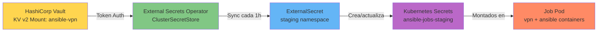

# HashiCorp Vault — Configuración para Staging

## Objetivo

Configurar HashiCorp Vault como backend de secretos para el entorno de **staging**, permitiendo que External Secrets Operator (ESO) sincronice automáticamente los secretos necesarios para ejecutar los Jobs de Ansible sobre VPN.

---

## Arquitectura de Secretos



### Separación por entornos

| Entorno | Backend de Secrets           | Namespace K8s             | Método de gestión |
|---------|------------------------------|---------------------------|-------------------|
| **Dev** | Secrets manuales K8s         | `ansible-jobs-dev`        | `kubectl create`  |
| **Staging** | HashiCorp Vault KV v2     | `ansible-jobs-staging`    | Vault CLI + ESO   |
| **Prod** | AWS Secrets Manager          | `ansible-jobs-prod`       | AWS Console + ESO |

---

## Prerequisitos

### 1. HashiCorp Vault desplegado

Puedes usar:
- **Vault OSS** (self-hosted)
- **HCP Vault** (managed by HashiCorp Cloud Platform)
- **Vault en Kubernetes** (Helm chart oficial)

Ejemplo de instalación con Helm:

```bash
helm repo add hashicorp https://helm.releases.hashicorp.com
helm repo update

helm install vault hashicorp/vault \
  --namespace vault \
  --create-namespace \
  --set "server.dev.enabled=true" \
  --set "injector.enabled=false"

# Obtener root token (solo dev/test)
kubectl exec -n vault vault-0 -- vault status
```

> **Producción:** Usa Vault con HA + backend storage (Consul, Raft) y certificados TLS.

### 2. External Secrets Operator instalado

```bash
helm repo add external-secrets https://charts.external-secrets.io
helm repo update

helm install external-secrets external-secrets/external-secrets \
  --namespace external-secrets \
  --create-namespace \
  --set installCRDs=true

# Verificar que esté corriendo
kubectl get pods -n external-secrets
```

### 3. Acceso al CLI de Vault

```bash
# Instalar Vault CLI
brew install vault  # macOS
# o https://developer.hashicorp.com/vault/downloads

# Configurar servidor y login
export VAULT_ADDR=https://vault.example.com:8200
export VAULT_TOKEN=hvs.XXXXXXXXXXXX

# Verificar conectividad
vault status
```

---

## Estructura de Secretos en Vault

### KV v2 Mount Point: `ansible-vpn`

El mount point `ansible-vpn` contiene todos los secretos relacionados con los Jobs de Ansible.

```
ansible-vpn/  (KV v2 mount)
├── staging/
│   ├── wireguard-config      → { "wg0.conf": "<WireGuard config completo>" }
│   ├── vault-password        → { "vault-password": "<contraseña ansible-vault>" }
│   └── ssh-key               → { "ssh-private-key": "<clave SSH privada PEM>" }
├── prod/
│   └── (similar estructura, gestionado en AWS Secrets Manager)
```

### Por qué KV v2 y no KV v1

- **Versionado:** KV v2 mantiene versiones históricas de los secretos
- **Soft delete:** Los secretos eliminados se pueden restaurar
- **Metadatos:** Timestamps de creación/actualización automáticos
- **Compatibilidad:** External Secrets Operator recomienda KV v2

---

## Configuración Paso a Paso

### Paso 1 — Habilitar KV v2 Engine

```bash
# Habilitar mount point (si no existe)
vault secrets enable -path=ansible-vpn -version=2 kv

# Verificar
vault secrets list
# Path              Type         Accessor              Description
# ----              ----         --------              -----------
# ansible-vpn/      kv           kv_xxxxxxxx           n/a
```

> Si el mount ya existe con KV v1, usa:
> ```bash
> vault kv enable-versioning ansible-vpn/
> ```

### Paso 2 — Crear los Secretos para Staging

#### 2.1 WireGuard Config (`wg0.conf`)

```bash
# Opción A: desde archivo local
vault kv put ansible-vpn/staging/wireguard-config \
  wg0.conf=@./test/vpn/wg0.conf

# Opción B: inline (para test)
vault kv put ansible-vpn/staging/wireguard-config \
  wg0.conf="[Interface]
PrivateKey = <CLIENT_PRIVATE_KEY>
Address = 10.10.99.2/24
DNS = 10.10.99.1

[Peer]
PublicKey = <SERVER_PUBLIC_KEY>
Endpoint = vpn.example.com:51820
AllowedIPs = 10.10.99.0/24, 10.10.20.0/24
PersistentKeepalive = 25"
```

#### 2.2 Ansible Vault Password

```bash
# Desde archivo
vault kv put ansible-vpn/staging/vault-password \
  vault-password="$(cat ./test/secrets/vault-password)"

# O directamente
vault kv put ansible-vpn/staging/vault-password \
  vault-password="mi-contraseña-segura"
```

#### 2.3 SSH Private Key

```bash
# Desde archivo (recomendado)
vault kv put ansible-vpn/staging/ssh-key \
  ssh-private-key=@./test/secrets/ssh-private-key

# Verificar que se guardó correctamente
vault kv get ansible-vpn/staging/ssh-key
```

### Paso 3 — Verificar los Secretos

```bash
# Listar paths
vault kv list ansible-vpn/staging
# Keys
# ----
# ssh-key
# vault-password
# wireguard-config

# Ver metadatos (sin revelar el secreto)
vault kv metadata get ansible-vpn/staging/wireguard-config

# Ver contenido (CUIDADO: imprime el secreto)
vault kv get ansible-vpn/staging/wireguard-config
vault kv get -field=wg0.conf ansible-vpn/staging/wireguard-config
```

---

## Políticas de Acceso en Vault

External Secrets Operator necesita un **token con permisos de lectura** sobre los paths de staging.

### Paso 4 — Crear la Política

Crea un archivo `eso-staging-policy.hcl`:

```hcl
# eso-staging-policy.hcl
# Política para External Secrets Operator - Staging
path "ansible-vpn/data/staging/*" {
  capabilities = ["read"]
}

path "ansible-vpn/metadata/staging/*" {
  capabilities = ["read", "list"]
}
```

> **Nota:** En KV v2, los datos están en `data/`, no directamente en el path raíz.

Aplicar la política:

```bash
vault policy write eso-staging-policy eso-staging-policy.hcl

# Verificar
vault policy read eso-staging-policy
```

### Paso 5 — Generar Token para ESO

```bash
# Crear token con la política
vault token create \
  -policy=eso-staging-policy \
  -period=720h \
  -display-name="external-secrets-staging"

# Output:
# Key                  Value
# ---                  -----
# token                hvs.CAES...xxxxx
# token_accessor       xxxxxxxxxxxxxx
# token_duration       720h
# token_renewable      true
# token_policies       ["default" "eso-staging-policy"]

# GUARDAR EL TOKEN: hvs.CAES...xxxxx
```

> **Producción:** Usa Kubernetes Auth Method o AppRole en lugar de tokens estáticos:
> ```bash
> vault auth enable kubernetes
> vault write auth/kubernetes/role/external-secrets \
>   bound_service_account_names=external-secrets \
>   bound_service_account_namespaces=external-secrets \
>   policies=eso-staging-policy \
>   ttl=24h
> ```

---

## Configuración en Kubernetes

### Paso 6 — Crear Secret con el Token de Vault

```bash
# Usando el token generado en Paso 5
export VAULT_TOKEN=hvs.CAES...xxxxx

kubectl create secret generic vault-token \
  --from-literal=token=$VAULT_TOKEN \
  -n external-secrets \
  --dry-run=client -o yaml | kubectl apply -f -

# Verificar
kubectl get secret vault-token -n external-secrets
```

> **Importante:** Este Secret debe estar en el namespace `external-secrets` (donde corre ESO).

### Paso 7 — Aplicar ClusterSecretStore

Edita `k8s/external-secrets/secret-store-vault.yaml` y reemplaza `VAULT_SERVER`:

```yaml
spec:
  provider:
    vault:
      server: "https://vault.example.com:8200"  # ← TU servidor Vault
      path: "ansible-vpn"
      version: "v2"
      auth:
        tokenSecretRef:
          name: vault-token
          namespace: external-secrets
          key: token
```

Aplicar:

```bash
kubectl apply -f k8s/external-secrets/secret-store-vault.yaml

# Verificar estado
kubectl get clustersecretstore hashicorp-vault -o yaml
```

**Estado esperado:**

```yaml
status:
  conditions:
  - lastTransitionTime: "2026-03-01T10:00:00Z"
    message: store validated
    reason: Valid
    status: "True"
    type: Ready
```

### Paso 8 — Aplicar ExternalSecrets para Staging

```bash
# Crear namespace si no existe
kubectl create namespace ansible-jobs-staging

# Aplicar los 3 ExternalSecrets
kubectl apply -f k8s/external-secrets/staging-external-secret.yaml

# Verificar estado
kubectl get externalsecrets -n ansible-jobs-staging
# NAME                    STORE               REFRESH INTERVAL   STATUS   READY
# vpn-wireguard-config    hashicorp-vault     1h                 SecretSynced   True
# ansible-vault-password  hashicorp-vault     1h                 SecretSynced   True
# ansible-ssh-key         hashicorp-vault     24h                SecretSynced   True

# Verificar que los Secrets se crearon
kubectl get secrets -n ansible-jobs-staging
# NAME                     TYPE     DATA   AGE
# vpn-wireguard-config     Opaque   1      2m
# ansible-vault-password   Opaque   1      2m
# ansible-ssh-key          Opaque   1      2m
```

---

## Verificación del Flujo Completo

### Test 1 — Ver contenido del Secret sincronizado

```bash
# Ver el wg0.conf sincronizado desde Vault
kubectl get secret vpn-wireguard-config -n ansible-jobs-staging \
  -o jsonpath='{.data.wg0\.conf}' | base64 -d

# Output esperado: contenido del fichero WireGuard
# [Interface]
# PrivateKey = ...
```

### Test 2 — Validar metadatos del ExternalSecret

```bash
kubectl describe externalsecret vpn-wireguard-config -n ansible-jobs-staging
```

**Salida esperada:**

```yaml
Status:
  Binding:
    Name:  vpn-wireguard-config
  Conditions:
    Message:               Secret was synced
    Reason:                SecretSynced
    Status:                True
    Type:                  Ready
  Refresh Time:            2026-03-01T10:00:00Z
  Synced Resource Version: 1-abc123def456
```

### Test 3 — Forzar refresh manual

```bash
# Modificar annotation para forzar re-sync
kubectl annotate externalsecret vpn-wireguard-config \
  -n ansible-jobs-staging \
  force-sync="$(date +%s)" \
  --overwrite

# Verificar logs de ESO
kubectl logs -n external-secrets \
  -l app.kubernetes.io/name=external-secrets -f
```

---

## Actualización de Secretos

### Rotación de WireGuard Keys

```bash
# 1. Generar nuevo par de claves
wg genkey | tee client-new.key | wg pubkey > client-new.pub

# 2. Crear nueva configuración wg0.conf
cat > wg0-new.conf <<EOF
[Interface]
PrivateKey = $(cat client-new.key)
Address = 10.10.99.2/24
DNS = 10.10.99.1

[Peer]
PublicKey = <SERVER_PUBLIC_KEY>
Endpoint = vpn.example.com:51820
AllowedIPs = 10.10.99.0/24, 10.10.20.0/24
PersistentKeepalive = 25
EOF

# 3. Actualizar en Vault (crea versión 2)
vault kv put ansible-vpn/staging/wireguard-config \
  wg0.conf=@wg0-new.conf

# 4. ESO sincronizará automáticamente en el próximo refresh (1h)
# O forzar inmediatamente:
kubectl annotate externalsecret vpn-wireguard-config \
  -n ansible-jobs-staging \
  force-sync="$(date +%s)" --overwrite

# 5. Verificar versión en Vault
vault kv metadata get ansible-vpn/staging/wireguard-config
# current_version: 2
```

### Rollback a versión anterior

```bash
# Ver historial
vault kv metadata get ansible-vpn/staging/wireguard-config

# Recuperar versión 1
vault kv get -version=1 ansible-vpn/staging/wireguard-config

# Promover versión 1 como versión 3 (KV v2 no permite sobrescribir)
vault kv get -version=1 -field=wg0.conf \
  ansible-vpn/staging/wireguard-config | \
  vault kv put ansible-vpn/staging/wireguard-config wg0.conf=-

# ESO sincronizará la nueva versión
```

---

## Troubleshooting

### ExternalSecret stuck en "SecretSyncedError"

```bash
kubectl describe externalsecret <NAME> -n ansible-jobs-staging
```

**Causas comunes:**

| Error en `Status.Conditions.Message` | Causa | Solución |
|--------------------------------------|-------|----------|
| `permission denied` | Token sin permisos | Verificar política y token |
| `secret not found at path` | Path incorrecto en Vault | Verificar `vault kv list ansible-vpn/staging` |
| `could not get secret data` | Property key incorrecta | Verificar que el key en Vault coincida con `remoteRef.property` |
| `vault server unreachable` | URL o red incorrecta | Verificar `server` en ClusterSecretStore |

### ClusterSecretStore en estado "Invalid"

```bash
kubectl describe clustersecretstore hashicorp-vault
```

**Debug:**

```bash
# Verificar que el secret vault-token existe
kubectl get secret vault-token -n external-secrets

# Verificar conectividad desde un pod de test
kubectl run vault-test --rm -it --restart=Never \
  --image=hashicorp/vault:latest -- \
  vault status -address=https://vault.example.com:8200

# Ver logs de ESO
kubectl logs -n external-secrets \
  -l app.kubernetes.io/name=external-secrets --tail=100
```

### Secret sincronizado pero con datos incorrectos

```bash
# Comparar datos en Vault vs Kubernetes
vault kv get -field=wg0.conf ansible-vpn/staging/wireguard-config > /tmp/vault.txt

kubectl get secret vpn-wireguard-config -n ansible-jobs-staging \
  -o jsonpath='{.data.wg0\.conf}' | base64 -d > /tmp/k8s.txt

diff /tmp/vault.txt /tmp/k8s.txt
```

### Token de Vault expirado

```bash
# Verificar TTL restante del token
vault token lookup $VAULT_TOKEN

# Renovar token (si es renewable)
vault token renew $VAULT_TOKEN

# O crear nuevo token y actualizar el Secret
vault token create -policy=eso-staging-policy -period=720h
kubectl create secret generic vault-token \
  --from-literal=token=<NEW_TOKEN> \
  -n external-secrets --dry-run=client -o yaml | kubectl apply -f -

# Reiniciar ESO para que recoja el nuevo token
kubectl rollout restart deployment external-secrets -n external-secrets
```

---

## Limpieza y Eliminación

### Eliminar secretos de Vault (staging)

```bash
# Soft delete (recuperable)
vault kv delete ansible-vpn/staging/wireguard-config
vault kv delete ansible-vpn/staging/vault-password
vault kv delete ansible-vpn/staging/ssh-key

# Purge permanente (destruye todas las versiones)
vault kv metadata delete ansible-vpn/staging/wireguard-config
```

### Eliminar recursos de Kubernetes

```bash
# Eliminar ExternalSecrets (también elimina los Secrets por deletionPolicy: Retain)
kubectl delete -f k8s/external-secrets/staging-external-secret.yaml

# Eliminar ClusterSecretStore
kubectl delete clustersecretstore hashicorp-vault

# Eliminar token
kubectl delete secret vault-token -n external-secrets
```

---

## Comandos Make Disponibles

| Comando | Descripción |
|---------|-------------|
| `make k8s-secrets-vault-token VAULT_TOKEN=hvs.XXX` | Crear Secret vault-token en Kubernetes |
| `make k8s-apply-external-secrets-staging` | Aplicar ClusterSecretStore + ExternalSecrets de staging |
| `make k8s-apply-external-secrets` | Aplicar todos los recursos ESO (staging + prod) |

Ejemplo de uso:

```bash
# 1. Generar token en Vault
export VAULT_TOKEN=$(vault token create \
  -policy=eso-staging-policy \
  -period=720h \
  -field=token)

# 2. Crear Secret en K8s
make k8s-secrets-vault-token VAULT_TOKEN=$VAULT_TOKEN

# 3. Aplicar recursos ESO
make k8s-apply-external-secrets-staging
```

---

## Mejores Prácticas

### 1. Rotación automática de tokens

```bash
# Usar Kubernetes Auth en lugar de tokens estáticos
vault auth enable kubernetes

vault write auth/kubernetes/config \
  kubernetes_host="https://$KUBERNETES_SERVICE_HOST:$KUBERNETES_SERVICE_PORT"

vault write auth/kubernetes/role/external-secrets \
  bound_service_account_names=external-secrets \
  bound_service_account_namespaces=external-secrets \
  policies=eso-staging-policy \
  ttl=24h \
  max_ttl=72h

# Actualizar ClusterSecretStore para usar kubernetes auth
```

### 2. Auditoría de accesos

```bash
# Habilitar audit log
vault audit enable file file_path=/vault/logs/audit.log

# Ver accesos a staging secrets
vault audit list
grep "ansible-vpn/staging" /vault/logs/audit.log | jq .
```

### 3. Backup de secretos

```bash
# Exportar todos los secretos de staging (CUIDADO: plaintext)
vault kv get -format=json ansible-vpn/staging/wireguard-config > backup-wg.json
vault kv get -format=json ansible-vpn/staging/vault-password > backup-vault.json
vault kv get -format=json ansible-vpn/staging/ssh-key > backup-ssh.json

# Guardar en lugar seguro (ej. otro Vault, encrypted S3, etc.)
```

### 4. Monitoreo de sincronización

Crea un ServiceMonitor para Prometheus (si tienes prometheus-operator):

```yaml
apiVersion: monitoring.coreos.com/v1
kind: ServiceMonitor
metadata:
  name: external-secrets
  namespace: external-secrets
spec:
  selector:
    matchLabels:
      app.kubernetes.io/name: external-secrets
  endpoints:
  - port: metrics
    interval: 30s
```

Métricas útiles:
- `externalsecret_sync_calls_total`
- `externalsecret_sync_calls_error`
- `externalsecret_status_condition{condition="Ready"}`

---

## Referencias

- [ClusterSecretStore: secret-store-vault.yaml](../../k8s/external-secrets/secret-store-vault.yaml)
- [ExternalSecrets: staging-external-secret.yaml](../../k8s/external-secrets/staging-external-secret.yaml)
- [External Secrets Operator Docs](https://external-secrets.io)
- [HashiCorp Vault KV v2 Docs](https://developer.hashicorp.com/vault/docs/secrets/kv/kv-v2)
- [Vault Policies Guide](https://developer.hashicorp.com/vault/tutorials/policies/policies)
