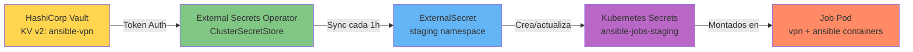

# HashiCorp Vault — Guía Completa de Configuración

Documentación unificada para configurar y gestionar HashiCorp Vault como backend de secretos para staging, con integración de External Secrets Operator (ESO).

---

## 📋 Tabla de Contenidos

- [Arquitectura](#-arquitectura)
- [Quick Start](#-quick-start)
- [Prerequisitos](#-prerequisitos)
- [Configuración Completa](#-configuración-completa)
- [Políticas y Tokens](#-políticas-y-tokens)
- [Integración con Kubernetes](#-integración-con-kubernetes)
- [Comandos Esenciales](#-comandos-esenciales)
- [Actualización y Versionado](#-actualización-y-versionado)
- [Troubleshooting](#-troubleshooting)
- [Referencias](#-referencias)

---

## 🏗️ Arquitectura



### Separación por Entorno

| Entorno     | Backend de Secrets    | Namespace K8s          | Método de gestión |
| ----------- | --------------------- | ---------------------- | ----------------- |
| **Dev**     | Kubernetes Secrets    | `ansible-jobs-dev`     | `kubectl create`  |
| **Staging** | HashiCorp Vault KV v2 | `ansible-jobs-staging` | Vault CLI + ESO   |
| **Prod**    | AWS Secrets Manager   | `ansible-jobs-prod`    | AWS Console + ESO |

### Estructura de Secretos

```
ansible-vpn/          (KV v2 mount point)
└── staging/
    ├── wireguard-config   → { "wg0.conf": "<WireGuard config completo>" }
    ├── vault-password     → { "vault-password": "<contraseña ansible-vault>" }
    └── ssh-key            → { "ssh-private-key": "<clave SSH privada PEM>" }
```

---

## 🚀 Quick Start

```bash
# 1. Habilitar KV v2 engine
vault secrets enable -path=ansible-vpn -version=2 kv

# 2. Crear los 3 secretos necesarios
vault kv put ansible-vpn/staging/wireguard-config wg0.conf=@test/vpn/wg0.conf
vault kv put ansible-vpn/staging/vault-password vault-password="$(cat test/secrets/vault-password)"
vault kv put ansible-vpn/staging/ssh-key ssh-private-key=@test/secrets/ssh-private-key

# 3. Crear política de lectura
vault policy write eso-staging-policy - <<EOF
path "ansible-vpn/data/staging/*" {
  capabilities = ["read"]
}
path "ansible-vpn/metadata/staging/*" {
  capabilities = ["read", "list"]
}
EOF

# 4. Generar token (guardar el output)
vault token create -policy=eso-staging-policy -period=720h -display-name="eso-staging"

# 5. Configurar en Kubernetes
export VAULT_TOKEN=hvs.CAES...xxxxx  # del paso anterior
kubectl create secret generic vault-token \
  --from-literal=token=$VAULT_TOKEN \
  -n external-secrets

# 6. Aplicar recursos ESO
kubectl apply -f k8s/external-secrets/secret-store-vault.yaml
kubectl apply -f k8s/external-secrets/staging-external-secret.yaml

# 7. Verificar sincronización
kubectl get externalsecrets -n ansible-jobs-staging
kubectl get secrets -n ansible-jobs-staging
```

---

## 📦 Prerequisitos

### 1. HashiCorp Vault

**Instalación con Helm (dev/test):**

```bash
helm repo add hashicorp https://helm.releases.hashicorp.com
helm install vault hashicorp/vault \
  --namespace vault \
  --create-namespace \
  --set "server.dev.enabled=true" \
  --set "injector.enabled=false"
```

> **Producción:** Usa Vault con HA + storage backend (Consul, Raft) y TLS.

### 2. External Secrets Operator

```bash
helm repo add external-secrets https://charts.external-secrets.io
helm install external-secrets external-secrets/external-secrets \
  --namespace external-secrets \
  --create-namespace \
  --set installCRDs=true

kubectl get pods -n external-secrets
```

### 3. Vault CLI

```bash
# macOS
brew install vault

# Linux
wget https://releases.hashicorp.com/vault/1.15.0/vault_1.15.0_linux_amd64.zip
unzip vault_*_linux_amd64.zip
sudo mv vault /usr/local/bin/

# Configurar conexión
export VAULT_ADDR=https://vault.example.com:8200
export VAULT_TOKEN=<ROOT_OR_ADMIN_TOKEN>
vault status
```

---

## 🔧 Configuración Completa

### Paso 1: Habilitar KV v2 Engine

```bash
# Crear mount point
vault secrets enable -path=ansible-vpn -version=2 kv

# Verificar
vault secrets list
# ansible-vpn/      kv           kv_xxxxxxxx           n/a
```

> Si el mount ya existe con KV v1: `vault kv enable-versioning ansible-vpn/`

### Paso 2: Crear Secretos

#### WireGuard Config

```bash
# Desde archivo (recomendado)
vault kv put ansible-vpn/staging/wireguard-config \
  wg0.conf=@./test/vpn/wg0.conf

# Inline (para pruebas)
vault kv put ansible-vpn/staging/wireguard-config \
  wg0.conf="[Interface]
PrivateKey = <CLIENT_PRIVATE_KEY>
Address = 10.10.99.2/24
DNS = 10.10.99.1

[Peer]
PublicKey = <SERVER_PUBLIC_KEY>
Endpoint = vpn.example.com:51820
AllowedIPs = 10.10.99.0/24, 10.10.20.0/24
PersistentKeepalive = 25"
```

#### Ansible Vault Password

```bash
vault kv put ansible-vpn/staging/vault-password \
  vault-password="$(cat ./test/secrets/vault-password)"
```

#### SSH Private Key

```bash
vault kv put ansible-vpn/staging/ssh-key \
  ssh-private-key=@./test/secrets/ssh-private-key
```

### Paso 3: Verificar

```bash
# Listar secretos
vault kv list ansible-vpn/staging

# Ver metadatos (sin contenido)
vault kv metadata get ansible-vpn/staging/wireguard-config

# Ver contenido completo
vault kv get ansible-vpn/staging/wireguard-config

# Solo un campo
vault kv get -field=wg0.conf ansible-vpn/staging/wireguard-config
```

---

## 🔐 Políticas y Tokens

### Crear Política para ESO

```bash
# Crear archivo de política
cat > eso-staging-policy.hcl <<'EOF'
# Acceso a datos (KV v2 usa path 'data/')
path "ansible-vpn/data/staging/*" {
  capabilities = ["read"]
}

# Acceso a metadatos
path "ansible-vpn/metadata/staging/*" {
  capabilities = ["read", "list"]
}
EOF

# Aplicar política
vault policy write eso-staging-policy eso-staging-policy.hcl

# Verificar
vault policy read eso-staging-policy
```

### Generar Token

```bash
# Token con 30 días de TTL (renovable)
vault token create \
  -policy=eso-staging-policy \
  -period=720h \
  -display-name="external-secrets-staging"

# Output:
# token                hvs.CAES...xxxxx  ← GUARDAR ESTE TOKEN
# token_duration       720h
# token_renewable      true
```

### Gestión de Tokens

```bash
# Ver información del token actual
vault token lookup

# Renovar token
vault token renew

# Verificar TTL restante
vault token lookup $VAULT_TOKEN | grep ttl

# Crear nuevo token
vault token create -policy=eso-staging-policy -period=720h

# Revocar token
vault token revoke <TOKEN>
```

> **Producción:** Usa Kubernetes Auth Method en lugar de tokens estáticos:
>
> ```bash
> vault auth enable kubernetes
> vault write auth/kubernetes/role/external-secrets \
>   bound_service_account_names=external-secrets \
>   bound_service_account_namespaces=external-secrets \
>   policies=eso-staging-policy \
>   ttl=24h
> ```

---

## ☸️ Integración con Kubernetes

### Paso 1: Crear Secret con Token

```bash
export VAULT_TOKEN=hvs.CAES...xxxxx

kubectl create secret generic vault-token \
  --from-literal=token=$VAULT_TOKEN \
  -n external-secrets

# Verificar
kubectl get secret vault-token -n external-secrets
```

### Paso 2: Aplicar ClusterSecretStore

Editar `k8s/external-secrets/secret-store-vault.yaml` si es necesario:

```yaml
spec:
  provider:
    vault:
      server: "https://vault.example.com:8200" # ← TU servidor
      path: "ansible-vpn"
      version: "v2"
      auth:
        tokenSecretRef:
          name: vault-token
          namespace: external-secrets
          key: token
```

```bash
kubectl apply -f k8s/external-secrets/secret-store-vault.yaml

# Verificar estado
kubectl get clustersecretstore hashicorp-vault -o yaml
# Status.Conditions.Type: Ready = True
```

### Paso 3: Aplicar ExternalSecrets

```bash
# Crear namespace
kubectl create namespace ansible-jobs-staging

# Aplicar ExternalSecrets
kubectl apply -f k8s/external-secrets/staging-external-secret.yaml

# Verificar sincronización
kubectl get externalsecrets -n ansible-jobs-staging
# NAME                    STATUS          READY
# vpn-wireguard-config    SecretSynced    True
# ansible-vault-password  SecretSynced    True
# ansible-ssh-key         SecretSynced    True

# Verificar Secrets creados
kubectl get secrets -n ansible-jobs-staging
```

### Paso 4: Validar Contenido

```bash
# Ver wg0.conf sincronizado
kubectl get secret vpn-wireguard-config \
  -n ansible-jobs-staging \
  -o jsonpath='{.data.wg0\.conf}' | base64 -d

# Verificar metadatos del ExternalSecret
kubectl describe externalsecret vpn-wireguard-config \
  -n ansible-jobs-staging
```

---

## 🛠️ Comandos Esenciales

### Operaciones Básicas

```bash
# Listar paths
vault kv list ansible-vpn/staging

# Ver metadatos sin revelar contenido
vault kv metadata get ansible-vpn/staging/wireguard-config

# Ver contenido completo
vault kv get ansible-vpn/staging/wireguard-config

# Ver solo un campo
vault kv get -field=wg0.conf ansible-vpn/staging/wireguard-config

# Ver versión específica
vault kv get -version=2 ansible-vpn/staging/wireguard-config
```

### Comandos Make

```bash
# Crear vault-token Secret
make k8s-secrets-vault-token VAULT_TOKEN=hvs.XXXX

# Aplicar recursos ESO de staging
make k8s-apply-external-secrets-staging

# Aplicar todos los recursos ESO
make k8s-apply-external-secrets
```

---

## 🔄 Actualización y Versionado

### Rotación de Secretos

```bash
# Actualizar secreto (crea nueva versión automáticamente)
vault kv put ansible-vpn/staging/wireguard-config \
  wg0.conf=@wg0-new.conf

# Ver historial de versiones
vault kv metadata get ansible-vpn/staging/wireguard-config
# current_version: 2

# ESO sincroniza automáticamente en el próximo refresh (1h)
# O forzar inmediatamente:
kubectl annotate externalsecret vpn-wireguard-config \
  -n ansible-jobs-staging \
  force-sync="$(date +%s)" --overwrite
```

### Rollback a Versión Anterior

```bash
# Ver historial
vault kv metadata get ansible-vpn/staging/wireguard-config

# Recuperar versión 1
vault kv get -version=1 ansible-vpn/staging/wireguard-config

# Promover versión 1 como nueva versión actual
vault kv get -version=1 -field=wg0.conf \
  ansible-vpn/staging/wireguard-config | \
vault kv put ansible-vpn/staging/wireguard-config wg0.conf=-
```

### Limpieza

```bash
# Soft delete (recuperable)
vault kv delete ansible-vpn/staging/wireguard-config

# Recuperar después de soft delete
vault kv undelete -versions=3 ansible-vpn/staging/wireguard-config

# Delete permanente (todas las versiones)
vault kv metadata delete ansible-vpn/staging/wireguard-config
```

---

## 🐛 Troubleshooting

### ExternalSecret en "SecretSyncedError"

```bash
kubectl describe externalsecret <NAME> -n ansible-jobs-staging
```

| Error                       | Causa                   | Solución                                                   |
| --------------------------- | ----------------------- | ---------------------------------------------------------- |
| `permission denied`         | Token sin permisos      | Verificar política: `vault policy read eso-staging-policy` |
| `secret not found at path`  | Path incorrecto         | Verificar: `vault kv list ansible-vpn/staging`             |
| `could not get secret data` | Property key incorrecta | Verificar key en `remoteRef.property` coincide con Vault   |
| `vault server unreachable`  | URL o red incorrecta    | Verificar `server` en ClusterSecretStore                   |

### ClusterSecretStore "Invalid"

```bash
kubectl describe clustersecretstore hashicorp-vault

# Verificar conectividad desde pod
kubectl run vault-test --rm -it --restart=Never \
  --image=hashicorp/vault:latest -- \
  vault status -address=https://vault.example.com:8200

# Ver logs de ESO
kubectl logs -n external-secrets \
  -l app.kubernetes.io/name=external-secrets --tail=100
```

### Token Expirado

```bash
# Verificar TTL
vault token lookup $VAULT_TOKEN

# Renovar (si es renewable)
vault token renew $VAULT_TOKEN

# O crear nuevo y actualizar Secret
vault token create -policy=eso-staging-policy -period=720h
kubectl create secret generic vault-token \
  --from-literal=token=<NEW_TOKEN> \
  -n external-secrets --dry-run=client -o yaml | kubectl apply -f -

# Reiniciar ESO
kubectl rollout restart deployment external-secrets -n external-secrets
```

### Comparar Datos Vault vs K8s

```bash
# Extraer datos
vault kv get -field=wg0.conf ansible-vpn/staging/wireguard-config > /tmp/vault.txt
kubectl get secret vpn-wireguard-config -n ansible-jobs-staging \
  -o jsonpath='{.data.wg0\.conf}' | base64 -d > /tmp/k8s.txt

# Comparar
diff /tmp/vault.txt /tmp/k8s.txt
```

---

## 📚 Referencias

- [ClusterSecretStore Config](../../k8s/external-secrets/secret-store-vault.yaml)
- [Staging ExternalSecrets](../../k8s/external-secrets/staging-external-secret.yaml)
- [External Secrets Operator Docs](https://external-secrets.io)
- [HashiCorp Vault KV v2](https://developer.hashicorp.com/vault/docs/secrets/kv/kv-v2)
- [Vault Policies Guide](https://developer.hashicorp.com/vault/tutorials/policies/policies)
